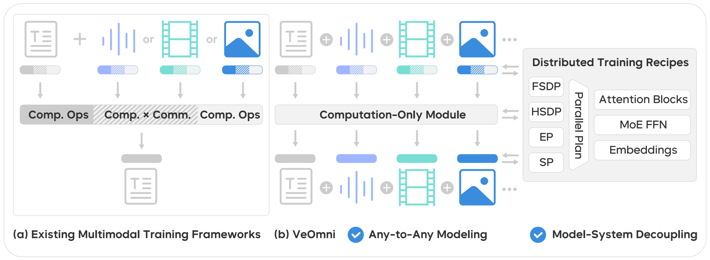
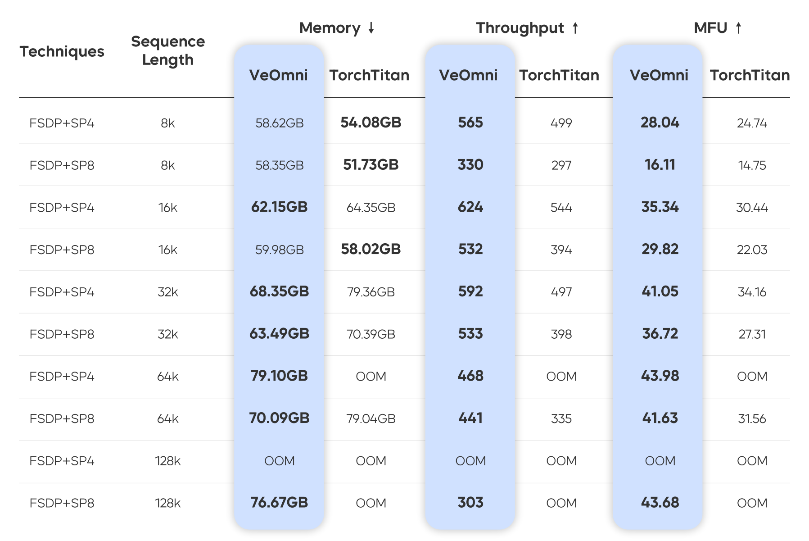

<div align="center">


<div align="center">
    VeOmni: Scaling Any Modality Model Training with Model-Centric Distributed Recipe Zoo
    <br>
    <br>
</div>

[](https://github.com/ByteDance-Seed/VeOmni/stargazers)
[](https://arxiv.org/abs/2508.02317)
[](https://veomni.readthedocs.io/en/latest/)
[](https://raw.githubusercontent.com/ByteDance-Seed/VeOmni/refs/heads/main/docs/assets/wechat.png)

</div>

## 🍪 Overview
VeOmni is a versatile framework for both single- and multi-modal pre-training and post-training. It empowers users to seamlessly scale models of any modality across various accelerators, offering both flexibility and user-friendliness.

VeOmni combines reusable model, data, optimizer, and distributed components with
training entry points for text, vision-language, audio, and diffusion workloads.
The trainers compose a shared training loop with model-specific runtimes; advanced
users can reuse the components in their own tasks. See the
[Trainer guide](docs/usage/trainer.md) for the extension points.

- **Modular**: configure or extend model loading, data processing, kernels, and training tasks.
- **Multimodal**: train text, vision-language, audio/video, and diffusion models.
- **PyTorch native**: use FSDP2, DeviceMesh, and distributed checkpointing.

<div align="center">

</div>

## 🔥 Project Milestones
- [2025/11] Our Paper [OmniScale: Scaling Any Modality Model Training with Model-Centric Distributed Recipe Zoo](https://arxiv.org/abs/2508.02317) was accepted by AAAI 2026
- [2025/09] We release first official release [v0.1.0](https://github.com/ByteDance-Seed/VeOmni/pull/75) of VeOmni.
- [2025/08] We release [VeOmni Tech report](https://arxiv.org/abs/2508.02317) and open the [WeChat group](./docs/assets/wechat.png). Feel free to join us!
- [2025/04] We release VeOmni!


## 📚 Key Features
- **FSDP2** backend for training.
- **Sequence Parallelism** with [DeepSpeed Ulysses](https://arxiv.org/abs/2309.14509), support with non-async and async mode.
- **Expert Parallelism** for large MoE model training, like [Qwen3-Moe](https://veomni.readthedocs.io/en/latest/key_features/ep_fsdp2.html).
- Efficient **GroupGemm** kernel for Moe model, [Liger-Kernel](https://github.com/linkedin/Liger-Kernel).
- Compatible with HuggingFace Transformers models. [Qwen3](https://veomni.readthedocs.io/en/latest/examples/qwen3.html), [Qwen3-VL](https://veomni.readthedocs.io/en/latest/examples/qwen3_vl.html), Qwen3-Moe, etc
- Dynamic batching strategy, Omnidata processing
- [**Torch Distributed Checkpoint**](https://docs.pytorch.org/docs/stable/distributed.checkpoint.html) for checkpoint.
- Support for NVIDIA GPU, AMD ROCm, and Ascend NPU training.
- Experiment tracking with wandb

## 📝 Roadmap

Track planned work and its current status in the
[2026 Q3 roadmap](https://github.com/ByteDance-Seed/VeOmni/issues/988) and
[NPU roadmap](https://github.com/ByteDance-Seed/VeOmni/issues/796).

## 🚀 Getting Started

| Goal | Start here |
| --- | --- |
| Install VeOmni | [NVIDIA GPU](docs/get_started/installation/install.md), [Ascend x86](docs/get_started/installation/install_ascend_x86.md), [Ascend ARM](docs/get_started/installation/install_ascend_arm.md), [AMD ROCm](docs/hardware_support/rocm/README.md), [Cambricon MLU](docs/hardware_support/mlu/README.md) |
| Run your first training job | [Quick Start](docs/get_started/quick_start.md) |
| Configure a run | [Arguments reference](docs/usage/arguments.md) |
| Contribute code or documentation | [Contribution guide](CONTRIBUTING.md) |

Browse the [documentation](https://veomni.readthedocs.io/en/latest/) for feature
and model guides. Installation instructions and examples on the `latest` site
track `main`; use the documentation from your checkout when working on an older revision.

## ✏️ Models and Recipes

VeOmni includes recipes for dense and MoE text models, vision-language and Omni
models, and diffusion models. The [model and recipe catalog](docs/examples/index.md)
links each family to its checked-in configurations, training guide, and limitations.
See [hardware support](docs/hardware_support/index.md) for platform-specific setup
and validation scope.

To integrate another architecture, follow the
[model integration guide](docs/usage/support_new_models/guide_and_checklist.md).

## ⛰️ Performance

<div align="left">

</div>

For more details, please refer to our [paper](https://arxiv.org/abs/2508.02317).

## 💡 Awesome work using VeOmni
- [dFactory: Easy and Efficient dLLM Fine-Tuning](https://github.com/inclusionAI/dFactory)
- [LMMs-Engine](https://github.com/EvolvingLMMs-Lab/lmms-engine)
- [UI-TARS: Pioneering Automated GUI Interaction with Native Agents](https://github.com/bytedance/UI-TARS)
- [OpenHA: A Series of Open-Source Hierarchical
Agentic Models in Minecraft](https://arxiv.org/pdf/2509.13347)
- [UI-TARS-2 Technical Report: Advancing GUI Agent with Multi-Turn Reinforcement Learning](https://arxiv.org/abs/2509.02544)
- [Open-dLLM: Open Diffusion Large Language Models](https://github.com/pengzhangzhi/Open-dLLM)
- [LingBot-VLA: A Pragmatic VLA Foundation Model](https://github.com/Robbyant/lingbot-vla)

## 🎨 Contributing

Contributions are welcome. Start with the [contribution guide](CONTRIBUTING.md).
For documentation changes, follow the [authoring guide](docs/README.md).


## 📝 Citation and Acknowledgement

If you find VeOmni useful for your research and applications, feel free to give us a star ⭐ or cite us using:

```bibtex
@article{ma2025veomni,
  title={VeOmni: Scaling Any Modality Model Training with Model-Centric Distributed Recipe Zoo},
  author={Ma, Qianli and Zheng, Yaowei and Shi, Zhelun and Zhao, Zhongkai and Jia, Bin and Huang, Ziyue and Lin, Zhiqi and Li, Youjie and Yang, Jiacheng and Peng, Yanghua and others},
  journal={arXiv preprint arXiv:2508.02317},
  year={2025}
}
```

Thanks to the following projects for their excellent work:

- [ByteCheckpoint](https://arxiv.org/abs/2407.20143)
- [veScale](https://github.com/volcengine/veScale)
- [Liger-Kernel](https://github.com/linkedin/Liger-Kernel)
- [LLaMA-Factory](https://github.com/hiyouga/LLaMA-Factory)
- [torchtitan](https://github.com/pytorch/torchtitan/)
- [torchtune](https://github.com/pytorch/torchtune)

## Star History

[](https://www.star-history.com/#ByteDance-Seed/VeOmni&type=date&legend=top-left)


## 🌱 About [ByteDance Seed Team](https://team.doubao.com/)

<div align="center">

</div>

Founded in 2023, ByteDance Seed Team is dedicated to crafting the industry's most advanced AI foundation models. The team aspires to become a world-class research team and make significant contributions to the advancement of science and society. You can get to know Bytedance Seed better through the following channels👇
<div>
  <a href="https://team.doubao.com/">
    </a>
  <a href="https://github.com/user-attachments/assets/469535a8-42f2-4797-acdf-4f7a1d4a0c3e">
    </a>
 <a href="https://www.xiaohongshu.com/user/profile/668e7e15000000000303157d?xsec_token=ABl2-aqekpytY6A8TuxjrwnZskU-6BsMRE_ufQQaSAvjc%3D&xsec_source=pc_search">
    </a>
  <a href="https://www.zhihu.com/org/dou-bao-da-mo-xing-tuan-dui/">
    </a>

</div>
