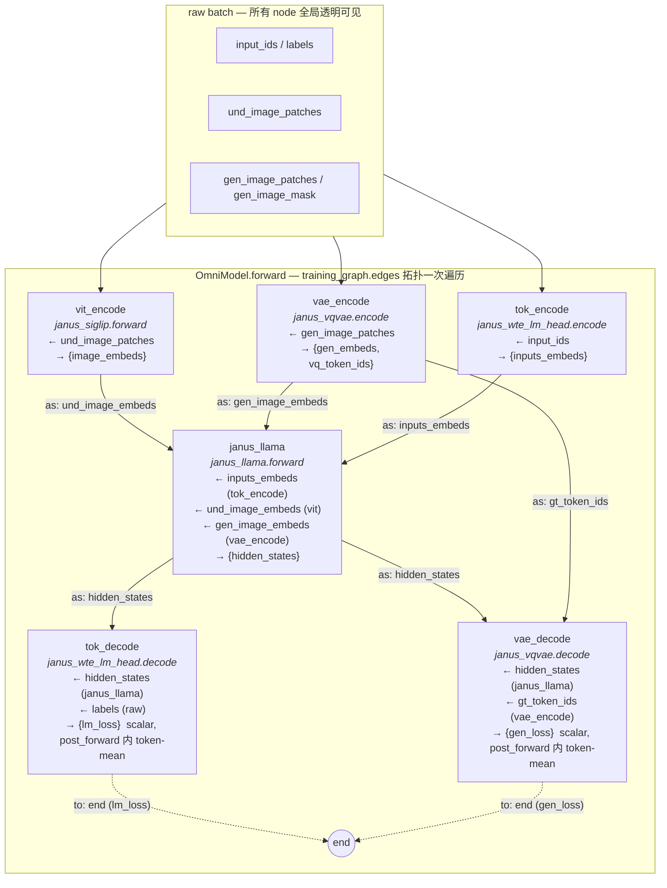
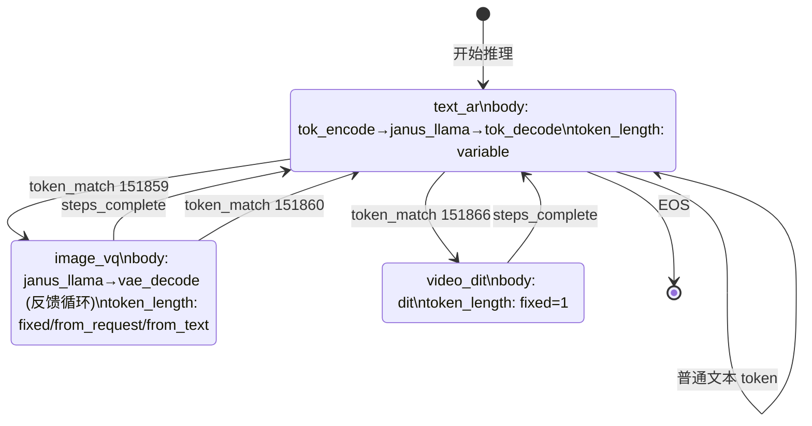

# SeedOmni V2 架构设计

> SeedOmni V2 (`veomni/models/seed_omni/`) 重写——把固定的 `Encoder → Foundation → Decoder` 三元结构换成**显式图（nodes + edges）声明**的模块化系统。`OmniModule` 是 mixin，模型本体来自 transformers / diffusers，通过多继承获得框架钩子。两个平级的池子描述全图：`nodes:` 池每个 entry 是一次 `module.method` 调用（不指定 method 时训练用 `forward`、推理用 `generate_step`），`edges:` 池每条边路由 `from → to` 的输出。同一 module 可挂多个 node。每个 node 必有出边——指向另一个 node 或保留关键字 `end`（虚拟终点），保证图无孤岛、无环。训练子集只列 `edges`（nodes 由 endpoints 自动并出，执行序由 topo sort 推导，可视化时画出 forward queue）；推理由 FSM 驱动，每个 state 的 `body` 也只列 edges，可无限循环（text→image→text→image→...）。loss 按 `_loss` 后缀隐式收集——每个 module 一次 forward 内部把所有 micro-batch 跑完，`post_forward` 自己做 token-level mean，OmniModel 顶层只把各 module 的标量 `_loss` 加起来。并行采用全局单一 `ParallelState`，OmniModel 顶层单次 `build_parallelize_model` 包装，`ParallelPlan` 由子模块递归聚合。生命周期上 weights 走 `build_foundation_model` + `build_parallelize_model`（多模块 weights_path 是 dict）、save 由每个 module 自己的 `CheckpointCallback` 写到自己的 subfolder（自带 config + 可选 asset，**所有非文本 processor 都跟随 module subfolder**），`tokenizer_path` 是唯一顶层全局字段——chat template 在 tokenizer 这一层吃掉，多模态拼接（text embedding + image feature 等）由 AR backbone 在 `pre_forward` 内部完成。**不保留 V1 兼容**。

## 总纲（不变量）

1. **`module` ≠ `node` ≠ `edge`**：实例 / 调用 / 数据流，三层各司其职。
2. **一个 module instance 可挂任意多个 node**；同 method 也可承担多个角色（按 kwargs 自分派）。
3. **训练 = DAG（一次拓扑遍历），推理 = FSM（含环、按状态转移循环）**。
4. **永远不自动推导"图结构本身"**：`edges` 必须 config 显式给出。但**执行顺序可由 topo sort 从 edges 推导**——可视化训练图时画出 forward queue；FSM 因含环不可推导执行序，只可视化状态转移图。

## 背景与问题

当前 [`modeling_seed_omni.py`](veomni/models/seed_omni/modeling_seed_omni.py) 采用固定的三元结构 `Encoder → Foundation → Decoder`，存在以下根本性局限：

- **结构写死**：`encoder`、`foundation`、`decoder` 是硬编码字段，无法表达 Qwen-Omni 的 thinker+talker（两个 LLM 串联）、BAGEL 的 AR+DiT 联合等架构
- **同模态只能有一个 encoder**：`self.image_encoder` 是单一字段，无法让理解图走 ViT、生成图走 VAE
- **SP 在外层**：`gather_seq_scatter_heads` 写在 `SeedOmniEncoderModel.forward()` 里，不随模块封装
- **ParallelPlan 不可组合**：`get_parallel_plan()` 只委托 foundation，encoder/decoder 即使本身是 MoE/带 embed 并行也无法把 plan 透出来 → 多模态 MoE（例如 ar_llm 是 MoE + vision_vae 也想加自己的 EP plan）只能改顶层模型逻辑
- **无 DiT 支持**：仅支持离散 VQ AR 生成，无法接入连续扩散模型

---

## 设计目标

| 目标 | 说明 |
|------|------|
| 完全模块化 | 所有组件以 OmniModule mixin 形态平等存在；只改 YAML（path / nodes / edges）即可替换任意模块 |
| 支持 AR + DiT | 同一训练框架内同时支持自回归和扩散两种生成范式 |
| 并行可组合 | 全局单一 `ParallelState`；OmniModel 顶层一次 `build_parallelize_model`；ParallelPlan 由各子模块的 `get_parallel_plan()` 递归聚合（**不**做异构 mesh / per-module FSDP wrap） |
| 训推一致（RL） | training `forward()` 和 inference `generate_step()` 共用同一底层实现 |
| 多模态对话驱动 | 同模态数据根据 conversation role 路由到不同模块（understanding vs. generation） |
| 推理循环生成 | 推理时可以反复循环（text→image→text→image），不是 DAG |
| 拆模型 / 多 path 加载 | 拆模型脚本输出 family 子模型目录，trainer 多 path 加载，per-module callback 各自存 subfolder |

---

## 核心设计

### 为什么训练是 DAG、推理不是

**训练**（teacher forcing）：AR LLM 一次 forward 处理完整序列，所有图像 output 位置已知且固定，其他模块在固定位置提取 hidden states 计算 loss。整个计算图**一次拓扑遍历**即可完成，是 DAG。

**推理**：token-by-token 驱动，生成一段文字后触发图像模块，图像模块完成后控制权归还文字模块，可无限循环（`text → image → text → image → ...`）。这**不是 DAG，是有限状态机（FSM）**。

两套执行语义分开实现：`OmniModel.forward()` 跑 DAG 遍历，`OmniModel.generate()` 跑状态机。

### 核心思路：nodes（call-site）+ edges（数据依赖）+ end（虚拟终点）

去掉 encoder / foundation / decoder 的固定角色，用两个平级的池子 + 一个保留关键字描述整张图：

- **`nodes:`** 图节点池——每个 entry 是一个 call-site，对应一次 `module.method` 调用。同一 module 可以挂多个 node（如 VAE 的 `encode` 与 `decode`，共享一份参数但是图上两个独立节点）。不指定 `method` 时**训练默认 `forward`、推理默认 `generate_step`**。
- **`edges:`** 图边池——每条边把上游 node 输出 dict 里的某个 key 路由到下游 node 的某个 kwarg：`{from: A, output: k, to: B, as: m}`。
- **`end`：保留关键字**——所有 sink（如 `*_loss` 产出位）必须有一条 `to: end` 的边。**任何 node 至少有一条出边**，无孤岛；自环 / 任何环严格禁止（自环= for-loop，应在模块内部实现）。

**nodes 与 edges 是独立命名空间**：FSM body 只查 edges 池、edges 的 `from`/`to` 只查 nodes 池（外加 `end` 关键字），名字可以重名互不冲突。

激活子集 `training_graph` 只列 `edges`，nodes 由 edge endpoints 自动并出；执行顺序由 edges 拓扑序自动推导（**这是唯一的"自动"**，结构本身仍要显式给出）。`generation_graph.states.<name>.body` 同样只列 edges。

```
modules pool             nodes pool                              edges pool
─────────────────────    ───────────────────────────────         ────────────────────────────────────────────────
janus_siglip      ──→    vit_encode   → siglip.forward           vit_to_llama:        vit_encode → janus_llama
janus_vqvae       ──→    vae_encode   → vqvae.encode             vae_enc_to_llama:    vae_encode → janus_llama
janus_wte_lm_head ──→    vae_decode   → vqvae.decode             tok_enc_to_llama:    tok_encode → janus_llama
janus_llama       ──→    tok_encode   → wte_lm.encode            llama_to_tok_decode: janus_llama → tok_decode
                         tok_decode   → wte_lm.decode            llama_to_vae_decode: janus_llama → vae_decode
                         janus_llama  → ar_llm.forward           tok_decode_to_end:   tok_decode → end  (lm_loss)
                                                                 vae_decode_to_end:   vae_decode → end  (gen_loss)
                                                                 ↑ to: end 是 sink 锚（拓扑标记）；loss 仍按 _loss 后缀收集
```

---

## 核心抽象

### 1. `OmniModule`：mixin 形式的钩子集

`OmniModule` 不是独立的基类，而是**多继承 mixin**——模型本体来自 transformers / diffusers，再多继承 `OmniModule` 拿到框架钩子。所有钩子都是**可选**的，按模块自身需要决定实现哪些。

```python
class OmniModule:
    """Mixin for HF / diffusers models. All hooks optional."""

    # ── 训练入口（通常继承自 HF 基类）─────────────────────────────
    def forward(self, **kwargs) -> Dict[str, Any]:
        """
        训练 node 默认入口。kwargs = raw batch 全部 key + 入边路由
        进来的上游输出（按 `as` 重命名）。返回命名 dict——
        下游通过出边 `output` 引用具体键；OmniModel 自动收集 `*_loss`。
        多 method 模块通常让 forward = 主 method（如 encode）。
        """

    # ── 任意命名 method（YAML `method:` 引用）─────────────────────
    # 同 method 可承担多角色，靠 kwargs 自分派：
    # - VQ head decode：吃 (hidden+gt) → gen_loss；吃 hidden → 采 vq_token_id + embed；吃 token_id → codebook lookup
    # - text head decode：吃 (hidden+labels) → lm_loss；吃 hidden → 采 next token
    # tied weights 时 encode/decode 共享 `embed_tokens.weight`。

    # ── FSM 推理入口（可选）────────────────────────────────────────
    def generate_step(self, **kwargs) -> Dict[str, Any]:
        """
        FSM 推理时 method 为默认（`forward`）的 node 自动改走 generate_step。
        AR backbone 在此做一次 next-token 采样（KV cache 由模块自管）；
        DiT 类模块可在此跑完整去噪循环；其他显式 method（如 `decode`）
        由 FSM 按名直调，训推共用同一实现。
        """

    # ── 数据钩子（可选）────────────────────────────────────────────
    def pre_forward(self, **kwargs) -> Dict[str, Any]:
        """缺输入时构造 dummy（保持计算图一致，避免 FSDP bwd hang）；SP slice 等。"""

    def post_forward(self, outputs: Dict[str, Any]) -> Dict[str, Any]:
        """SP gather；token-level loss scale（按 sum + token_count 形式吐出）。"""

    # ── 并行（可选）────────────────────────────────────────────────
    def get_parallel_plan(self) -> Optional[ParallelPlan]:
        """
        本模块的 ParallelPlan，fqn 用**模块本地命名**（不带任何前缀）。
        OmniModel 在聚合时调 ``ParallelPlan.update_prefix(name)`` 加上
        ``<name>.`` 前缀，得到整模 plan 后传给顶层一次性的
        ``build_parallelize_model``。本方法只负责声明 EP / embed 等
        ExtraParallel 切分；SP gather/scatter 走 ``pre_forward``/``post_forward``，
        FSDP 由顶层单次 wrap 统一应用。
        """
```

模块**实际继承形态**：

```python
class JanusLlama(LlamaModel, OmniModule):
    """Janus 的 LLM backbone：LlamaModel + OmniModule 合体。
    forward 沿用 LlamaModel.forward；generate_step / post_forward 自定义。"""

class JanusVQDecoder(PreTrainedModel, OmniModule):
    """VQ codec：自定义 encode / decode 两个 method；forward = encode。"""

class TextEmbed(nn.Module, OmniModule):
    """generic wte + lm_head：encode / decode 对称；forward = encode。"""
```

- `model_type` 字段写在该模型的 `configuration_xxx.py`（HF 风格 `PretrainedConfig.model_type`），**不写在 YAML**——YAML modules 池只给 `weights_path` / `config_path`，`model_type` 由 HF AutoConfig 自动从 `<path>/config.json` 读出，再到模块注册表里找对应合体类。
- 没有 `_no_split_modules`、`config_class` 这类强约束——按 HF 原生写就行，FSDP 必要的 `_no_split_modules` 用 HF 基类自带的或在合体类里覆盖。

### 2. `OmniConfig`：modules + nodes + edges + 训练子集 + 推理状态机

顶层 6 个 section 各司其职：

| Section | 职责 |
|---|---|
| `tokenizer_path` | **全局** tokenizer 路径（raw data → input_ids 的入口）。每个训练任务必须配一个 |
| `modules` | 模型实例池：name → `{weights_path / config_path, ...特化字段}`。**不写 model_type**（自动从 HF config.json 读） |
| `nodes` | 图节点池：name → `{module: <name>(.<method>)?}`，声明一次 `module.method` 调用 |
| `edges` | 图边池：name → `{from, output, to, as}`，声明一条数据依赖（`to: end` 表示 sink） |
| `training_graph` | 只列 `edges:` 子集；`TrainingGraph` 据 endpoints 自动并出 nodes、按 topo 排序（DAG 视图） |
| `generation_graph` | 推理 FSM；`states.<name>.body` 也只列 edges 子集（FSM 视图） |

同一个 module 可以挂多个 node，每次以不同 method 被调用，但**模型实例不拆分**——`janus_vqvae.encode` 和 `janus_vqvae.decode` 是图上两个独立节点，共享一个 `JanusVQDecoder` 实例；同一个 method 也可以承担训练 + 推理两条 input pathway，靠 kwargs 自分派（`vae_decode` 是这种统一 head 的典型例子，`tok_decode` 同理）。

> **`text_embed`：通用 wte + lm_head 模块。** AR LLM 的 `embed_tokens` 与 `lm_head` 都是 vocab-依赖层，与 backbone 无强耦合——把它们拆出独立模块（与 VQ codec 一样有 `encode` / `decode` 两个 call-site：encode 是 wte 查表，decode 是投影到 vocab；tied weights 时 encode/decode 共用一份矩阵）。这样：①LLM backbone 变成纯 hidden-state 计算，无 vocab 层；②同一份 backbone 可在不同 vocab 任务上复用；③图模型对文本和图像生成完全对称——都是 `encode → backbone → decode`。`scripts/split_janus.py` 会自动把 `embed_tokens` + `lm_head` 拆成 `text_embed/`、把 backbone 拆成 `ar_llm/` 子目录。

```yaml
# ── 全局 tokenizer（raw data → input_ids）────────────────────────────
tokenizer_path: /path/to/janus_tokenizer

# ── 模块注册表（不写 model_type，HF AutoConfig 自动读）──────────────
modules:
  janus_siglip:      {weights_path: /path/to/janus_siglip}
  janus_vqvae:       {weights_path: /path/to/janus_vqvae, freeze: true}
  janus_llama:       {weights_path: /path/to/janus_llama}        # 纯 backbone，无 vocab 层
  janus_wte_lm_head: {weights_path: /path/to/janus_wte_lm_head}

# ── 图节点池（每个 entry 是一次 module.method 调用）─────────────────
#
# {module: X}              → 训练用 X.forward / 推理用 X.generate_step
# {module: X.method}       → 训推都用 X.method（dotted 简写）
# {module: X, method: m}   → 同上（等价展开）
nodes:
  vit_encode:  {module: janus_siglip}                      # 默认：训练 forward / 推理 generate_step
  vae_encode:  {module: janus_vqvae,       method: encode} # pixels → gen_embeds + vq_token_ids
  vae_decode:  {module: janus_vqvae,       method: decode} # 统一 VQ head（见下方说明）
  tok_encode:  {module: janus_wte_lm_head, method: encode} # input_ids → inputs_embeds
  tok_decode:  {module: janus_wte_lm_head, method: decode} # 统一 text head（见下方说明）
  janus_llama: {module: janus_llama}                       # 纯 backbone

# ── 图边池（数据依赖；to: end 表示 sink）────────────────────────────
#
# {from: A, output: k, to: B, as: m}
#   把 node A 输出 dict 里的 k 路由成 node B 的 kwarg m
# {from: A, output: k, to: end}
#   sink 边——保证图无孤岛；loss 数值仍由 *_loss 后缀隐式收集
#   （edge 到 end 是拓扑标记，不携带数据）
edges:
  # ── 训练数据边
  vit_to_llama:       {from: vit_encode,  output: image_embeds,  to: janus_llama, as: und_image_embeds}
  vae_enc_to_llama:   {from: vae_encode,  output: gen_embeds,    to: janus_llama, as: gen_image_embeds}
  tok_enc_to_llama:   {from: tok_encode,  output: inputs_embeds, to: janus_llama, as: inputs_embeds}
  llama_to_tok_decode:{from: janus_llama, output: hidden_states, to: tok_decode,  as: hidden_states}
  llama_to_vae_decode:{from: janus_llama, output: hidden_states, to: vae_decode,  as: hidden_states}
  vae_tok_to_decode:  {from: vae_encode,  output: vq_token_ids,  to: vae_decode,  as: gt_token_ids}

  # ── 训练 sink 边（to: end，保证无孤岛；loss 仍按 _loss 后缀收集）
  tok_decode_to_end:  {from: tok_decode,  output: lm_loss,       to: end}
  vae_decode_to_end:  {from: vae_decode,  output: gen_loss,      to: end}

  # ── 推理反馈边
  vae_decode_to_llama:{from: vae_decode,  output: embed,         to: janus_llama, as: inputs_embeds}
  tok_decode_to_input:{from: tok_decode,  output: input_ids,     to: tok_encode,  as: input_ids}

# ── 训练 DAG（只列 edges；nodes 由 endpoints 自动并出，topo 推执行序）
training_graph:
  edges:
    - vit_to_llama
    - vae_enc_to_llama
    - tok_enc_to_llama
    - llama_to_tok_decode
    - llama_to_vae_decode
    - vae_tok_to_decode
    - tok_decode_to_end
    - vae_decode_to_end

# ── 推理图（FSM）；state.body 也只列 edges
generation_graph:
  initial: text_ar
  states: { ... }                 # 见 "推理：生成图" 节
```

**只改 config 即可完成模块替换**：
- 把 `janus_llama.weights_path` 指向其他 backbone 的拆分目录 → 换了 backbone（`model_type` 自动从新 path 的 config.json 读）
- 把 `janus_siglip` 改成另一份 vision encoder ckpt → 换了 vision encoder
- 新增 `talker` 模块 + 对应 node/edges → 支持 Qwen-Omni 风格的双 LLM

### 3. `OmniModel`：两套执行语义

```python
class OmniModel(PreTrainedModel, GenerationMixin):
    modules_dict: nn.ModuleDict          # 模块实例（一份 module 一个 key）
    graph:        TrainingGraph          # 训练 DAG（节点 = call-site，边 = 数据依赖）
    fsm:          GenerationGraph        # 推理 FSM（基于同一对 nodes/edges 池）

    # ── 训练路径：node DAG 一次遍历 ──────────────────────────────────────
    def forward(self, **batch) -> OmniOutput:
        node_outputs = {}                  # 索引 = node 名
        losses = {}
        for n in self.graph.execution_order:            # 由 edges topo 推出的 node 序
            module_name = self.graph.module_of(n)
            method      = self.graph.method_of(n)       # 默认 forward
            module      = self.modules_dict[module_name]
            inputs      = self.graph.collect_inputs(n, node_outputs, batch)
            # 一次调用内部把本 step 的所有 micro-batch 跑完：模块 forward
            # 自己迭代 micro-batches → 累加 token-sum loss / 累加 token_count →
            # post_forward 里做一次 token-level mean，吐出标量 `*_loss`
            if method == "forward":
                outputs = module(**inputs)              # 走 FSDP 包装层
            else:
                outputs = getattr(_unwrap(module), method)(**inputs)  # 直调 raw module
            node_outputs[n] = outputs
            # _loss 后缀隐式收集；此时每个 _loss 已经是 mean 后的标量
            losses |= {f"{n}/{k}": v for k, v in outputs.items() if k.endswith("_loss")}
        # 顶层只把各 module 已 mean 的标量 loss 求和（无须再加权）
        total_loss = sum(losses.values()) if losses else None
        return OmniOutput(
            losses=losses,
            total_loss=total_loss,
            **{f"{n}_out": o for n, o in node_outputs.items()},
        )

    # ── 推理路径：状态机分发 ────────────────────────────────────────────
    def prepare_inputs_for_generation(self, input_ids, **kwargs):
        return self._fsm.step(input_ids, self.modules_dict, **kwargs)

    # ── ParallelPlan 递归聚合（供顶层 build_parallelize_model 使用）─────
    # 注意：本类把 parameters() / named_parameters() delegate 到
    # self.omni_modules，bypass 了 "omni_modules." 这一段，所以
    # self.named_parameters() 看到的 fqn 是 <name>.<rest>，前缀只加 <name>.
    def get_parallel_plan(self) -> ParallelPlan | None:
        merged: dict[str, dict[str, Shard]] = {}
        for name, mod in self.omni_modules.items():
            plan = mod.get_parallel_plan() if hasattr(mod, "get_parallel_plan") else None
            if plan is None:
                continue
            plan.update_prefix(name)                      # 加 <name>. 前缀
            for para, sub_plan in plan.extra_parallel_plan.items():
                merged.setdefault(para, {}).update(sub_plan)
        return ParallelPlan(merged) if merged else None
```

**Loss 协议（单键 `_loss`）**：每个 module 一次 `forward` 内部**自己遍历所有 micro-batch**——所有 micro-batch 跑完 → 在 `post_forward` 内部按 token-sum / token-count 做 mean → 吐出标量 `<name>_loss`（已经是正确的 token-level mean）。OmniModel 顶层只是把各 module 的标量 loss 加起来，不需要 token count 元数据。

为什么在 module 内部 loop micro-batch 而不是外层：
- **正确性**：不同 micro-batch 的 image token 数不同时，必须先 sum loss / sum tokens 再 mean——这是 token-level mean。如果外层每个 micro-batch 调一次 module、各自吐 mean，再外层做 batch-mean，会得到 **batch-weighted** 而非 **token-weighted** 的错误结果。
- **简洁性**：单键 `_loss` 协议足够；无需 `_loss_sum + _loss_token_count` 双键；OmniModel 不感知 token 数。
- **执行**：依赖每个 module 自己实现 `pre_forward` / `forward` 中的 micro-batch 循环（即"一个 module 一次性跑完所有 micro-batch"），相当于把 trainer 现有 `mean_global_loss`（参考 [`base.py:530-532`](veomni/trainer/base.py)）的语义内化到模块。

---

## 训练数据流

训练时 teacher forcing，AR LLM 一次 forward 处理完整序列，整体是个 node DAG。每个 node 跑一遍：fan-in 边把多个上游输出合并进它的 kwargs，fan-out 让多个下游共享同一份输出。同一 module 可以挂多个 node，分别调不同 method。



**Forward queue 由 topo sort 自动推导**——`scripts/visualize_omni_graph.py` 会基于 `training_graph.edges` 跑 Kahn topo sort，输出严格的执行序列：

```
forward queue:
  1. vit_encode    (no deps)
  2. vae_encode    (no deps)
  3. tok_encode    (no deps)
  4. janus_llama   (waits: vit_encode, vae_encode, tok_encode)
  5. tok_decode    (waits: janus_llama)
  6. vae_decode    (waits: janus_llama, vae_encode)
  → end            (sink)
```

无环要求保证 topo sort 可解；任何环（含自环）会在 `TrainingGraph` 构造时直接报错。

**关于 janus_vqvae 的双角色——靠两个 node 表达**：

- `vae_encode` (`janus_vqvae.encode`)：吃 `gen_image_patches`，吐 `gen_embeds` 喂给 `janus_llama`。同时把 `vq_token_ids` 通过 `vae_tok_to_decode` 边送给下游做 ground truth。
- `vae_decode` (`janus_vqvae.decode`)：**统一 VQ head**——同一个 node 同时承担训练 loss 和推理反馈：
  - 训练：吃 `janus_llama.hidden_states` 和 `vae_encode.vq_token_ids` → 吐标量 `gen_loss`（走 `generation_head` + CE，`post_forward` 内已做 token-level mean）
  - 推理：吃 `janus_llama` 采样的 `token_id` → 吐 `embed`（走 `generation_embeddings` + `aligner`）
  - 两条路径互不干扰，按 kwargs 分派——HF 风格的 "input present → run, absent → skip / dummy"

两个 node 共享同一个 `JanusVQDecoder` 实例（同一份参数），但**图论上是两个独立节点**，分别在 `janus_llama` 之前和之后执行——没有环、没有"同模块跑两次"的特殊处理，就是标准 DAG。

**端点边 (`to: end`) 与 loss 收集**：

- `to: end` 边是**拓扑标记**：保证图无孤岛、可视化时所有 sink 都汇入 end 节点，**不携带数据语义**。
- loss 仍由 `*_loss` **后缀**隐式收集：OmniModel 扫描每个 module 的输出 dict，把 `_loss` 后缀键（已经是 module 内部 token-level mean 后的标量）收齐求和。
- 因此即便某个 sink 边漏写了，只要模块输出有 `_loss` 后缀键就还会被收集——但**强烈建议每个 sink 都补一条 `to: end` 边**，保证拓扑完整，避免可视化丢节点。

**Dummy forward**：node 一旦进了 `training_graph.edges`，**必跑一遍 forward**——data 全 0 / dummy 也必须走完整张图，避免 FSDP backward hang。模块自己在 `pre_forward` / `forward` 里写 dummy 路径（输入为 None / 全 0 时构造形状一致的 dummy tensor、loss 标量为 0），保证计算图静态一致。

**训推一致性**：训练用 teacher forcing（ground truth VQ embeds 直接送入 `janus_llama`），推理用 `image_vq` body loop（`janus_llama` 采样 vq_token_id → 同一个 `vae_decode` node 走推理路径产 embed → 下一步 input）。训练和推理共用同一份参数、同一个 node、同一个 `decode` 方法，仅 kwargs 不同。

### Q：同一个模块在数据流上出现两次怎么办？

典型场景：一个统一的 `image_codec`，输入图像过它得到 embeds 喂给 LLM，LLM 输出再过它得到生成图像。直觉上 `image_codec` 是一个节点被调用两次，但这会让图带环。

**做法：声明两个 node，共享一个 module 实例。**

```yaml
modules:
  image_codec: {weights_path: /path/to/image_codec}
  ar_llm:      {weights_path: /path/to/ar_llm}

nodes:
  img_encode: {module: image_codec, method: encode}     # 第一次调用：raw image → embeds
  ar_llm:     {module: ar_llm}
  img_decode: {module: image_codec, method: decode}     # 第二次调用：hidden_states → image

edges:
  img_to_ar:    {from: img_encode, output: embeds, to: ar_llm, as: image_embeds}
  ar_to_img:    {from: ar_llm, output: hidden_states, to: img_decode, as: hidden_states}
  img_dec_end:  {from: img_decode, output: gen_loss, to: end}

training_graph:
  edges: [img_to_ar, ar_to_img, img_dec_end]
```

`OmniModel.modules_dict["image_codec"]` 只 init 一次、参数只一份；`module_of("img_encode") == module_of("img_decode") == "image_codec"`，两个 node 通过 module 名拿到的是**同一个 Python 对象**。反向传播时两次调用的梯度自动累加到同一份参数上，就是普通的 weight sharing，没有任何 magic。

为什么不允许"一个 node 跑多次"：那会让图带环，`from`/`to` 失去唯一性，loss key（`{node}/{loss_name}`）失去唯一性，拓扑排序退化成"输入到齐就跑"的数据流调度，且 torch.compile / FSDP2 都假设 sub-module 调用顺序在一次 forward 中静态可枚举。把它写成两个 node，等价于**显式静态展开**那次循环——表达力一样，YAML 多几行，换来全程纯 DAG。

至于"自回归推理时 image_codec 在每个 token step 都被调用"这种**时序上的重复**——交给 FSM：训练图保持静态 DAG，FSM 在每个 step 内执行一段 body 序列（也只是 edges），整段 body 由外层步数循环驱动，不会污染 DAG 的"每个 node 跑一次"语义。

---

## 推理：生成图（FSM 视图）

### 核心统一抽象

推理和训练的本质差异在于：训练时 edges 做**一次拓扑遍历**，推理时 state.body 做**N 步循环**。两者都**只列 edges**——edge 自带 from/to 节点信息，激活的 nodes 由 endpoints 自动并出。

**FSM 一步执行规则**：

- 按 `state.body` 列出的 edges 顺序遍历；遇到 `from` 节点首次时**执行该节点**（method 为默认时 → 调 `generate_step`；显式 method → 直调），把输出 dict 写入 ctx。
- 该 edge 把 `ctx[output]` 复制到 `ctx[as]` 作为下游节点的 kwarg。
- 同 step 内同一节点不重复执行——后续命中的 edge 只做路由。

典型形态：

- **单节点循环**：文本 AR（`tok_encode → janus_llama → tok_decode`，variable 步）；DiT（`dit` 循环 forward，1 步）
- **多节点串接 + 反馈循环**：VQ 图像生成（`janus_llama → vae_decode → 反馈回 janus_llama`，循环 576 步）

```
训练时：training_graph.edges → 拓扑排序 → 一次 forward 遍历
推理时：state.body (edges)   → 按序执行 (node 首次激活 / edge 路由) → 循环 N 步
```

### 状态机定义

```yaml
generation_graph:
  initial: text_ar

  states:

    # ── 文本生成：每步 tok_encode → janus_llama → tok_decode ────
    text_ar:
      body:
        - tok_enc_to_llama       # tok_encode 执行 → inputs_embeds 路由到 janus_llama
        - llama_to_tok_decode    # janus_llama 执行（generate_step）→ hidden_states 路由到 tok_decode
        - tok_decode_to_input    # tok_decode 执行 → next input_ids 写回，下一步从 raw_batch 续上
      token_length: {type: variable}
      transitions:
        - {condition: {type: token_match, token_id: 151859}, next_state: image_vq}
        - {condition: {type: token_match, token_id: 151866}, next_state: video_dit}

    # ── VQ 图像生成：每步 janus_llama → vae_decode → 反馈 ───────
    # janus_llama generate_step 输出 hidden_states 给 vae_decode；
    # vae_decode 在 generation_head 上采 vq_token_id 并查 codebook 出 embed；
    # 路由回 janus_llama 作为下一步 inputs_embeds
    image_vq:
      body:
        - llama_to_vae_decode    # janus_llama 执行 → hidden_states
        - vae_decode_to_llama    # vae_decode 执行 → embed 路由回 janus_llama
      token_length:
        type: fixed
        value: 256
        # type: from_request            # 从用户请求参数读取
        # field: image_token_count
        # type: from_generated_text     # 从已生成文本中解析
        # extractor: parse_image_tokens
      transitions:
        - {condition: {type: steps_complete}, next_state: text_ar}
        - {condition: {type: token_match, token_id: 151860}, next_state: text_ar}

    # ── DiT 图像/视频生成：每步只执行 dit ─────────────────────────
    # dit.generate_step() 内部跑完整去噪循环，一次调用即产出完整结果
    # （所以 token_length=1）
    video_dit:
      body:
        - dit_to_end             # dit 执行 → loss/产物到 end（推理时 to: end 是终结标记）
      token_length: {type: fixed, value: 1}
      transitions:
        - {condition: {type: steps_complete}, next_state: text_ar}
```

### Token Length 策略

| 策略 | 说明 | 典型场景 |
|------|------|----------|
| `variable` | 无上限，持续循环直到转移条件或 EOS | 文本 AR、audio stream |
| `fixed` | 静态固定步数 | VQ 图像 token（256/1024 等）；DiT 单次调用（value=1） |
| `from_request` | 从用户的推理请求参数读取 | 用户指定分辨率 → 对应 token 数 |
| `from_generated_text` | 调用模块内定义的解析函数，从已生成内容提取 | AR 先生成 `<image w=1024 h=1024>`，再据此决定 VQ token 数 |

### KV cache 由模块自管

KV 状态完全 module-specific：
- **Janus 风格**（每个 token 都过 `janus_llama` 生成 → 文本/图像/文本切换时 KV 可复用）→ `janus_llama.generate_step` 内部维护 KV，状态切换时不清。
- **DiT 后回到 LLM**（DiT 不消耗 LLM 的 KV，DiT 后切回文本要重新过 prompt）→ `dit.generate_step` 完成后，下次 `janus_llama.generate_step` 检测到上下文变化、清空 KV 重算。

何时复用、何时清空、是否保存 conversation history——都由各模块自己实现，OmniModel 不感知。

### 状态机实现

```python
class GenerationGraph:
    """
    每次推理 step：
      1. 按 state.body 顺序遍历 edges：edge.from 首次命中时调 module.method
         （forward → generate_step），写 outputs 到 ctx；edge 把 ctx[output] → ctx[as]
      2. 检查所有转移条件（first-match）
      3. 若触发转移，更新 _current_state 并重置 _step_count
    """
    _current_state: str
    _step_count: int
    _token_budget: int | None      # fixed / from_request / from_text 解析结果缓存
```

### 状态机示意



---

## 配置示例：不同模型架构

### Seed-Omni（AR + VQ 图像生成）

两个模块各出现两次，共享一份参数：

* `janus_vqvae` 挂 `vae_encode`（teacher-forcing embeds + ground-truth tokens）和 `vae_decode`（**统一 VQ head**——训练算 `gen_loss`、推理 hidden→sample→embed）。
* `janus_wte_lm_head` 挂 `tok_encode`（input_ids → inputs_embeds，wte lookup）和 `tok_decode`（**统一 text head**——训练算 `lm_loss`、推理 hidden→sample→next token）。`tie_word_embeddings=true` 时 encode/decode 共用 `embed_tokens.weight`，否则各持一份矩阵。

`janus_llama` 自身不再持有 `wte` / `lm_head`——就是个纯 backbone（`inputs_embeds → hidden_states`）。

`scripts/split_janus.py` 把原始 Janus checkpoint 拆成 4 份：`janus_siglip/`、`janus_vqvae/`、`janus_wte_lm_head/`、`janus_llama/`，每份带 config.json（`model_type` 已写入）。YAML 里只填 `weights_path` 即可，model_type 自动从 config 读。

```yaml
tokenizer_path: /path/to/janus/tokenizer

modules:
  janus_siglip:      {weights_path: /path/to/janus_siglip}
  janus_vqvae:       {weights_path: /path/to/janus_vqvae, freeze: true}
  janus_wte_lm_head: {weights_path: /path/to/janus_wte_lm_head}
  janus_llama:       {weights_path: /path/to/janus_llama}              # 纯 backbone，无 vocab 层

nodes:
  vit_encode:  {module: janus_siglip}                            # 默认 forward / generate_step
  vae_encode:  {module: janus_vqvae,       method: encode}       # pixels → gen_embeds + vq_token_ids
  tok_encode:  {module: janus_wte_lm_head, method: encode}       # input_ids → inputs_embeds
  janus_llama: {module: janus_llama}                             # inputs_embeds → hidden_states
  tok_decode:  {module: janus_wte_lm_head, method: decode}       # 训练: +labels → lm_loss
                                                                 # 推理: hidden → sample → next id
  vae_decode:  {module: janus_vqvae,       method: decode}       # 训练: +gt → gen_loss
                                                                 # 推理: hidden → sample → vq_id + embed

edges:
  # ── 训练数据边
  vit_to_llama:        {from: vit_encode,  output: image_embeds,  to: janus_llama, as: und_image_embeds}
  vae_enc_to_llama:    {from: vae_encode,  output: gen_embeds,    to: janus_llama, as: gen_image_embeds}
  tok_enc_to_llama:    {from: tok_encode,  output: inputs_embeds, to: janus_llama, as: inputs_embeds}
  llama_to_tok_decode: {from: janus_llama, output: hidden_states, to: tok_decode,  as: hidden_states}
  llama_to_vae_decode: {from: janus_llama, output: hidden_states, to: vae_decode,  as: hidden_states}
  vae_tok_to_decode:   {from: vae_encode,  output: vq_token_ids,  to: vae_decode,  as: gt_token_ids}
  # ── 训练 sink 边（保证图无孤岛；loss 仍按 _loss 后缀收集）
  tok_decode_to_end:   {from: tok_decode,  output: lm_loss,       to: end}
  vae_decode_to_end:   {from: vae_decode,  output: gen_loss,      to: end}
  # ── 推理反馈边
  vae_decode_to_llama: {from: vae_decode,  output: embed,         to: janus_llama, as: inputs_embeds}
  tok_decode_to_input: {from: tok_decode,  output: input_ids,     to: tok_encode,  as: input_ids}

training_graph:
  edges:
    - vit_to_llama
    - vae_enc_to_llama
    - tok_enc_to_llama
    - llama_to_tok_decode
    - llama_to_vae_decode
    - vae_tok_to_decode
    - tok_decode_to_end
    - vae_decode_to_end

generation_graph:
  initial: text_ar
  states:
    text_ar:
      # 每步：tok_encode → janus_llama → tok_decode；
      # tok_decode 把 next id 写回 ctx，下一步从 raw_batch 续上。
      body: [tok_enc_to_llama, llama_to_tok_decode, tok_decode_to_input]
      token_length: {type: variable}
      transitions:
        - {condition: {type: token_match, token_id: 151859}, next_state: image_vq}
    image_vq:
      # vae_decode 在 generation_head 上采 vq_id 并查 codebook 出 embed；
      # janus_llama 失去 lm_head 后 VQ 采样回到正确的 VQ vocab（不再借 text vocab）。
      body: [llama_to_vae_decode, vae_decode_to_llama]
      token_length: {type: fixed, value: 256}
      transitions:
        - {condition: {type: steps_complete}, next_state: text_ar}
```

### Qwen-Omni（thinker + talker 双 LLM + 音频）

两个 LLM 各配一份 `wte_lm_head`（`tie_word_embeddings=true` 时 encode/decode 共用一矩阵；下面省略 thinker / talker 各自的 `tok_encode` / `tok_decode` 两节点和对应 edges，结构同 Seed-Omni）。

```yaml
tokenizer_path: /path/to/qwen_omni/tokenizer

modules:
  qwen_vision:        {weights_path: /path/to/qwen_vision}
  qwen_audio:         {weights_path: /path/to/qwen_audio}
  thinker_wte_lm:     {weights_path: /path/to/thinker_wte_lm}            # thinker 的 wte + lm_head
  thinker_llm:        {weights_path: /path/to/thinker_llm}               # 纯 backbone
  talker_wte_lm:      {weights_path: /path/to/talker_wte_lm}             # talker 的 wte + lm_head
  talker_llm:         {weights_path: /path/to/talker_llm}                # 纯 backbone
  codec2wav:          {weights_path: /path/to/codec_decoder}

nodes:
  vision_encode: {module: qwen_vision}
  audio_encode:  {module: qwen_audio}
  thinker_llm:   {module: thinker_llm}
  talker_llm:    {module: talker_llm}
  # 每个 LLM 自己的 tok_encode / tok_decode 略（结构同 Seed-Omni）

edges:
  vision_to_thinker: {from: vision_encode, output: image_embeds, to: thinker_llm, as: vision_embeds}
  audio_to_thinker:  {from: audio_encode,  output: audio_embeds, to: thinker_llm, as: audio_embeds}
  thinker_to_talker: {from: thinker_llm,   output: hidden_states, to: talker_llm,  as: thinker_hidden_states}
  # tok_*/sink 略

training_graph:
  edges: [vision_to_thinker, audio_to_thinker, thinker_to_talker, ...]

generation_graph:
  initial: thinking
  states:
    thinking:
      body: [tok_enc_to_thinker, thinker_to_tok_dec, thinker_tok_dec_to_input]
      token_length: {type: variable}
      transitions:
        - {condition: {type: token_match, token_id: 151860}, next_state: speaking}
    speaking:
      body: [thinker_to_talker, talker_to_tok_dec, talker_tok_dec_to_input]
      token_length: {type: variable}
      transitions:
        - {condition: {type: token_match, token_id: 151861}, next_state: thinking}
        - {condition: {type: eos}, next_state: done}
```

`thinker_llm` 内部决定如何将 `vision_embeds`、`audio_embeds` merge 进 embedding；`talker_llm` 内部决定如何用 `thinker_hidden_states` 作为 cross-attention key。**与 vllm-omni 中 thinker2talker `custom_process_input_func` 对应，但移入模块内部。**

### BAGEL（AR + DiT 图像生成）

```yaml
tokenizer_path: /path/to/bagel/tokenizer

modules:
  bagel_siglip:    {weights_path: /path/to/bagel_siglip}
  bagel_wte_lm:    {weights_path: /path/to/bagel_wte_lm}
  bagel_llama:     {weights_path: /path/to/bagel_llama}        # 纯 backbone
  bagel_dit:       {weights_path: /path/to/bagel_dit}

nodes:
  vision_encode: {module: bagel_siglip}
  tok_encode:    {module: bagel_wte_lm, method: encode}
  bagel_llama:   {module: bagel_llama}
  tok_decode:    {module: bagel_wte_lm, method: decode}
  bagel_dit:     {module: bagel_dit}

edges:
  vit_to_llama:    {from: vision_encode, output: image_embeds,  to: bagel_llama, as: vision_embeds}
  tok_enc_to_llama:{from: tok_encode,    output: inputs_embeds, to: bagel_llama, as: inputs_embeds}
  llama_to_tok_d:  {from: bagel_llama,   output: hidden_states, to: tok_decode,  as: hidden_states}
  llama_to_dit:    {from: bagel_llama,   output: hidden_states, to: bagel_dit,   as: condition}
  tok_dec_to_end:  {from: tok_decode,    output: lm_loss,       to: end}
  dit_to_end:      {from: bagel_dit,     output: dit_loss,      to: end}

training_graph:
  edges: [vit_to_llama, tok_enc_to_llama, llama_to_tok_d, llama_to_dit, tok_dec_to_end, dit_to_end]

generation_graph:
  initial: text_ar
  states:
    text_ar:
      body: [tok_enc_to_llama, llama_to_tok_d, tok_dec_to_input]
      token_length: {type: variable}
      transitions:
        - {condition: {type: token_match, token_id: 151870}, next_state: image_dit}
    image_dit:
      body: [llama_to_dit, dit_to_end]
      token_length:
        type: from_generated_text      # AR 先生成 "<image w=1024 h=768>"，DiT 解析出尺寸
        extractor: parse_image_config
      transitions:
        - {condition: {type: steps_complete}, next_state: text_ar}
```

---

## 离线 Embedding：不是特殊模式，就是不同的 training_graph

V2 框架中不存在 `offline_embedding` / `offline_training` / `online_training` 三种特殊模式的概念。它们只是**三份不同的 `training_graph` 配置**加上**不同的数据集**：

| 场景 | training_graph.edges | 数据集 | 产出 |
|------|---------------------------|--------|------|
| 生成 embedding | 激活 condition 模块到 backbone 的 edges + sink edge 到 end | 原始数据 | trainer 收集模块输出，存盘 |
| 离线训练 DiT | 只列 `dit` 的 sink 边到 end | 预存的 embedding 数据 | loss |
| 在线训练（全图） | 全部 edges | 原始数据 | loss |

```yaml
# ── 场景 A：生成 condition embedding（只跑到 bagel_llama，保存 hidden_states）
training_graph:
  edges:
    - vit_to_llama        # 端点并出 {vision_encode, bagel_llama}
    - tok_enc_to_llama    # 并出 {tok_encode, bagel_llama}
    - llama_to_end        # sink：保证 bagel_llama 不是孤岛
# 数据集：原始图文数据
# trainer 逻辑：从 OmniModel.forward() 输出里读 bagel_llama_out['hidden_states']，写到 parquet

# ── 场景 B：用预存 embedding 训练 DiT
training_graph:
  edges: [dit_to_end]    # 端点并出 {bagel_dit}
# 数据集：上一步保存的 parquet（batch 里已带 condition 字段）
# bagel_dit.forward() 直接从 **kwargs 里取 raw_batch['condition']

# ── 场景 C：在线全图训练
training_graph:
  edges: [vit_to_llama, tok_enc_to_llama, llama_to_tok_d, llama_to_dit, tok_dec_to_end, dit_to_end]
# 数据集：原始图文数据
```

**关键**：raw batch 对所有 node 全局透明。在场景 B 中，预存的 `condition` 字段已经在 batch 里，`bagel_dit.forward()` 直接从 `**kwargs` 里取，不需要任何特殊注入逻辑。OmniModel 本身没有任何 mode 切换，模型行为完全由 `training_graph.edges` 决定。`OfflineEmbeddingSaver` 是 trainer 层的工具，模型不感知。

---

## 并行配置（单一 ParallelState + 递归 ParallelPlan）

本版本采用与 `BaseTrainer` 完全一致的并行入口：**全局一份 `ParallelState`**（FSDP / SP / EP / CP / TP 维度共享），**OmniModel 顶层单次** `build_parallelize_model` 包装。子模块**不**单独 wrap FSDP、**不**单独定义 mesh / dp_mode；它们只通过 `get_parallel_plan()` 贡献自己那部分的 ExtraParallel（EP / embed 等）切分声明，由 OmniModel 收集后递归合并成整模 plan。

| 层级 | 职责 |
|------|------|
| 全局 `ParallelState` | trainer 层一次 `init_parallel_state(...)`；所有子模块共享 fsdp_mesh / sp_group / ep_group |
| 每个 `OmniModule.forward()` | 内部自管 SP `gather/scatter`（数据进出 SP 区域），对外完全透明 |
| `OmniModel.forward()` | 不含任何 SP / FSDP / EP 操作，仅做图遍历 + loss 聚合 |
| `OmniModule.get_parallel_plan()` | 返回**模块本地** fqn 的 `ParallelPlan`（如 `layers.*.mlp.experts.gate_up_proj`），不带任何前缀 |
| `OmniModel.get_parallel_plan()` | 调 `plan.update_prefix(name)` 加 `<name>.` 前缀，把所有子模块 plan 合并成一份整模 plan |
| trainer | 一次 `build_parallelize_model(omni_model, ...)`：内部读 `omni_model.get_parallel_plan()` 应用 EP，再 `fully_shard()` 顶层 |

```python
class OmniModel(nn.Module):
    def get_parallel_plan(self) -> ParallelPlan | None:
        merged: dict[str, dict[str, Shard]] = {}
        for name, mod in self.omni_modules.items():
            plan = mod.get_parallel_plan() if hasattr(mod, "get_parallel_plan") else None
            if plan is None:
                continue
            plan.update_prefix(name)                     # 加 <name>. 前缀
            for para, sub_plan in plan.extra_parallel_plan.items():
                merged.setdefault(para, {}).update(sub_plan)
        return ParallelPlan(merged) if merged else None
```

### FQN 视角对齐（重要细节）

`OmniModel` 把 `parameters()` / `named_parameters()` delegate 到 `self.omni_modules`（bypass 了 `omni_modules.` 这一段），所以 `model.named_parameters()` 看到的 fqn 形如 `<module_name>.<rest>`。`ParallelPlan.apply` 按这一视角做 fqn 匹配，与 `update_prefix(name)` 加的 `<name>.` 前缀**对齐一致**。FSDP2 仍按真实 attribute 路径（`omni_modules.<name>.<...>`）找 child module，两套视角各走各的，互不干扰。

### 举例

- `janus_llama`（MoE）：模块自身 `get_parallel_plan()` 返回 `{"ep": {"layers.*.mlp.experts.gate_up_proj": Shard(0), ...}}`；OmniModel 加前缀后变成 `{"ep": {"janus_llama.layers.*.mlp.experts.gate_up_proj": Shard(0), ...}}`
- `janus_siglip`（VLM ViT）：`get_parallel_plan()` 返回 `None`（无 ExtraParallel）；SP 在自己的 `forward()` 里通过 `gather_seq_scatter_heads` 处理
- `bagel_dit`：当前版本不做 per-module 不同 mesh / TP；后续如有需要再扩展

### micro_batch_size 一致

跨 node 的 `micro_batch_size` **强制全局一致**——暂不考虑不同 node 用不同 micro batch 数的场景（实现复杂度高、收益有限）。模块特化字段 `micro_batch_size` 仍保留在 `modules:` 池里以备未来扩展，但当前版本由顶层统一传入。

### 本版本明确**不做**的

- ❌ 子模块各自 wrap FSDP（异构 dp_mode）
- ❌ 子模块持有自己的 `ParallelState` / mesh
- ❌ 子模块声明独立 SP / EP group（SP / EP group 全局唯一）
- ❌ DDP 路径（暂只支持 FSDP2）
- ❌ 跨 node 不同 micro_batch_size

### 与现有基础设施

`torch_parallelize.py` 的 `build_parallelize_model` 需扩展支持**多 weights_path**（见下一节）；`BaseTrainer._build_parallelized_model` 复用——`OmniTrainer` 走 `_build_model`（构造 raw OmniModel）→ `_build_parallelized_model`（顶层一次 wrap）的两步流程，与 `VLMTrainer` / `TextTrainer` 对齐。

---

## 生命周期

### Build & 权重加载

复用 trainer 现有两个组件函数（**需要扩展支持多模块**）：

| 组件 | 现状 | OmniModel 改动 |
|------|------|----------------|
| [`build_foundation_model`](veomni/trainer/base.py) (255-262) | 单一 `weights_path` → 单一 `nn.Module` | 接 `dict[str, str]`：`{module_name: path, ...}`，按 modules 池 init `ModuleDict` |
| [`build_parallelize_model`](veomni/trainer/base.py) (387-404) | 单一 `weights_path` 加载到 single model | 接多 path，按 module subdir 分别从 meta device 加载 |

**Meta device + 多 path 加载流程**：

1. 各 module 在 meta device 上按 HF AutoConfig + AutoModel 构造（自动从 `<weights_path>/config.json` 读 `model_type`）。
2. 用 module mixin 注册表 `MODULE_MIXIN_REGISTRY[hf_model_type]` 找到合体类（`type(name, (HFClass, mixin), {})` 或预先定义的合体类），把 mixin 钩子挂上。
3. ParallelPlan 应用、`fully_shard()` 顶层 wrap。
4. 按 module subdir 分别 `_load_state_dict_from_safetensors(<weights_path>/model.safetensors)` 到对应子树（FQN 前缀 `<module_name>.`）。

**Key convert**：`scripts/split_<family>.py` 拆分时只关心 family 内子模型，不知道用户在 YAML 里给这个子模型起什么 node 名。所以约定：
- 拆模型脚本输出固定的子目录命名（如 `janus_siglip/`、`janus_vqvae/`），子目录里 weights 用模块**本地** fqn 命名。
- 加载时按 YAML `modules.<name>.weights_path` 读取，state_dict 套上 `<name>.` 前缀就能放到 `omni_model.modules_dict.<name>` 子树。
- 用户在 YAML 里改 module 的 key（如把 `janus_llama` 改成 `my_backbone`），不影响加载——前缀由 YAML key 决定。

### Save：每个 module 自己的 callback

每个 module 在初始化时挂一个自己的 [`CheckpointCallback`](veomni/trainer/callbacks/checkpoint_callback.py) 实例。trainer 触发 save 时遍历所有 callback，各自写自己的 subfolder：

```
output_ckpt_dir/
├── janus_siglip/
│   ├── config.json                   # 含 model_type，HF save_pretrained 写
│   └── model.safetensors
├── janus_vqvae/
│   ├── config.json
│   ├── model.safetensors
│   └── preprocessor_config.json      # 此模块的 asset（vision processor）
├── janus_llama/
│   ├── config.json                   # 无 asset（tokenizer 全局）
│   └── model.safetensors
├── janus_wte_lm_head/
│   ├── config.json                   # 无 asset（tokenizer 全局）
│   └── model.safetensors
├── tokenizer/                         # 全局，OmniModel 顶层 callback
│   ├── tokenizer.json
│   └── special_tokens_map.json
└── omni_config.yaml                   # 顶层 OmniConfig（modules / nodes / edges / graphs）
```

- "整体打包存"由顶层 callback 触发（不重复写每个 module）。
- config.json 由各 callback 顺带保存（HF 风格 `save_pretrained`）；`model_type` 字段自动随 config 落盘——下次加载直接 from_pretrained。
- 训练继续时 weights_path 直接指向各 subdir，无需再过拆模型脚本。

### Assets

| 类别 | 是否全局 | 存放位置 |
|------|---------|---------|
| **tokenizer** | **唯一全局** | OmniConfig 顶层 `tokenizer_path` → save 到 `tokenizer/` 子目录。raw data 直接过 tokenizer 得到 input_ids / attention_mask / labels（chat template 也在这一层吃掉）。 |
| vision processor / image processor | per-module | 跟随该 module subdir（如 `janus_siglip/preprocessor_config.json`、`janus_vqvae/preprocessor_config.json`） |
| audio feature extractor | per-module | 跟随该 module subdir |
| 任何其他 processor（video / video frame extractor 等） | per-module | 跟随该 module subdir |

- **每个 module 0 或 1 个 asset，不会重复**——一个 module 只对应一种 processor。
- **tokenizer 是唯一全局**：raw data 必须先过 tokenizer 才能进入任何 module，这层无法 per-module。
- **vocab-bound 模块（如 `janus_llama`、`janus_wte_lm_head`）本身没有 asset**——它们读 input_ids 而不读原始字节。
- **vision encoder 类模块（如 `janus_siglip`、`janus_vqvae`）的 image processor 跟随该模块**——避免顶层维护一个 processor 注册表。模块的 `pre_forward` 直接从 raw_batch 取原始 image 并调本模块自己的 processor 完成 patch / normalize。

### micro_batch_size、freeze、gradient_checkpointing 等模块特化字段

写在 `modules.<name>.<field>`，由各模块自己读取并应用。当前版本：
- `freeze: true` → 模块构造完后冻结所有参数（不参与训练）。
- `gradient_checkpointing: true` → 模块 init 后调 `gradient_checkpointing_enable()`。
- `micro_batch_size` → 字段保留但当前必须全局一致。

---

## 数据路由：raw conversation list + tokenizer + backbone `pre_forward`

V2 框架**不再需要** "chat template + 多模态 slot 路由表"——这两者在新方案里被 tokenizer 和 backbone module 自然吃掉。

### Raw data 形式

每条 sample 是一个**有序 list**，每个 item 形如：

```python
{
  "type": "text" | "image" | "audio" | "video" | "vq_image" | "noisy_image" | ...,
  "role": "user" | "assistant" | "system",
  "value": <str | path | tensor>,         # text 是字符串；image/audio 是路径或 tensor
  # ... 模态特化字段（image: w/h/num_patches；audio: sr/duration；vq_image: vq_token_ids；...）
}
```

例如 Janus 风格的"理解一张图 + 生成一段文 + 生成一张图"对话：

```python
[
  {"type": "text",     "role": "system",    "value": "You are a helpful assistant."},
  {"type": "text",     "role": "user",      "value": "Describe this picture and draw a similar one:"},
  {"type": "image",    "role": "user",      "value": "/path/to/cat.jpg"},        # → 喂给 vit_encode
  {"type": "text",     "role": "assistant", "value": "A cat on a sofa."},
  {"type": "vq_image", "role": "assistant", "value": "/path/to/target_dog.jpg"}, # → 喂给 vae_encode
]
```

### Tokenizer 吃掉 chat template

raw data 一进来先全量过 `tokenizer_path` 指向的 tokenizer：

- 文本 item 直接 encode（包含 system prompt / user prefix / assistant prefix / EOS / BOS 等所有 chat-template 角色 token）。
- 图像 / 音频 / 视频等非文本 item 占位，每个 item 在 token 流里展开成 `<image>` / `<image_pad>` / `<audio>` 等 placeholder token（数量 = 该 item 的 patch 数 / token 数）。
- 输出统一的 `input_ids` / `attention_mask` / `labels` 序列。

**框架本身不感知 chat template 的细节**——所有"system / user / assistant 角色拼接、模态切换 token、role-aware label mask"都封进 tokenizer。一个 model family 提供自己的 tokenizer，里面已经写好了它的 chat template 习惯。

```python
# 极简接口（实际由 multimodal_transform.py 实现）
encoded = tokenizer.apply_chat_template(raw_conversation, return_assistant_tokens_mask=True)
batch["input_ids"]      = encoded["input_ids"]      # 含 placeholder 的完整 token 序列
batch["attention_mask"] = encoded["attention_mask"]
batch["labels"]         = encoded["labels"]         # assistant 区段标 -100/真值
batch["und_images"]     = [<cat.jpg>, ...]          # 原始 user-side images
batch["gen_images"]     = [<dog.jpg>, ...]          # 原始 assistant-side vq_images
batch["und_image_pos"]  = [<token_idx, num_patches>, ...]   # 每张图在 token 序列里的位置 + 占多少 placeholder
batch["gen_image_pos"]  = [...]
# 类似 audio / video
```

### Backbone `pre_forward` 完成多模态拼接

`tok_encode` 把 `input_ids` 全量过 wte 得到一份"含 placeholder 的 text embedding 序列"；vision / audio 等 encoder 各自吐出 embedding list。**真正的拼接在 backbone（如 `janus_llama`）的 `pre_forward` 里完成**：

```python
class JanusLlama(LlamaModel, OmniModule):
    def pre_forward(
        self,
        inputs_embeds,                       # 来自 tok_encode（含 placeholder 槽位）
        und_image_embeds=None,               # 来自 vit_encode（list[Tensor]）
        gen_image_embeds=None,               # 来自 vae_encode（list[Tensor]）
        und_image_pos=None, gen_image_pos=None,
        attention_mask=None, labels=None,
        **_,
    ):
        # 把每张图的 image_embeds 按 (token_idx, num_patches) 写到 inputs_embeds 对应位置
        # （overwriting 那 num_patches 个 placeholder slot）
        if und_image_embeds is not None:
            for emb, (idx, n) in zip(und_image_embeds, und_image_pos):
                inputs_embeds[:, idx:idx + n] = emb
        if gen_image_embeds is not None:
            for emb, (idx, n) in zip(gen_image_embeds, gen_image_pos):
                inputs_embeds[:, idx:idx + n] = emb
        # mask / labels 在 tokenizer 已对齐到 placeholder，无需再重排
        return {"inputs_embeds": inputs_embeds, "attention_mask": attention_mask, "labels": labels}
```

这样：
- **chat template 没有概念**——是 tokenizer 内部的事。
- **多模态拼接没有全局路由表**——每个 backbone 自己决定如何 merge 上游 encoder 的输出（不同 backbone 可能 cross-attn 而非 inplace overwrite）。
- **labels / mask 不需要在框架层处理**——tokenizer 已经把 assistant 段标好，placeholder 段标为 -100。
- **模态新增 = 加一个 module + 一条 edge**——`pre_forward` 多接一个 kwarg、多写一段位置 overwrite 即可。

### Per-module `pre_forward` 责任清单

| 模块 | `pre_forward` 主要职责 |
|------|----------------------|
| `vit_encode` / `vae_encode` 等 vision encoder | 用本模块自带的 image processor 把 raw images 处理成 patches |
| `audio_encode` | 用本模块自带的 feature extractor 把 raw audio 处理成 mel / patches |
| `tok_encode` | 直接读 `input_ids`，无额外处理 |
| `<backbone>` | 多模态拼接 + dummy fill + SP slice |
| `tok_decode` / `vae_decode` | 直接读上游 hidden_states，无额外处理 |

---

## 文件结构

模块按 **model family** 组织：每个 family 的子模型放到 `modules/<family>/`，跨 family 复用的轻量模块放到 `modules/base/`。每个子模型一组 (`configuration_xxx.py`, `modeling_xxx.py`, `processing_xxx.py`) 三件套，`model_type` 写在 `configuration_xxx.py`（参考 [`veomni/models/diffusers/wan_t2v/wan_condition/configuration_wan_condition.py`](veomni/models/diffusers/wan_t2v/wan_condition/configuration_wan_condition.py) 第 7 行 `model_type = "WanTransformer3DConditionModel"`）。

```
veomni/models/seed_omni/                    # 整个目录完全重写，不保留 V1
├── module.py                               # OmniModule mixin（所有 hook 可选）
├── graph.py                                # NodeDef / EdgeDef：节点 / 边的共享数据类型 + end 关键字
├── training_graph.py                       # TrainingGraph：DAG 视图，按 edges topo 推执行序
├── generation_graph.py                     # GenerationGraph：FSM 视图，按 state.body (edges) 分发
├── configuration_seed_omni.py              # OmniConfig：tokenizer_path + modules + nodes + edges + training_graph + generation_graph
├── modeling_omni.py                        # OmniModel：DAG forward + FSM generate + parallel plan 聚合 + 多模块 build/load/save
└── modules/
    ├── base/                               # 跨 family 复用的轻量模块
    │   ├── modeling_text_embed.py          # 通用 wte + lm_head（tied/untied 自适应）
    │   └── modeling_mlp_adapter.py         # 如 1024→2048 的简单投影，用于不同 dim 模块对接
    ├── janus/                              # janus 全家桶
    │   ├── modeling_janus_llama.py         + configuration_janus_llama.py        + processing_janus_llama.py
    │   ├── modeling_janus_siglip.py        + configuration_janus_siglip.py       + processing_janus_siglip.py
    │   ├── modeling_janus_vqvae.py         + configuration_janus_vqvae.py        + processing_janus_vqvae.py
    │   └── modeling_janus_wte_lm_head.py   + configuration_janus_wte_lm_head.py
    ├── qwen_omni/                          # qwen-omni 全家桶（thinker + talker + ...）
    │   ├── modeling_qwen_thinker_llm.py    + ...
    │   └── ...
    ├── bagel/
    │   ├── modeling_bagel_llama.py         + ...
    │   └── ...
    └── ...
```

`modules/__init__.py` 的 `MODULE_MIXIN_REGISTRY: dict[str, type]` 把 HF `model_type` 字符串映射到对应的合体类（或 mixin 类，由 `type()` 动态合成）。

---

## 命名规范

| 对象 | 规则 | 例子 |
|------|------|------|
| **module name**（YAML modules 池 key） | 具体模型简名（不带前缀） | `janus_llama`, `janus_siglip`, `janus_vqvae`, `janus_wte_lm_head`；通用模块用单名（`siglip`、`vqvae`） |
| **node name**（YAML nodes 池 key） | `<模型简名>_<功能>` 或裸 `<模型简名>`（backbone 类） | `siglip_encode`, `vae_encode`, `vae_decode`, `tok_encode`, `tok_decode`, `janus_llama`（不要写 `run_ar`） |
| **edge name**（YAML edges 池 key） | `<from>_to_<to>` 或语义化名字 | `vit_to_llama`, `llama_to_tok_decode`, `tok_decode_to_end` |
| **model_type**（HF config） | 由模型 config 决定，写在 `configuration_xxx.py` | `model_type = "janus_llama"` 等 |
| **拆模型脚本** | 每子模型独立 (configuration, modeling, processing) 三件套 | `configuration_janus_llama.py` + `modeling_janus_llama.py` + `processing_janus_llama.py` |

**拆模型脚本怎么定子模型 `model_type`**：
- 从某个 family 拆出新子模型时（如 Janus 拆出 `janus_llama` / `janus_siglip` / `janus_vqvae` / `janus_wte_lm_head`），每个子模型在 `configuration_<sub>.py` 里写明自己的 `model_type` 字符串。
- 拆模型脚本（`scripts/split_<family>.py`）按 sub-config 分别生成 `<output_dir>/<sub_name>/config.json`，`model_type` 字段会随 `save_pretrained` 自动落盘。
- YAML 里只填 `weights_path` 即可，HF AutoConfig 会从 `<weights_path>/config.json` 读出 `model_type`，再到 `MODULE_MIXIN_REGISTRY` 找合体类。

---

## 关键设计决策

1. **模块按 model family 组织**：`modules/<family>/` 下放该 family 拆出的子模型；`modules/base/` 放跨 family 复用的小模块（通用 text_embed、MLP adapter 等）。代码层面所有模块都是 OmniModule mixin 形态——HF / diffusers 模型 + OmniModule 多继承。

2. **OmniModule 是 mixin，不是基类**：所有钩子（`forward` / `generate_step` / `pre_forward` / `post_forward` / `get_parallel_plan`）都可选，模块按需实现。这避免了为继承模型而 ad-hoc 改 transformers 的 inheritance hierarchy。

3. **raw batch 全局透明**：每个 node 默认拿到完整 raw batch，避免边声明过于繁琐；只有 node 间中间输出（hidden states / embeds）才通过 edge 传递。

4. **loss 收集按 `_loss` 后缀**（隐式）+ `to: end` sink 边（拓扑显式）：模块输出的 `*_loss` 键（已 mean 的标量）由 `OmniModel.forward()` 自动收集求和；`to: end` 是拓扑标记，保证图无孤岛，不携带数据语义。

5. **Loss mean 在 module 内部完成**：每个 module 一次 `forward` 把所有 micro-batch 跑完，`post_forward` 内部按 token-sum / token-count 做 token-level mean，吐出标量 `*_loss`。**外层只求和**——这样既保证 token-level 加权正确性（不同 micro-batch 的 token 数不同时不会退化为 batch-weighted），又让 OmniModel 协议简单（单键 `_loss`，无需 `*_loss_token_count`）。

6. **nodes / edges 平级、独立命名空间**：FSM body 只查 edges 池、edges.from/to 只查 nodes 池（外加 `end` 关键字），名字可以重名。两个平级池让结构与图论一致，错配字段在解析阶段就报错。

7. **无孤岛、无环**：每个 node 至少一条出边（指向另一 node 或 `end`）；任何环（含自环）严格禁止——自环=for-loop，应在模块内部实现。

8. **node 与 module 解耦**：图节点是 **node**（YAML 中 `nodes:` 池 key），不是 module。同一 module 可挂多个 node（`vae_encode` / `vae_decode`），module 实例只有一份，参数共享。**同一个 method 也可承担多重角色**——VQ head 的 `decode` 训练吃 `hidden+gt` 出 loss、推理吃 `hidden` 采样、吃 `token_id` lookup，按 kwargs 自分派。

9. **method 默认值**：node 不指定 `method:` 时，**训练默认 `forward`、推理默认 `generate_step`**。训练时 `forward` 走 FSDP 包装层，其他 method 直调 raw module（FSDP2 透明）；推理时 `generate_step` 是 FSM 的 next-token 采样入口。

10. **配置层不写 `model_type`**：YAML modules 池只写 `weights_path` / `config_path`，`model_type` 由 HF AutoConfig 自动从 `<path>/config.json` 读出。这让"换 backbone"等价于"换 path"，无需改 YAML 其他字段。

11. **training_graph / generation_graph 同构**：两者都基于同一组 `nodes:` / `edges:` 池，`training_graph` 只列 edges 子集（一次 DAG 遍历），`generation_graph.states.<name>.body` 也只列 edges 子集（FSM 一步循环执行）。**激活 nodes 由 edges endpoints 自动并出，执行序由 topo sort 推导**——这是框架唯一的"自动"，结构本身仍要显式给出。

12. **token_length 可插拔**：AR / VQ / DiT 都通过 `token_length` 策略统一表达，模块的推理方法（`generate_step` 或显式 method）内部实现无论是 next-token 采样还是完整去噪循环，对状态机均透明。

13. **KV cache 由模块自管**：何时复用、何时清空，是 model-specific——Janus 风格（每 token 都过同一 LLM）可复用；DiT 后回到 LLM 必须重算。OmniModel 不感知。

14. **生命周期分层**：weights 加载走 `build_foundation_model` + `build_parallelize_model`（多 path 扩展）；保存由每个 module 自己的 `CheckpointCallback` 写到 subfolder（自带 config + 可选 asset）；`tokenizer_path` 是顶层全局字段。

15. **RL 一致性**：训练 node 的 `forward()` 和推理 node 的 `generate_step()` 共用同一底层模型实现，log-prob 直接从 logits 提取，无两套实现分叉。一个 module type 一个 instance；RL 场景的 reference model 和 actor model 是两个独立 instance（model_type 可以相同）。
