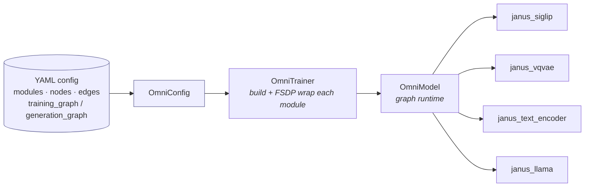
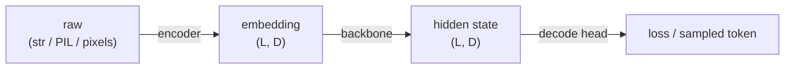
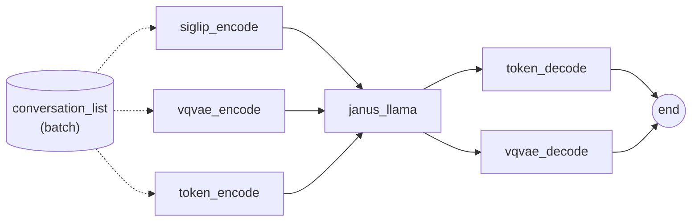
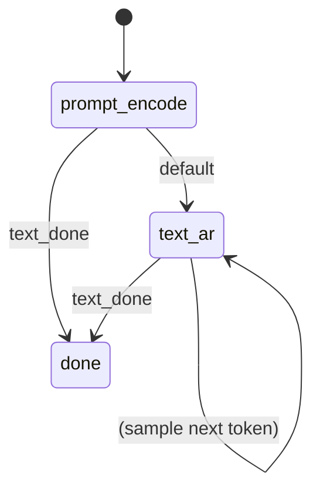
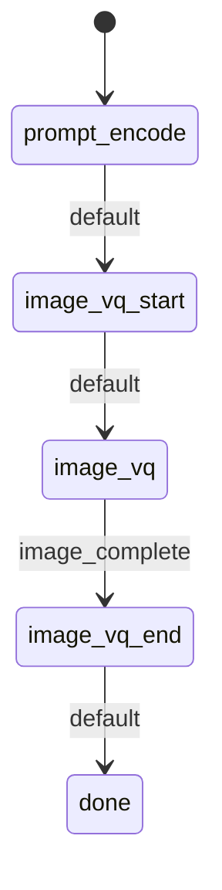

# SeedOmni V2 — Architecture & Developer Guide

> A ~10-minute tour of the composable, graph-driven multi-modal model in
> `veomni/models/seed_omni/`. By the end you will know how the modules fit
> together, what data flows between them, how Janus trains and generates, and
> how to add a new model.

---

## 1. What SeedOmni V2 is

SeedOmni V2 is a **model-agnostic runtime** for multi-modal models. The
framework (`OmniModel`) knows *nothing* about Janus, vision towers, VQ codecs,
or boundary tokens. It only knows how to:

1. Build a set of independent sub-models (each combines train/infer mixins with
   a real HF model class).
2. Walk a **graph** declared in YAML, calling one sub-model per node.
3. Pass a single shared data object — the **conversation list** — through
   those calls, and sum up a single `_loss` per node during training.

Everything model-specific (how to embed a SigLIP image, when to emit a
`<begin_of_image>` token, how to decode a VQ grid) lives inside the modules.
Swap the modules + the YAML graph and you have a different model — no
framework changes.



---

## 2. The four building blocks

### 2.1 Train/Infer mixins (`module.py`)

Every sub-model multi-inherits from `TrainModuleMixin` +
`InferModuleMixin` **and** a real HuggingFace / diffusers model:

```python
class JanusSiglip(TrainModuleMixin, InferModuleMixin, SiglipVisionModel): ...
class JanusLlama(TrainModuleMixin, InferModuleMixin, PreTrainedModel): ...
```

`module.py` still exports `OmniModule` as a compatibility alias
(`OmniModule = TrainModuleMixin + InferModuleMixin`), but new modules should
prefer explicit dual-mixin inheritance.

The mixins expose **optional hooks** with safe defaults:

| Hook | When | Purpose |
|------|------|---------|
| `forward(**kwargs)` | training | the node's main compute; may return one `_loss` |
| `pre_forward(method, **kwargs)` | training | prep inputs (read from conversation list) |
| `post_forward(method, **outputs)` | training | write results back onto conversation list |
| `generate(...)` / `generate_step` | inference | one FSM step (sample / embed) |
| `finalize(*, ctx)` | inference | flush buffered output if `max_new_tokens` hit |
| `freeze_model()` | build | freeze a parameter subset |
| `get_parallel_plan()` | build | per-module FSDP/SP plan |
| `get_assets()` | save | processors / tokenizers to checkpoint |
| `dummy_inputs(...)` | training | zero placeholders to keep FSDP aligned |

### 2.2 `ConversationItem` — the data carrier (`conversation.py`)

There are **no per-field data channels** between modules. Instead, a single
mutable list is threaded through every call. One element:

```python
@dataclass
class ConversationItem:
    type: str    # "text" | "image" | "output"
    value: Any   # raw content → embedding tensor → hidden state (mutated in place)
    role: str    # "user" | "assistant" | "dummy"
    meta: dict   # per-module baggage: labels, attention_mask, janus_vqvae_labels, ...
```

- Training carries a **batch**: `list[list[ConversationItem]]`.
- Inference carries **one request**: `list[ConversationItem]`.

**`value` has a lifecycle** — modules overwrite it as data flows downstream:



A `role="dummy"` item is a zero-tensor placeholder an encoder appends on a
micro-batch that lacks its modality (e.g. a text-only sample has no image). The
backbone skips dummy rows when packing but folds a `+ value.mean()*0.0` anchor
so FSDP gradient-sync stays aligned across ranks.

### 2.3 Two graph views (`graph.py`, `training_graph.py`, `generation_graph.py`)

The YAML declares two shared pools — **`nodes`** (`module.method` call-sites)
and **`edges`** (`{from, to}`) — and two views over them:

- **`TrainingGraph`** — a **DAG**. Active nodes are derived from the endpoints
  of `training_graph.edges`; a topological sort gives the forward order. Each
  active node runs **exactly once** per forward. **Edges are pure topology** —
  they declare order only, not data routing.
- **`GenerationGraph`** — a **finite-state machine**. Each `state.body` is a
  list of edges to run that step; `transitions` pick the next state by
  `module_signal` (a string a module writes into `ctx`) or `default`.

### 2.4 `OmniModel` — the runtime (`modeling_omni.py`)

Holds the sub-modules (as direct attributes, so param FQNs are
`<module>.<rest>`), the `TrainingGraph`, and the optional `GenerationGraph`.

**Loss protocol:** each module returns at most one scalar `_loss` (already
token-mean-reduced over its own micro-batches); `OmniModel.forward` simply sums
them. No central averaging — token counts stay correct across modules.

---

## 3. Training flow (Janus joint SFT)

The default Janus `training_graph` (`configs/seed_omni/janus_1.3b/train.yaml`):



What each node does to the shared carrier:

1. **`siglip_encode`** — replaces user `image` items' raw pixels with SigLIP
   patch embeddings.
2. **`vqvae_encode`** — replaces assistant `image` items with VQ embeddings and
   stashes `meta.janus_vqvae_labels`.
3. **`token_encode`** — applies the Janus chat template to `text` items,
   tokenises, runs word-token embedding (`wte`), and stores `meta.labels`.
4. **`janus_llama`** — concatenates every non-dummy item's embedding into one
   packed `bs=1` sequence, runs the LLaMA backbone (no `wte`, no `lm_head`),
   and writes the hidden state back onto each item's `value`.
5. **`token_decode`** / **`vqvae_decode`** — read hidden states + labels off
   the carrier and each return one `_loss`.

The runtime loop (simplified from `OmniModel.forward`):

```python
for node in training_graph.execution_order:
    module = getattr(self, training_graph.module_of(node))
    kwargs = training_graph.collect_inputs(node, ...)   # shallow copy of batch
    kwargs = module.pre_forward(method, **kwargs)       # read conversation_list
    out    = module(**kwargs)                            # through FSDP wrapper
    out    = module.post_forward(method, **out)          # write conversation_list back
    batch["conversation_list"] = out["conversation_list"]  # carrier flows on
    if "_loss" in out: losses[node] = out["_loss"]
total_loss = sum(losses.values())
```

**Dummy forward (training only):** every active node must run on every
micro-batch or FSDP all-reduce hangs. Missing a modality? The encoder runs its
`dummy_inputs()` zeros and appends a `role="dummy"` item; the backbone folds the
anchor term described in §2.2. Inference has no such constraint — modules may
`return {}` and the FSM skips the edge.

---

## 4. Inference flow (FSM)

`OmniModel.generate(request, trace, generation_kwargs)` loops: run the current
state's body, drain any one-shot `generated` payloads, then take the first
matching transition. It stops at the `done` state or the
`generation_kwargs["max_new_tokens"]` cap (default 2048). It does **not** reset
the FSM — `OmniInferencer` calls `reset()` at request boundaries.

The same node pool backs three different FSMs, selected by
`model.omni_infer_type` (which overlays one `infer_*.yaml`):

**Understanding — `infer_und.yaml` (I2T / VQA):**



The `token_generate` node (the text encoder's `generate`) samples a token each
step and emits the `text_done` signal when it hits `</s>`.

**Generation — `infer_gen.yaml` (T2I):**



`image_vq_start` emits `<begin_of_image>`; `image_vq` loops backbone →
`vqvae.generate` for 576 VQ steps and emits `image_complete` when the grid is
full; `image_vq_end` emits `<end_of_image>`.

**Interleave — `infer_interleave.yaml`:** the model decides mid-stream whether
to open an image span (`start_image_gen` on a sampled `<boi>`), so `text_ar`
and `image_vq` transition into each other instead of straight to `done`.

---

## 5. The Janus modules

| Module (`model_type`) | HF base | Role |
|-----------------------|---------|------|
| `janus_siglip` | `SiglipVisionModel` | encode **understanding** images → patch embeds |
| `janus_vqvae` | `JanusVQVAE` + gen heads | encode **generation** images / decode VQ grid → pixels |
| `janus_text_encoder` | LLaMA `wte` + `lm_head` | chat template, token embed, LM head, `<boi>`/`<eoi>` emit |
| `janus_llama` | patched `LlamaModel` | backbone (no `wte`, no `lm_head`) |

Why split the LLM into `text_encoder` + `llama`? Word-token embedding and the
LM head are vocabulary-dependent — they mirror the discrete-image VQ codec on
the text side. Splitting them lets the graph treat text and image
symmetrically (both have `encode` / `decode` nodes), and lets Janus own the
boundary-token logic without the framework knowing about it.

---

## 6. Adding a new model

Use the `/seedomni-v2` skill for the full checklist. The shape of the work:

1. **Split the checkpoint.** Write `scripts/multimodal/convert_model/split_<model>.py`
   to break the upstream HF checkpoint into one self-contained subfolder per
   module (`config.json` + `model.safetensors` + any processor/tokenizer JSON).

2. **Write each module triplet** under
   `veomni/models/seed_omni/modules/<family>/<sub>/`:
   - `configuration.py` — a `PretrainedConfig` with a unique `model_type`.
   - `modeling.py` — `class X(TrainModuleMixin, InferModuleMixin, <HFBase>)`;
     implement the hooks you need (at minimum `forward` for a training node,
     `pre_forward` / `post_forward` to read/write the conversation list,
     `generate` for an inference node).
   - `processing.py` (optional) — if the module consumes raw images / audio.
   - `modulemixin.py` (optional, recommended for large modules) — put
     module-specific `XTrainModuleMixin` / `XInferModuleMixin` here, and keep
     `modeling.py` focused on model structure/init. `janus/vqvae` is the
     reference pattern.

   Reuse cross-family helpers in `modules/base/` where possible.

3. **Register** the classes in `modules/__init__.py`
   (`OMNI_CONFIG_REGISTRY` / `OMNI_MODEL_REGISTRY` / `OMNI_PROCESSOR_REGISTRY`),
   keyed by `model_type`. The trainer resolves a module by reading
   `config.json` → `model_type` → registry.

4. **Write the YAML** (`configs/seed_omni/<model>/`):
   - `train.yaml` — `modules`, `nodes`, `edges`, and the `training_graph` edge
     list. Remember: edges only declare order; modules move data via the
     conversation list.
   - `infer_*.yaml` — one `generation_graph` (FSM) per scenario, overlaying the
     training vocabulary.

5. **Honour the contracts:**
   - Return at most one scalar `_loss` per node (token-mean reduced).
   - Read inputs in `pre_forward`, write results in `post_forward`, always
     returning `{"conversation_list": ...}` so the carrier flows on.
   - Implement `dummy_inputs()` for any encoder whose modality can be absent
     from a micro-batch.
   - For inference modules, emit `module_signal` strings to drive FSM
     transitions, and clear private buffers in `reset_inference_state()` /
     `finalize()`.

6. **Validate:** render the graph with `TrainingGraph.to_mermaid()`, run the
   unit tests in `tests/seed_omni/`, then the end-to-end scripts
   (`test_und.sh` / `test_gen.sh` / `test_train.sh`).

---

## 7. File map

| Path | Responsibility |
|------|----------------|
| `module.py` | generic `TrainModuleMixin` / `InferModuleMixin` + compatibility `OmniModule` |
| `conversation.py` | `ConversationItem` + carrier helpers |
| `graph.py` | shared `NodeDef` / `EdgeDef` / `END` |
| `training_graph.py` | DAG view (topological forward order) |
| `generation_graph.py` | FSM view (states / transitions / signals) |
| `configuration_omni.py` | parse + merge the YAML into `OmniConfig` |
| `modeling_omni.py` | `OmniModel` runtime (train DAG + infer FSM + loss sum) |
| `checkpoint_callback.py` | per-module checkpoint layout |
| `modules/<family>/<sub>/` | per-module config / modeling / processing (optional `modulemixin.py`) |
| `veomni/trainer/omni_trainer.py` | build + FSDP-wrap modules, drive the loop |
| `veomni/trainer/omni_inferencer.py` | request loop, `reset` + `finalize` |
| `configs/seed_omni/<model>/` | `train.yaml` + `infer_*.yaml` |
```
