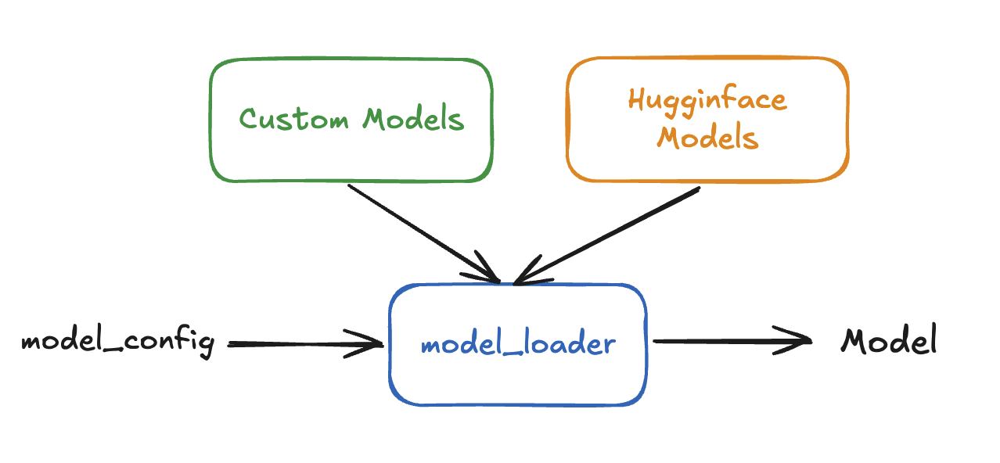

# Adding a New Model to VeOmni

## 📚 Overview
In this tutorial, we will guide you through the process of adding a new model to VeOmni. We use a registry-based system to manage different model implementations.

VeOmni uses a model registry system that allows you to:
1. Support both HuggingFace models and their custom implementations
2. Register your custom model implementation
3. Automatically load the appropriate model based on the configuration

## 🔍 Model Registry System

To enable users to quickly train models from HuggingFace and flexibly train custom models, VeOmni adopts a model registration system to support model loading and initialization. This design is inspired by [vLLM](https://github.com/vllm-project/vllm) and [SGLang](https://github.com/sgl-project/sglang). An overall architecture diagram is shown below.

<div style="text-align: center;">
    
</div>

Users can directly load models from HuggingFace and start the training process by specifying the model name or model path. Additionally, they can implement their own custom models or enhance existing HuggingFace models with advanced features such as sequence parallelism or expert parallelism. Custom modeling can be implemented in one of the supported modeling paths:

- `veomni/models_kernel/transformers/`
- `veomni/models_kernel/diffusers/`


## 🛠️ Add Your Own Model

### 1. Create Your Model Implementation

Create a model package under `veomni/models_kernel/transformers/`. Declare
model changes in a patchgen config and generate the modeling file; do not edit
the generated output directly.


### 2. Register Your Model

See the [new-model guide](../usage/support_new_models/guide_and_checklist.md) for more details.


### 3. Model Configuration

Your model should have a corresponding configuration class that inherits from `PretrainedConfig`. The configuration should include:

```python
class YourCustomConfig(PretrainedConfig):
    model_type = "your_custom_model"
    architectures = ["YourCustomModel"]  # This should match your model class name
```

You can also use the model configuration from HuggingFace if you are only modifying the modeling component of an existing HuggingFace model.


Register the generated model class from the package's `__init__.py`:

```python
# veomni/models_kernel/transformers/your_custom_model/__init__.py
from veomni.models_kernel.registry import MODEL_CONFIG_REGISTRY, MODELING_REGISTRY

from .configuration_your_custom_model import YourCustomConfig


@MODEL_CONFIG_REGISTRY.register("your_custom_model")
def register_config():
    return YourCustomConfig


@MODELING_REGISTRY.register("your_custom_model")
def register_modeling(architecture: str):
    from .generated.patched_modeling_your_custom_model_gpu import YourCustomModel

    return YourCustomModel
```

Import the package from `veomni/models_kernel/transformers/__init__.py` so the
decorators run at package import time. See the
[new-model guide](../usage/support_new_models/guide_and_checklist.md) for the
patchgen config and validation workflow.

### 4. Loading Your Model

The framework will automatically handle model loading based on the configuration. You can load your model using:

```python
from veomni.models_kernel import build_foundation_model

model = build_foundation_model(
    config_path=args.model.config_path,
    weights_path=args.model.model_path,
    kernels_implementation=args.model.ops_implementation,
    # Add other optional keyword arguments as needed.
)
```

VeOmni supports various initialization methods:

- Empty initialization
- Loading from weights file
- Meta device initialization
- Support for different devices (CUDA, CPU, NPU)
