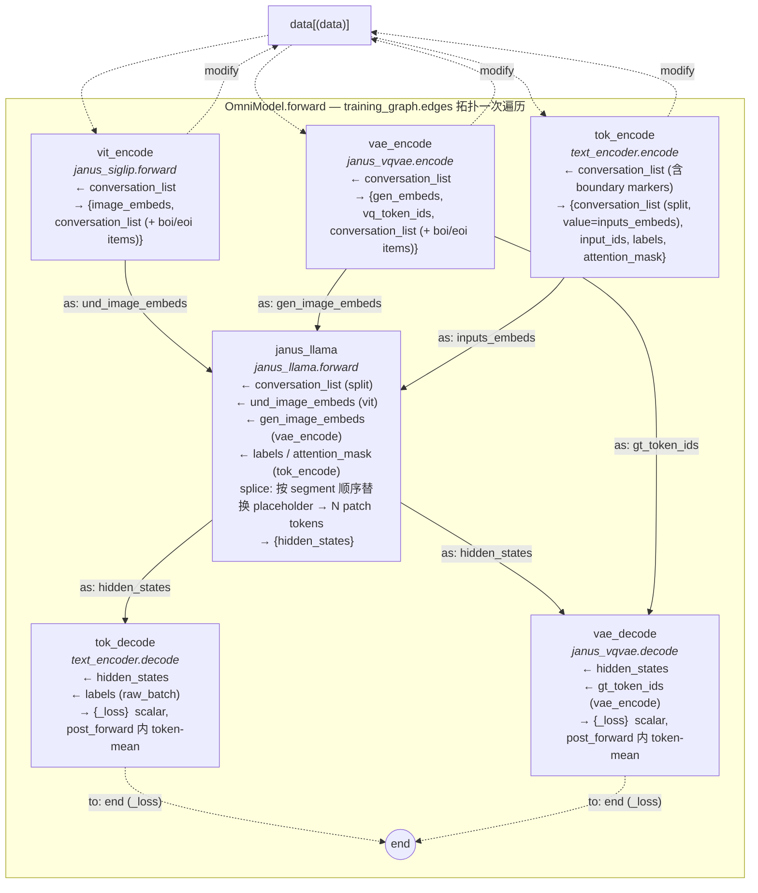
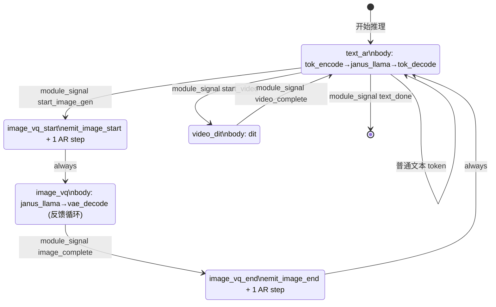

# SeedOmni V2 架构设计

> **Schema note (current)**: SeedOmni V2 不再使用独立的 `nodes:` / `edges:` 池。`training_graph`（训练）与 `generation_graph.states.<name>.body`（推理）都是**扁平的 edge 列表**，每个 edge 的端点直接写成 `module[.method]` 字符串——裸 module 在训练默认 `.forward`、推理默认 `.generate`；带点的 `module.method` 原样使用。node 的身份就是其规范化的 `"<module>.<method>"`。本文档下方残留的 `nodes:` / `edges:` 池示例与 `output:` / `as:` 路由字段均已废弃，请以扁平 edge 列表 + `module[.method]` 端点为准（edge 仅声明拓扑顺序，数据通过共享 `conversation_list` / `ctx` 流动）。
>
> SeedOmni V2 (`veomni/models/seed_omni/`) 重写——把固定的 `Encoder → Foundation → Decoder` 三元结构换成**显式图声明**的模块化系统。`ModuleMixin` 是共享 mixin 基类；每个子模型再写 `XxxModuleMixin(ModuleMixin)`（`modulemixin.py`）并与 HuggingFace `PreTrainedModel` 多继承（`modeling.py`）。`training_graph` 是一条条 edge（`{from, to}`，端点为 `module[.method]`），node 由 endpoints 自动并出；同一 module 可挂多个 method。每个 node 必有出边——指向另一个 node 或保留关键字 `end`（虚拟终点），保证图无孤岛、无环。训练执行序由 topo sort 推导（可视化时画出 forward queue + `data` 伪节点）；推理由 FSM 驱动，每个 state 的 `body` 也是一条条内联 edge，可无限循环（text→image→text→image→...）。**数据完全 model-agnostic**：raw_batch 起点只有 `conversation_list`（list of dict，含 type / value / role / loss_mask），chat template / tokenize / image processor / boundary marker 注入全部由对应 module 在 forward 阶段自管——同一份数据可同时喂给任意 ug 模型；每个 module 的 `forward(**kwargs) -> Dict` 返回 dict 被框架按 edge.output 立刻写回 raw_batch（data 100% 走 raw_batch、module 之间不互相返回值）；collator helper / SP slice 由各 module 自己在 pre_forward 中按需调用（ViT 切 image batch、text encoder 切 sequence，各管各的）。loss 按 `_loss` 后缀隐式收集——每个 module 一次 forward 内部把所有 micro-batch 跑完，`post_forward` 自己做 token-level mean，OmniModel 顶层只把各 module 的标量 `_loss` 加起来。并行采用全局单一 `ParallelState`，OmniModel 顶层单次 `build_parallelize_model` 包装，`ParallelPlan` 由子模块递归聚合。生命周期上 weights 走 `build_foundation_model` + `build_parallelize_model`（多模块 path dict）、save 由各 module-trainer 的 `OmniModuleHfCallback` / `OmniModuleLoraCallback` 写到各 subfolder（config + 可选 processor/tokenizer 资产）。**配置拆分**：`base.yaml`（`model.model_path` + `model.modules` + `model.train_graph` + 顶层 `accelerator` + `infer` 块）→ `OmniConfig.from_omni_args` 合并 train/infer module 覆盖并解析相对 `model.model_path`。**FSM 转移**：只有 `module_signal` 与 `default` 两种 condition；text 侧由 `JanusTextEncoder` 通过 `module._tokenizer` 解析后发出 `start_image_gen` / `text_done` 等信号。**不保留 V1 兼容**。

## 总纲（不变量）

1. **`module` ≠ `node` ≠ `edge`**：实例 / 调用 / 数据流，三层各司其职。
2. **一个 module instance 可挂任意多个 node**；同 method 也可承担多个角色（按 kwargs 自分派）。
3. **训练 = DAG（一次拓扑遍历），推理 = FSM（含环、按状态转移循环）**。
4. **永远不自动推导"图结构本身"**：`edges` 必须 config 显式给出。但**执行顺序可由 topo sort 从 edges 推导**——可视化训练图时画出 forward queue；FSM 因含环不可推导执行序，只可视化状态转移图。

## 背景与问题

当前 [`modeling_seed_omni.py`](veomni/models/seed_omni/modeling_seed_omni.py) 采用固定的三元结构 `Encoder → Foundation → Decoder`，存在以下根本性局限：

- **结构写死**：`encoder`、`foundation`、`decoder` 是硬编码字段，无法表达 Qwen-Omni 的 thinker+talker（两个 LLM 串联）、BAGEL 的 AR+DiT 联合等架构
- **同模态只能有一个 encoder**：`self.image_encoder` 是单一字段，无法让理解图走 ViT、生成图走 VAE
- **SP 在外层**：`gather_seq_scatter_heads` 写在 `SeedOmniEncoderModel.forward()` 里，不随模块封装
- **ParallelPlan 不可组合**：`get_parallel_plan()` 只委托 foundation，encoder/decoder 即使本身是 MoE/带 embed 并行也无法把 plan 透出来 → 多模态 MoE（例如 ar_llm 是 MoE + vision_vae 也想加自己的 EP plan）只能改顶层模型逻辑

---

## 设计目标

| 目标 | 说明 |
|------|------|
| 完全模块化 | 所有组件以 `*ModuleMixin` + HF 模型多继承形态平等存在；只改 YAML（path / nodes / edges）即可替换任意模块 |
| 支持 AR + DiT | 同一训练框架内同时支持自回归和扩散两种生成范式 |
| 并行可组合 | 每个子模块可在完整 world 上跑**自己的**并行拓扑（异构 FSDP2 / FSDP2+ExtraParallel(`emb`/`ep`) / DDP）：拓扑与全局一致则复用全局 `ParallelState`，不同则自建独立 mesh；ParallelPlan 由各子模块 `get_parallel_plan()` 贡献 ExtraParallel 切分 |
| 训推一致（RL） | training `forward()` 和 inference `generate_step()` 共用同一底层实现 |
| 多模态对话驱动 | 同模态数据根据 conversation role 路由到不同模块（understanding vs. generation） |
| 推理循环生成 | 推理时可以反复循环（text→image→text→image），不是 DAG |
| 拆模型 / 多 path 加载 | 拆模型脚本输出 family 子模型目录，trainer 多 path 加载，per-module callback 各自存 subfolder |

---

Related Models
Lance https://arxiv.org/pdf/2605.18678
Cola-dlm https://hongcanguo.github.io/Cola-DLM/
Interaction Models https://thinkingmachines.ai/blog/interaction-models/
Cheers https://github.com/AI9Stars/Cheers
SenseNova-U1 https://github.com/OpenSenseNova/SenseNova-U1
Tuna-2 https://github.com/facebookresearch/tuna-2

---

## 核心设计

### 为什么训练是 DAG、推理不是

**训练**（teacher forcing）：AR LLM 一次 forward 处理完整序列，所有图像 output 位置已知且固定，其他模块在固定位置提取 hidden states 计算 loss。整个计算图**一次拓扑遍历**即可完成，是 DAG。

**推理**：token-by-token 驱动，生成一段文字后触发图像模块，图像模块完成后控制权归还文字模块，可无限循环（`text → image → text → image → ...`）。这**不是 DAG，是有限状态机（FSM）**。

两套执行语义分开实现：`OmniModel.forward()` 跑 DAG 遍历，`OmniModel.generate()` 跑状态机。

### 核心思路：nodes（call-site）+ edges（数据依赖）+ end（虚拟终点）

去掉 encoder / foundation / decoder 的固定角色，用两个平级的池子 + 一个保留关键字描述整张图：

- **`nodes:`** 图节点池——每个 entry 是一个 call-site，对应一次 `module.method` 调用。同一 module 可以挂多个 node（如 VAE 的 `encode` 与 `decode`，共享一份参数但是图上两个独立节点）。不指定 `method` 时**训练默认 `forward`、推理默认 `generate_step`**。
- **`edges:`** 图边池——每条边把上游 node 输出 dict 里的某个 key 路由到下游 node 的某个 kwarg：`{from: A, output: k, to: B, as: m}`。
- **`end`：保留关键字**——所有 sink（如 `*_loss` 产出位）必须有一条 `to: end` 的边。**任何 node 至少有一条出边**，无孤岛；自环 / 任何环严格禁止（自环= for-loop，应在模块内部实现）。

**nodes 与 edges 是独立命名空间**：FSM body 只查 edges 池、edges 的 `from`/`to` 只查 nodes 池（外加 `end` 关键字），名字可以重名互不冲突。

激活子集 `training_graph` 只列 `edges`，nodes 由 edge endpoints 自动并出；执行顺序由 edges 拓扑序自动推导（**这是唯一的"自动"**，结构本身仍要显式给出）。`generation_graph.states.<name>.body` 同样只列 edges。

```
modules pool             nodes pool                                edges pool
─────────────────────    ─────────────────────────────────         ────────────────────────────────────────────────
janus_siglip      ──→    vit_encode   → siglip.forward             vit_to_llama:        vit_encode → janus_llama
janus_vqvae       ──→    vae_encode   → vqvae.encode               vae_enc_to_llama:    vae_encode → janus_llama
janus_text_encoder  ──→    vae_decode   → vqvae.decode               tok_enc_to_llama:    tok_encode → janus_llama
janus_llama       ──→    tok_encode   → text_encoder.encode          llama_to_tok_decode: janus_llama → tok_decode
                         tok_decode   → text_encoder.decode          llama_to_vae_decode: janus_llama → vae_decode
                         janus_llama  → ar_llm.forward             tok_decode_to_end:   tok_decode → end  (lm_loss)
                                                                   vae_decode_to_end:   vae_decode → end  (gen_loss)
                                                                   ↑ to: end 是 sink 锚（拓扑标记）；loss 仍按 _loss 后缀收集
```

---

## 核心抽象

### 1. `ModuleMixin`：mixin 形式的钩子集

`ModuleMixin`（`module.py`）提供共享默认实现；每个子模型在 `modulemixin.py` 里写 `XxxModuleMixin(ModuleMixin)`，在 `modeling.py` 里写 `class Xxx(XxxModuleMixin, PreTrainedModel)`。核心 `forward` 留在 `modeling.py`；图钩子（`pre_forward` / `post_forward` / `generate` / `init_omni_state`）留在 `modulemixin.py`。

**初始化链**（不要在 mixin 里 override `post_init`）：

```python
class JanusSiglip(JanusSiglipModuleMixin, PreTrainedModel):
    def __init__(self, config):
        super().__init__(config)      # → PreTrainedModel + init_omni_state()
        ... 构建子模块 ...
        self.post_init()              # HF 权重初始化 / tied keys / parallel plan
```

**主要钩子**（除训练图节点外均可选）：

| 钩子 | 用途 |
|------|------|
| `init_omni_state()` | 设置 `_conversation_carrier`、KV / VQ 缓冲区等运行时状态 |
| `pre_forward(method, **kwargs)` | 从 `conversation_list` 抽输入；FSDP dummy；SP slice |
| `forward(**kwargs)` | 训练计算；可返回标量 `_loss` |
| `post_forward(method, **outputs)` | 写回 `conversation_list`；`loss` → `_loss` |
| `generate` / `generate_step` | FSM 单步推理 |
| `dummy_inputs` | 缺模态时的零张量（训练 FSDP 对齐） |
| `reset_*_inference_state` / `finalize` | 推理生命周期 |
| `get_parallel_plan` / `get_assets` | 并行与 checkpoint 资产 |

模块**实际继承形态**：

```python
class JanusLlama(JanusLlamaModuleMixin, PreTrainedModel):
    """纯 backbone；wte/lm_head 在 janus_text_encoder。"""

class JanusVqvae(JanusVqvaeModuleMixin, PreTrainedModel):
    """VQ codec：encode / decode 两个 graph method；forward 在 modeling.py。"""

class JanusTextEncoder(JanusTextEncoderModuleMixin, TextEncoder):
    """继承 base TextEncoder；Janus chat template + FSM module_signal。"""
```

- `model_type` 写在 `configuration.py`（HF `PretrainedConfig.model_type`），**不写在 YAML**——train YAML 的 `modules.*.model.model_path` 指向子目录，`read_model_type` 读 `config.json` 后在 `OMNI_MODEL_REGISTRY` 解析类。
- Tokenizer / processor 是**模块私有资产**（如 `janus_text_encoder/tokenizer/`），由 `OmniModuleTrainer` 在 build 时挂到 `module._tokenizer` / `module._processor`。

### 2. `OmniConfig`：modules + nodes + edges + 训练子集 + 推理状态机

**拆分 YAML 分工**（omni 配置；canonical 示例：`configs/seed_omni/Janus/janus_1.3b/`）：

| 文件 | 职责 |
|------|------|
| **Launcher**（`base.yaml`） | VeOmni 训练 / 推理共用入口：`model.model_path`（split checkpoint 根）、`model.modules` / `model.train_graph`、顶层 `accelerator`（v2 把 accelerator 从 `train` 提到与 `model`/`data`/`train` 平级）、`train.*` / `data.*`，以及 `infer` 块（`infer.modules` / `infer.infer_graph`（scenario → infer YAML）/ `infer.infer_type` / `infer.generation_kwargs` / 可选 `infer.model_path`） |
| **Train modules**（`modules_train.yaml`） | 每个 module 的训练覆盖（`model` / `train` / `accelerator`）。``modules.*.model.model_path`` 写**相对**子目录名（如 `janus_siglip`）或绝对路径 |
| **Train graph**（`graph_train.yaml`） | `training_graph`（扁平 edge 列表，端点为 `module[.method]`） |
| **Infer modules**（`modules_infer.yaml`，可选） | 每个 module 的推理覆盖，与 train modules **按模块名 deep-merge**；默认每个 module 走 eager 加载 |
| **Infer graph**（`graph_infer_*.yaml`） | 每个场景一个 `generation_graph`，由 `infer.infer_graph` 映射 |

运行时加载（训练 / 推理均通过 `OmniConfig.from_omni_args`，由 `OmniArguments.load_omni_config()` / `load_omni_infer_config()` 调用）：

```python
cfg = OmniConfig.from_omni_args(
    global_args=args._to_base_args(),    # OmniArguments -> VeOmniArguments base
    model_path="/tmp/janus_1.3b_split",
    modules="configs/seed_omni/Janus/janus_1.3b/modules_train.yaml",
    train_graph="configs/seed_omni/Janus/janus_1.3b/graph_train.yaml",
    # 推理时改传 infer_modules / infer_graph / generation_kwargs
)
```

`from_omni_args` 把 train / infer 的 module 覆盖合并到 launcher `global_args` 上，并把相对 `model.model_path` join 到 `model_path` 根目录；module 块顶层的 `accelerator` 会被 lift 到 `train.accelerator`。

图可视化（一条命令出四张图）：

```bash
python scripts/visualize_omni_graph.py configs/seed_omni/Janus/janus_1.3b/base.yaml
# → graphs/janus_1.3b_base/{training,infer_gen,infer_und,infer_interleave}.mmd
```

顶层 section 各司其职：

| Section | 职责 |
|---|---|
| `modules` | 模型实例池：name → launcher args 深合并后的 per-module 配置块（含 `model.model_path`）。**不写 model_type** |
| `training_graph` | 扁平 edge 列表（`{from, to}`，端点为 `module[.method]` 字符串）；`TrainingGraph` 据 endpoints 自动并出 nodes、按 topo 排序（DAG 视图）。无独立 `nodes` / `edges` 池 |
| `generation_graph` | 推理 FSM；`states.<name>.body` 是一条条内联 `{from, to}` edge（端点 `module[.method]`，裸 module 默认 `.generate`）（FSM 视图） |

同一个 module 可以挂多个 node，每次以不同 method 被调用，但**模型实例不拆分**——`janus_vqvae.encode` 和 `janus_vqvae.decode` 是图上两个独立节点，共享一个 `JanusVQDecoder` 实例；同一个 method 也可以承担训练 + 推理两条 input pathway，靠 kwargs 自分派（`vae_decode` 是这种统一 head 的典型例子）。

> **`text_encoder`：model-specific 的 chat-template + wte + lm_head 模块。** 这一层是 V2 数据流的核心枢纽：
> - **Tokenizer 资产** 住在 ``modules/<family>/text_encoder/tokenizer/``；build 时挂到 ``module._tokenizer``，special-token id **不落 config**；
> - 在 `forward.encode` 中把 raw `conversation_list` 拼接成 `input_ids` / `inputs_embeds` / `labels` / `attention_mask`（含 chat template / system prompt / EOS / boi-eoi marker token）；
> - 在 `forward.decode` 中把 hidden_states 投影回 vocab（lm_head；tied weights 时 encode/decode 共享同一份矩阵）；推理时采样后写 **FSM ``module_signal``**（如 Janus 的 `start_image_gen` / `text_done`），YAML 不硬编码 token id。
>
> Janus 子类额外提供 ``emit_image_start`` / ``emit_image_end`` 两个 call-site（推理 bridge state 用），边界 token id 由 ``module._tokenizer`` 解析。
>
> 跟 V1 的"通用 wte + lm_head"不同，V2 的 `text_encoder` 是 **model-specific**——每个 family 一份 `modules/<family>/text_encoder/`。``scripts/convert_model.py``（family 实现见 ``modules/janus/convert_model.py``）把 ``embed_tokens`` + ``lm_head`` 拆到 ``text_encoder/`` 子目录，**全局 tokenizer 写到 output 根**。

```yaml
# ── 模块注册表（不写 model_type，HF AutoConfig 自动读）──────────────
# model.model_path 相对 launcher 的 model.model_path
modules:
  janus_siglip:       {model: {model_path: janus_siglip}}
  janus_vqvae:        {model: {model_path: janus_vqvae}}
  janus_llama:        {model: {model_path: janus_llama}}
  janus_text_encoder: {model: {model_path: janus_text_encoder}}

# ── 图节点池（每个 entry 是一次 module.method 调用）─────────────────
#
# {module: X}              → 训练用 X.forward / 推理用 X.generate_step
# {module: X.method}       → 训推都用 X.method（dotted 简写）
# {module: X, method: m}   → 同上（等价展开）
nodes:
  vit_encode:  {module: janus_siglip}                          # conversation_list[image*] → image_embeds + 注入 boi/eoi item
  vae_encode:  {module: janus_vqvae,      method: encode}      # conversation_list[vq_image*] → gen_embeds + vq_token_ids
  vae_decode:  {module: janus_vqvae,      method: decode}      # 统一 VQ head（见下方说明）
  tok_encode:  {module: janus_text_encoder, method: encode}      # conversation_list → split conversation_list (value=inputs_embeds) + flat input_ids/labels/attention_mask
  tok_decode:  {module: janus_text_encoder, method: decode}      # 统一 text head（见下方说明）
  janus_llama: {module: janus_llama}                           # inputs_embeds + image embeds → splice → hidden_states

# ── 图边池（数据依赖；to: end 表示 sink）────────────────────────────
#
# {from: A, output: k, to: B, as: m}
#   声明 A 的返回 dict 中 k 字段是 B 的依赖；A 一旦执行，k 被框架按 as=m
#   写回 raw_batch（如果 as 缺省则按 output=k 写回）；B 执行时从 raw_batch
#   按自己的 input keys 取。raw_batch 全局透明，edge 是依赖契约 + 拓扑
#   标记，不是数据通道。
# {from: A, output: k, to: end}
#   sink 边——保证图无孤岛；loss 数值仍由 *_loss 后缀隐式收集。
edges:
  # ── 训练数据边
  vit_to_llama:       {from: vit_encode,  output: image_embeds,  to: janus_llama, as: und_image_embeds}
  vae_enc_to_llama:   {from: vae_encode,  output: gen_embeds,    to: janus_llama, as: gen_image_embeds}
  tok_enc_to_llama:   {from: tok_encode,  output: inputs_embeds, to: janus_llama, as: inputs_embeds}
  llama_to_tok_decode:{from: janus_llama, output: hidden_states, to: tok_decode,  as: hidden_states}
  llama_to_vae_decode:{from: janus_llama, output: hidden_states, to: vae_decode,  as: hidden_states}
  vae_tok_to_decode:  {from: vae_encode,  output: vq_token_ids,  to: vae_decode,  as: gt_token_ids}

  # ── 训练 sink 边（to: end，保证无孤岛；loss 仍按 _loss 后缀收集）
  tok_decode_to_end:  {from: tok_decode,  output: lm_loss,       to: end}
  vae_decode_to_end:  {from: vae_decode,  output: gen_loss,      to: end}

  # ── 推理反馈边
  vae_decode_to_llama:{from: vae_decode,  output: embed,         to: janus_llama, as: inputs_embeds}
  # 推理时 decode 产出的 (B,1) step token 由框架 append 到 ctx["input_ids"]；
  # 下一步 tok_encode 在有 past_key_values 时只 embed input_ids[:, -1:]。

# ── 训练 DAG（只列 edges；nodes 由 endpoints 自动并出，topo 推执行序）
training_graph:
  edges:
    - vit_to_llama
    - vae_enc_to_llama
    - tok_enc_to_llama
    - llama_to_tok_decode
    - llama_to_vae_decode
    - vae_tok_to_decode
    - tok_decode_to_end
    - vae_decode_to_end

# ── 推理图（FSM）；state.body 也只列 edges
generation_graph:
  initial: text_ar
  states: { ... }                 # 见 "推理：生成图" 节
```

**只改 config 即可完成模块替换**：
- 把 `janus_llama` 的 `model.model_path` 指向其他 backbone 子目录 → 换了 backbone（`model_type` 自动从新 path 的 config.json 读）
- 把 `janus_siglip` 改成另一份 vision encoder ckpt → 换了 vision encoder
- 新增 `talker` 模块 + 对应 node/edges → 支持 Qwen-Omni 风格的双 LLM

### 3. `OmniModel`：两套执行语义

```python
class OmniModel(PreTrainedModel, GenerationMixin):
    modules_dict: nn.ModuleDict          # 模块实例（一份 module 一个 key）
    graph:        TrainingGraph          # 训练 DAG（节点 = call-site，边 = 数据依赖）
    fsm:          GenerationGraph        # 推理 FSM（基于同一对 nodes/edges 池）

    # ── 训练路径：node DAG 一次遍历 ──────────────────────────────────────
    def forward(self, **batch) -> OmniOutput:
        node_outputs = {}                  # 索引 = node 名
        losses = {}
        for n in self.graph.execution_order:            # 由 edges topo 推出的 node 序
            module_name = self.graph.module_of(n)
            method      = self.graph.method_of(n)       # 默认 forward
            module      = self.modules_dict[module_name]
            inputs      = self.graph.collect_inputs(n, node_outputs, batch)
            # 一次调用内部把本 step 的所有 micro-batch 跑完：模块 forward
            # 自己迭代 micro-batches → 累加 token-sum loss / 累加 token_count →
            # post_forward 里做一次 token-level mean，吐出标量 `*_loss`
            if method == "forward":
                outputs = module(**inputs)              # 走 FSDP 包装层
            else:
                outputs = getattr(_unwrap(module), method)(**inputs)  # 直调 raw module
            node_outputs[n] = outputs
            # _loss 后缀隐式收集；此时每个 _loss 已经是 mean 后的标量
            losses |= {f"{n}/{k}": v for k, v in outputs.items() if k.endswith("_loss")}
        # 顶层只把各 module 已 mean 的标量 loss 求和（无须再加权）
        total_loss = sum(losses.values()) if losses else None
        return OmniOutput(
            losses=losses,
            total_loss=total_loss,
            **{f"{n}_out": o for n, o in node_outputs.items()},
        )

    # ── 推理路径：状态机分发 ────────────────────────────────────────────
    def prepare_inputs_for_generation(self, input_ids, **kwargs):
        return self._fsm.step(input_ids, self.modules_dict, **kwargs)

    # ── ParallelPlan 递归聚合（供顶层 build_parallelize_model 使用）─────
    # 注意：sub-modules 直接挂为 OmniModel 顶层 attribute（不通过 ModuleDict
    # 中介，D2.2 已落地），所以 self.named_parameters() 看到的 fqn 是
    # <name>.<rest>，无中间 prefix。`modules_dict` 是 property dict view，
    # 用于向后兼容老 callsite。
    def get_parallel_plan(self) -> ParallelPlan | None:
        merged: dict[str, dict[str, Shard]] = {}
        for name in self._module_names:
            mod = getattr(self, name)
            plan = mod.get_parallel_plan() if hasattr(mod, "get_parallel_plan") else None
            if plan is None:
                continue
            plan.update_prefix(name)                      # 加 <name>. 前缀
            for para, sub_plan in plan.extra_parallel_plan.items():
                merged.setdefault(para, {}).update(sub_plan)
        return ParallelPlan(merged) if merged else None
```

**Loss 协议（单键 `_loss`）**：每个 module 一次 `forward` 内部**自己遍历所有 micro-batch**——所有 micro-batch 跑完 → 在 `post_forward` 内部按 token-sum / token-count 做 mean → 吐出标量 `<name>_loss`（已经是正确的 token-level mean）。OmniModel 顶层只是把各 module 的标量 loss 加起来，不需要 token count 元数据。

为什么在 module 内部 loop micro-batch 而不是外层：
- **正确性**：不同 micro-batch 的 image token 数不同时，必须先 sum loss / sum tokens 再 mean——这是 token-level mean。如果外层每个 micro-batch 调一次 module、各自吐 mean，再外层做 batch-mean，会得到 **batch-weighted** 而非 **token-weighted** 的错误结果。
- **简洁性**：单键 `_loss` 协议足够；无需 `_loss_sum + _loss_token_count` 双键；OmniModel 不感知 token 数。
- **执行**：依赖每个 module 自己实现 `pre_forward` / `forward` 中的 micro-batch 循环（即"一个 module 一次性跑完所有 micro-batch"），相当于把 trainer 现有 `mean_global_loss`（参考 [`base.py:530-532`](veomni/trainer/base.py)）的语义内化到模块。

---

## 训练数据流

训练时 teacher forcing，AR LLM 一次 forward 处理完整序列，整体是个 node DAG。每个 node 跑一遍 `forward`：返回 dict 被框架立刻按 edge.output 写回 raw_batch；下游 module 从同一 raw_batch 按自己的 input keys 取。同一 module 可以挂多个 node，分别调不同 method。



**Forward queue 由 topo sort 自动推导**——`scripts/visualize_omni_graph.py`（传入 launcher YAML）会基于 `training_graph.edges` 跑 Kahn topo sort，并画 **`data[(data)]` 伪节点**指向所有 source node（表示 kwargs 来自共享 batch dict）。注意 **`tok_encode` 必须等 `vit_encode` / `vae_encode` 完成**——它们对 `conversation_list` 的修改（插入 boi/eoi marker item）是 `tok_encode` 拼接 chat template 时的必要前置：

```
forward queue:
  1. vit_encode    (no deps; reads conversation_list, mutates it with boi/eoi)
  2. vae_encode    (no deps; reads conversation_list, mutates it with boi/eoi)
  3. tok_encode    (waits: vit_encode, vae_encode; reads mutated conversation_list)
  4. janus_llama   (waits: vit_encode, vae_encode, tok_encode)
  5. tok_decode    (waits: janus_llama)
  6. vae_decode    (waits: janus_llama, vae_encode)
  → end            (sink)
```

> 注：vit_encode / vae_encode 之间互不依赖（都只读 conversation_list 的不同 item type），它们对 conversation_list 的修改在不同位置（`image` item 处 vs `vq_image` item 处），插入操作满足交换律。框架不强求两者的相对顺序，但相对 `tok_encode` 必须都在它之前。

无环要求保证 topo sort 可解；任何环（含自环）会在 `TrainingGraph` 构造时直接报错。

**关于 janus_vqvae 的双角色——靠两个 node 表达**：

- `vae_encode` (`janus_vqvae.encode`)：吃 `gen_image_patches`，吐 `gen_embeds` 喂给 `janus_llama`。同时把 `vq_token_ids` 通过 `vae_tok_to_decode` 边送给下游做 ground truth。
- `vae_decode` (`janus_vqvae.decode`)：**统一 VQ head**——同一个 node 同时承担训练 loss 和推理反馈：
  - 训练：吃 `janus_llama.hidden_states` 和 `vae_encode.vq_token_ids` → 吐标量 `gen_loss`（走 `generation_head` + CE，`post_forward` 内已做 token-level mean）
  - 推理：吃 `janus_llama` 采样的 `token_id` → 吐 `embed`（走 `generation_embeddings` + `aligner`）
  - 两条路径互不干扰，按 kwargs 分派——HF 风格的 "input present → run, absent → skip / dummy"

两个 node 共享同一个 `JanusVQDecoder` 实例（同一份参数），但**图论上是两个独立节点**，分别在 `janus_llama` 之前和之后执行——没有环、没有"同模块跑两次"的特殊处理，就是标准 DAG。

**端点边 (`to: end`) 与 loss 收集**：

- `to: end` 边是**拓扑标记**：保证图无孤岛、可视化时所有 sink 都汇入 end 节点，**不携带数据语义**。
- loss 仍由 `*_loss` **后缀**隐式收集：OmniModel 扫描每个 module 的输出 dict，把 `_loss` 后缀键（已经是 module 内部 token-level mean 后的标量）收齐求和。
- 因此即便某个 sink 边漏写了，只要模块输出有 `_loss` 后缀键就还会被收集——但**强烈建议每个 sink 都补一条 `to: end` 边**，保证拓扑完整，避免可视化丢节点。

**Dummy forward**：node 一旦进了 `training_graph.edges`，**必跑一遍 forward**——data 全 0 / dummy 也必须走完整张图，避免 FSDP backward hang。模块自己在 `pre_forward` / `forward` 里写 dummy 路径（输入为 None / 全 0 时构造形状一致的 dummy tensor、loss 标量为 0），保证计算图静态一致。

**训推一致性**：训练用 teacher forcing（ground truth VQ embeds 直接送入 `janus_llama`），推理用 `image_vq` body loop（`janus_llama` 采样 vq_token_id → 同一个 `vae_decode` node 走推理路径产 embed → 下一步 input）。训练和推理共用同一份参数、同一个 node、同一个 `decode` 方法，仅 kwargs 不同。

### Q：同一个模块在数据流上出现两次怎么办？

典型场景：一个统一的 `image_codec`，输入图像过它得到 embeds 喂给 LLM，LLM 输出再过它得到生成图像。直觉上 `image_codec` 是一个节点被调用两次，但这会让图带环。

**做法：声明两个 node，共享一个 module 实例。**

```yaml
modules:
  image_codec: {model: {model_path: /path/to/image_codec}}
  ar_llm:      {model: {model_path: /path/to/ar_llm}}

nodes:
  img_encode: {module: image_codec, method: encode}     # 第一次调用：raw image → embeds
  ar_llm:     {module: ar_llm}
  img_decode: {module: image_codec, method: decode}     # 第二次调用：hidden_states → image

edges:
  img_to_ar:    {from: img_encode, output: embeds, to: ar_llm, as: image_embeds}
  ar_to_img:    {from: ar_llm, output: hidden_states, to: img_decode, as: hidden_states}
  img_dec_end:  {from: img_decode, output: gen_loss, to: end}

training_graph:
  edges: [img_to_ar, ar_to_img, img_dec_end]
```

`OmniModel.modules_dict["image_codec"]` 只 init 一次、参数只一份；`module_of("img_encode") == module_of("img_decode") == "image_codec"`，两个 node 通过 module 名拿到的是**同一个 Python 对象**。反向传播时两次调用的梯度自动累加到同一份参数上，就是普通的 weight sharing，没有任何 magic。

为什么不允许"一个 node 跑多次"：那会让图带环，`from`/`to` 失去唯一性，loss key（`{node}/{loss_name}`）失去唯一性，拓扑排序退化成"输入到齐就跑"的数据流调度，且 torch.compile / FSDP2 都假设 sub-module 调用顺序在一次 forward 中静态可枚举。把它写成两个 node，等价于**显式静态展开**那次循环——表达力一样，YAML 多几行，换来全程纯 DAG。

至于"自回归推理时 image_codec 在每个 token step 都被调用"这种**时序上的重复**——交给 FSM：训练图保持静态 DAG，FSM 在每个 step 内执行一段 body 序列（也只是 edges），整段 body 由外层步数循环驱动，不会污染 DAG 的"每个 node 跑一次"语义。

---

## 推理：生成图（FSM 视图）

### 核心统一抽象

推理和训练的本质差异在于：训练时 edges 做**一次拓扑遍历**，推理时 state.body 做**N 步循环**。两者都**只列 edges**——edge 自带 from/to 节点信息，激活的 nodes 由 endpoints 自动并出。

**FSM 一步执行规则**：

- 按 `state.body` 列出的 edges 顺序遍历；遇到 `from` 节点首次时**执行该节点**（method 为默认时 → 调 `generate_step`；显式 method → 直调），module forward 返回 dict 被框架按 edge.output 立刻**写回 ctx**（推理时 `ctx == raw_batch`）。
- 该 edge 同时声明下游期望的 kwarg 名（`as: ...`）；如果 `as != output`，等价于 `ctx[as] = ctx[output]` 的别名重命名。
- 同 step 内同一节点不重复执行——后续命中的 edge 只做依赖声明 / 别名映射。
- **module 之间不直接传值**：下游 module 执行时，它的 kwargs 由框架从 `ctx` 按 edge 声明的 input key（即上游 edge.as 或下游本身声明的 key）取得，跟训练时一样。

典型形态：

- **单节点循环**：文本 AR（`tok_encode → janus_llama → tok_decode`，variable 步）；DiT（`dit` 循环 forward，1 步）
- **多节点串接 + 反馈循环**：VQ 图像生成（`janus_llama → vae_decode → 反馈回 janus_llama`，循环 576 步）

```
训练时：training_graph.edges → 拓扑排序 → 一次 forward 遍历
推理时：state.body (edges)   → 按序执行 (node 首次激活 / edge 路由) → 循环 N 步
```

### 状态机定义

```yaml
generation_graph:
  initial: text_ar

  states:

    # ── 文本生成：每步 tok_encode → janus_llama → tok_decode ────
    text_ar:
      body:
        - tok_enc_to_llama       # tok_encode 执行 → inputs_embeds 路由到 janus_llama
        - llama_to_tok_decode    # janus_llama 执行（generate_step）→ hidden_states 路由到 tok_decode
        - tok_decode_sink        # leaf；框架在 step 末 append decode 的 input_ids
      transitions:
        # text_decoder 采样后在 return dict 写 module_signal；YAML 不出现 token id
        - {condition: {type: module_signal, key: start_image_gen}, next_state: image_vq_start}
        - {condition: {type: module_signal, key: text_done}, next_state: done}
        - {condition: {type: module_signal, key: start_video}, next_state: video_dit}  # 其他 family 示例

    # ── 边界 token bridge（Janus：emit_image_start + 一次 AR）────
    image_vq_start:
      body: [emit_start_to_ar, emit_start_sink, ar_run_sink]
      transitions:
        - {condition: {type: default}, next_state: image_vq}   # body 跑一次即转移

    # ── VQ 图像生成：每步 janus_llama → vae_decode → 反馈 ───────
    image_vq:
      body:
        - llama_to_vae_decode
        - vae_decode_to_llama
      # 无步数预算——循环直到 vae_decode 内部 grid 跑满并 raise image_complete
      transitions:
        - {condition: {type: module_signal, key: image_complete}, next_state: image_vq_end}

    image_vq_end:
      body: [emit_end_to_ar, emit_end_sink, ar_run_sink]
      transitions:
        - {condition: {type: default}, next_state: text_ar}

    # ── DiT 图像/视频生成：每步只执行 dit ─────────────────────────
    video_dit:
      body:
        - dit_to_end
      # DiT 模块内部完成整轮去噪后 raise 完成信号；FSM 不数步数
      transitions:
        - {condition: {type: module_signal, key: video_complete}, next_state: text_ar}
```

### FSM 转移条件

| 类型 | 谁决定 | YAML | 典型场景 |
|------|--------|------|----------|
| `module_signal` | 模块在 return dict 写一次性 flag | `{type: module_signal, key: K}` | VQ 末 patch → `image_complete`；text 采样 boi/eos → `start_image_gen` / `text_done` |
| `default` | catch-all 兜底——无条件匹配，**必须放在最后** | `{type: default}` | 单趟 bridge / leaf state（prompt encode、emit `<boi>` / `<eoi>`），或 `module_signal` 之后的 else 分支 |

> 框架只有这两种 condition；不再支持 YAML 硬编码 vocab id 的 `token_match`——special-token 语义全部留在 module 内部，由 module emit `module_signal`。

> **state 没有步数预算**：state body 跑一次后持续循环，直到某条转移触发。"跑多少步、何时结束 state" 完全由模块决定——AR 循环靠 `module_signal`（模块在 return dict 写 ``ctx["module_signal"] = "<K>"``，YAML 的 ``module_signal.key: K`` 做字符串相等匹配，转移后框架 pop），单趟 bridge state 靠 `default`。转移按顺序求值、首个匹配生效，所以 `default` 无条件匹配 ⇒ 它是最低优先级的兜底分支，必须排在最后（否则框架在构图时报错，因为其后的转移是死代码）。框架不再有 `token_length` 这个概念。

(如果要解析得到生成图像大小，这个东西可能做成一个 node，输出的 size 信息直接交给 image decoder，由该模块自行决定循环步数。)

### KV cache 由模块自管

KV 状态完全 module-specific：
- **Janus 风格**（每个 token 都过 `janus_llama` 生成 → 文本/图像/文本切换时 KV 可复用）→ `janus_llama.generate_step` 内部维护 KV，状态切换时不清。
- **DiT 后回到 LLM**（DiT 不消耗 LLM 的 KV，DiT 后切回文本要重新过 prompt）→ `dit.generate_step` 完成后，下次 `janus_llama.generate_step` 检测到上下文变化、清空 KV 重算。

何时复用、何时清空、是否保存 conversation history——都由各模块自己实现，OmniModel 不感知。

### 状态机实现

```python
class GenerationGraph:
    """
    每次推理 step：
      1. 按 state.body 顺序遍历 edges：edge.from 首次命中时调 module.method
         （forward → generate_step），写 outputs 到 ctx；edge 把 ctx[output] → ctx[as]
      2. 检查所有转移条件（first-match）
      3. 若触发转移，更新 _current_state
    （无步数预算——是否结束 state 完全取决于模块 raise 的 module_signal 或 always）
    """
    _current_state: str
```

### 状态机示意



---

## 配置示例：不同模型架构

### Seed-Omni（AR + VQ 图像生成）

两个模块各出现两次，共享一份参数：

* `janus_vqvae` 挂 `vae_encode`（teacher-forcing embeds + ground-truth tokens）和 `vae_decode`（**统一 VQ head**——训练算 `gen_loss`、推理 hidden→sample→embed）。
* `text_encoder` 挂 `tok_encode` / `tok_decode`。推理-only 节点 `emit_image_start` / `emit_image_end` 由 `JanusTextEncoder` 提供。

`janus_llama` 自身不再持有 `wte` / `lm_head`——就是个纯 backbone（`inputs_embeds → hidden_states`）。

`scripts/convert_model.py` 把原始 Janus checkpoint 拆成 4 份 module 子目录：`janus_siglip/`、`janus_vqvae/`、`janus_text_encoder/`（含 tokenizer 资产）、`janus_llama/`。YAML 里 ``model.model_path`` 写相对名（如 `janus_siglip`），launcher 的 ``model.model_path`` 指向 split 根。

```yaml
# model.model_path 相对 launcher model.model_path

modules:
  janus_siglip:       {model: {model_path: janus_siglip}}
  janus_vqvae:        {model: {model_path: janus_vqvae}}
  janus_text_encoder: {model: {model_path: janus_text_encoder}}
  janus_llama:        {model: {model_path: janus_llama}}

nodes:
  vit_encode:  {module: janus_siglip}                          # conversation_list[image*] + 注入 boi/eoi item
  vae_encode:  {module: janus_vqvae,      method: encode}      # conversation_list[vq_image*] → gen_embeds + vq_token_ids
  tok_encode:  {module: janus_text_encoder, method: encode}      # conversation_list → split conversation_list (value=inputs_embeds segment) + input_ids/labels/mask
  janus_llama: {module: janus_llama}                           # inputs_embeds + multimodal splice → hidden_states
  tok_decode:  {module: janus_text_encoder, method: decode}      # 训练: +labels → lm_loss
                                                               # 推理: hidden → sample → next id
  vae_decode:  {module: janus_vqvae,      method: decode}      # 训练: +gt → gen_loss
                                                               # 推理: hidden → sample → vq_id + embed

edges:
  # ── 训练数据边
  vit_to_llama:        {from: vit_encode,  output: image_embeds,  to: janus_llama, as: und_image_embeds}
  vae_enc_to_llama:    {from: vae_encode,  output: gen_embeds,    to: janus_llama, as: gen_image_embeds}
  tok_enc_to_llama:    {from: tok_encode,  output: inputs_embeds, to: janus_llama, as: inputs_embeds}
  llama_to_tok_decode: {from: janus_llama, output: hidden_states, to: tok_decode,  as: hidden_states}
  llama_to_vae_decode: {from: janus_llama, output: hidden_states, to: vae_decode,  as: hidden_states}
  vae_tok_to_decode:   {from: vae_encode,  output: vq_token_ids,  to: vae_decode,  as: gt_token_ids}
  # ── 训练 sink 边（保证图无孤岛；loss 仍按 _loss 后缀收集）
  tok_decode_to_end:   {from: tok_decode,  output: lm_loss,       to: end}
  vae_decode_to_end:   {from: vae_decode,  output: gen_loss,      to: end}
  # ── 推理反馈边
  vae_decode_to_llama: {from: vae_decode,  output: embed,         to: janus_llama, as: inputs_embeds}
  # decode/emit 的 (B,1) input_ids 由框架 append；tok_encode 有 KV 时只 embed 最后一列

training_graph:
  edges:
    - vit_to_llama
    - vae_enc_to_llama
    - tok_enc_to_llama
    - llama_to_tok_decode
    - llama_to_vae_decode
    - vae_tok_to_decode
    - tok_decode_to_end
    - vae_decode_to_end

generation_graph:
  initial: text_ar
  states:
    text_ar:
      body: [tok_enc_to_llama, llama_to_tok_decode, tok_decode_sink]
      transitions:
        - {condition: {type: module_signal, key: start_image_gen}, next_state: image_vq_start}
        - {condition: {type: module_signal, key: text_done}, next_state: done}
    image_vq_start:
      body: [emit_start_to_ar, emit_start_sink, ar_run_sink]
      transitions:
        - {condition: {type: default}, next_state: image_vq}
    image_vq:
      body: [llama_to_vae_decode, vae_decode_to_llama]
      transitions:
        - {condition: {type: module_signal, key: image_complete}, next_state: image_vq_end}
    image_vq_end:
      body: [emit_end_to_ar, emit_end_sink, ar_run_sink]
      transitions:
        - {condition: {type: default}, next_state: text_ar}
```

### Qwen-Omni（thinker + talker 双 LLM + 音频）

两个 LLM 各配一份 `text_encoder`（`tie_word_embeddings=true` 时 encode/decode 共用一矩阵；下面省略 thinker / talker 各自的 `tok_encode` / `tok_decode` 两节点和对应 edges，结构同 Seed-Omni）。

```yaml
# tokenizer 跟随 thinker_text_encoder 和 talker_text_encoder（两个 text encoder 用不同 vocab 时各自带一份）

modules:
  qwen_vision:          {model: {model_path: /path/to/qwen_vision}}
  qwen_audio:           {model: {model_path: /path/to/qwen_audio}}
  thinker_text_encoder: {model: {model_path: /path/to/thinker_text_encoder}}
  thinker_llm:          {model: {model_path: /path/to/thinker_llm}}
  talker_text_encoder:  {model: {model_path: /path/to/talker_text_encoder}}
  talker_llm:           {model: {model_path: /path/to/talker_llm}}
  codec2wav:            {model: {model_path: /path/to/codec_decoder}}

nodes:
  vision_encode: {module: qwen_vision}
  audio_encode:  {module: qwen_audio}
  thinker_llm:   {module: thinker_llm}
  talker_llm:    {module: talker_llm}
  # 每个 LLM 自己的 tok_encode / tok_decode 略（结构同 Seed-Omni）

edges:
  vision_to_thinker: {from: vision_encode, output: image_embeds, to: thinker_llm, as: vision_embeds}
  audio_to_thinker:  {from: audio_encode,  output: audio_embeds, to: thinker_llm, as: audio_embeds}
  thinker_to_talker: {from: thinker_llm,   output: hidden_states, to: talker_llm,  as: thinker_hidden_states}
  # tok_*/sink 略

training_graph:
  edges: [vision_to_thinker, audio_to_thinker, thinker_to_talker, ...]

generation_graph:
  initial: thinking
  states:
    thinking:
      body: [tok_enc_to_thinker, thinker_to_tok_dec, thinker_tok_dec_to_input]
      transitions:
        - {condition: {type: module_signal, key: start_speaking}, next_state: speaking}
    speaking:
      body: [thinker_to_talker, talker_to_tok_dec, talker_tok_dec_to_input]
      transitions:
        - {condition: {type: module_signal, key: resume_thinking}, next_state: thinking}
        - {condition: {type: module_signal, key: text_done}, next_state: done}
```

`thinker_llm` 内部决定如何将 `vision_embeds`、`audio_embeds` merge 进 embedding；`talker_llm` 内部决定如何用 `thinker_hidden_states` 作为 cross-attention key。**与 vllm-omni 中 thinker2talker `custom_process_input_func` 对应，但移入模块内部。**

### BAGEL（AR + DiT 图像生成）

```yaml
# tokenizer 跟随 bagel_text_encoder module

modules:
  bagel_siglip:       {model: {model_path: /path/to/bagel_siglip}}
  bagel_text_encoder: {model: {model_path: /path/to/bagel_text_encoder}}
  bagel_llama:        {model: {model_path: /path/to/bagel_llama}}
  bagel_dit:          {model: {model_path: /path/to/bagel_dit}}

nodes:
  vision_encode: {module: bagel_siglip}
  tok_encode:    {module: bagel_text_encoder, method: encode}
  bagel_llama:   {module: bagel_llama}
  tok_decode:    {module: bagel_text_encoder, method: decode}
  bagel_dit:     {module: bagel_dit}

edges:
  vit_to_llama:    {from: vision_encode, output: image_embeds,  to: bagel_llama, as: vision_embeds}
  tok_enc_to_llama:{from: tok_encode,    output: inputs_embeds, to: bagel_llama, as: inputs_embeds}
  llama_to_tok_d:  {from: bagel_llama,   output: hidden_states, to: tok_decode,  as: hidden_states}
  llama_to_dit:    {from: bagel_llama,   output: hidden_states, to: bagel_dit,   as: condition}
  tok_dec_to_end:  {from: tok_decode,    output: lm_loss,       to: end}
  dit_to_end:      {from: bagel_dit,     output: dit_loss,      to: end}

training_graph:
  edges: [vit_to_llama, tok_enc_to_llama, llama_to_tok_d, llama_to_dit, tok_dec_to_end, dit_to_end]

generation_graph:
  initial: text_ar
  states:
    text_ar:
      body: [tok_enc_to_llama, llama_to_tok_d, tok_dec_to_input]
      transitions:
        - {condition: {type: module_signal, key: start_image_gen}, next_state: image_dit}
    image_dit:
      # DiT 模块自己解析 AR 生成的 "<image w=1024 h=768>" 决定去噪步数 /
      # 分辨率，完成后 raise image_complete；FSM 不数步数。
      body: [llama_to_dit, dit_to_end]
      transitions:
        - {condition: {type: module_signal, key: image_complete}, next_state: text_ar}
```

---

## 离线 Embedding：不是特殊模式，就是不同的 training_graph + 不同的 dataset

V2 框架中不存在 `offline_embedding` / `offline_training` / `online_training` 三种特殊模式的概念。它们只是**三份不同的 `training_graph` 配置**加上**不同的数据集格式**：

| 场景 | training_graph.edges | 数据集格式 | raw_batch 起点 | 产出 |
|------|---------------------------|--------|--------|------|
| **A. 生成 embedding** | 激活前置模块到断点 module 的 edges + sink edge 到 end | 原始 jsonl + 多模态文件 | `{conversation_list}` | trainer 收集断点 module 输出，dump 成 pickle dataset |
| **B. 离线训练 DiT** | 只列 dit 子图的 edges + sink | 上一步 dump 出来的 **pickle dataset**（已含 pre-computed tensors） | `{condition: <Tensor>, dit_target: <Tensor>, ...}`（直接含张量字段，**无 conversation_list**） | dit_loss |
| **C. 在线全图训练** | 全部 edges | 原始 jsonl + 多模态文件 | `{conversation_list}` | 各 module 的 _loss 求和 |

```yaml
# ── 场景 A：生成 condition embedding（只跑到 bagel_llama，保存 hidden_states）
training_graph:
  edges:
    - vit_to_llama        # 端点并出 {vision_encode, bagel_llama}
    - tok_enc_to_llama    # 并出 {tok_encode, bagel_llama}
    - llama_to_end        # sink：保证 bagel_llama 不是孤岛
# 数据集：原始 jsonl + 多模态文件，正常进 multimodal_transform.py + collator → conversation_list
# trainer 逻辑：从 OmniModel.forward() 输出里读 raw_batch['hidden_states']，
#              连同 sample id、原始 metadata 一起 pickle 到磁盘
#              （建议字段：{'condition': hidden_states, 'sample_id': ..., 'meta': ...}）

# ── 场景 B：用预存 pickle 训练 DiT
training_graph:
  edges: [dit_to_end]    # 端点并出 {bagel_dit}
# 数据集：场景 A dump 出来的 pickle（已含 pre-computed condition 字段）
# Dataset 直接读 pickle，dataloader 把 N 条 sample 包成 batch:
#   raw_batch = {'condition': <Tensor>, 'dit_target': <Tensor>, ...}
# **注意**：raw_batch 起点不再是 conversation_list——这是离线场景的特殊性
# bagel_dit.forward() 按自己的 input keys 从 raw_batch 拿 condition 即可，
# 完全跳过 vit/text_encoder 等前置 module（它们不在 training_graph.edges 里就不会跑）

# ── 场景 C：在线全图训练
training_graph:
  edges: [vit_to_llama, tok_enc_to_llama, llama_to_tok_d, llama_to_dit, tok_dec_to_end, dit_to_end]
# 数据集：原始图文数据 → conversation_list
```

**关键不变量**：
- raw_batch 是 mutable dict，**起点 schema 由 dataset 决定**——在线场景下 dataset 输出 conversation_list；离线场景下 dataset 输出已 pickle 好的张量字典。两种 schema 都通过相同的 OmniModel.forward 入口，只是 training_graph.edges 决定走哪些 module。
- **跳过前置 module 的方法 = 不在 training_graph.edges 里列它**——`TrainingGraph` 据 endpoints 自动并出 active node 集合，没列的 module 不会被实例化、也不会跑 forward；离线场景下连 vit/text_encoder 实例都不会被构造（节省显存）。
- **OfflineEmbeddingSaver 是 trainer 层的工具，模型不感知**——`OmniModel` 本身没有任何 mode 切换，所有 mode 差异都封在"哪份 training_graph 配置 + 哪份 dataset"。
- **Pickle 格式由 saver / loader 协议决定**：scripts/`save_offline_embeddings.py`（场景 A 之后）输出 pickle；scripts 里的 OfflineDataset 类负责加载 pickle 并按 batch 喂出。两边的 schema 约定（字段名 / 张量 dtype）跟训练 yaml 里 dit module 的 input keys 对齐。

---

## 并行配置（按模块 ParallelState + 递归 ParallelPlan）

每个子模块可在**完整 world** 上跑自己的并行拓扑——同一个 OmniModel 内可同时存在异构的
**FSDP2 / FSDP2 + ExtraParallel（`emb`/`ep`）/ DDP**。机制如下：

- trainer 先建**一份全局 `ParallelState`**（`OmniTrainer.base._setup()`，来自顶层 `accelerator`）。
- 每个子模块比较自己的 accelerator 拓扑与全局拓扑（`OmniTrainer._build_model` 用
  `_accelerator_topology(module_acc) != _accelerator_topology(global_acc)`）：**一致则复用**全局
  `ParallelState`（不重复建进程组）；**不同则**由 `OmniModuleTrainer._setup` 调
  `init_parallel_state(...)` **自建独立 mesh**。
- 每个子模块**各自 wrap**（FSDP2 原地分片 / DDP 包装），权重也按各自路径加载（`build_parallelize_model`
  的 `weights_path={name: path}` dispatch）。
- ExtraParallel（`emb`/`ep`）切分仍由各子模块 `get_parallel_plan()` 贡献，但应用在该模块自己的 mesh 上。

per-module 拓扑通过 `modules_{train,infer}.yaml` 里每个模块的 `accelerator:` 块声明（被 `OmniConfig`
lift 到 `train.accelerator`）。

| 层级 | 职责 |
|------|------|
| 全局 `ParallelState` | trainer 层一次 `init_parallel_state(...)`（顶层 `accelerator`）；拓扑相同的子模块复用它 |
| 每个 `OmniModuleTrainer._setup` | 拓扑不同的子模块自建独立 `ParallelState`（先 `_dedup_extra_parallel` 折叠重复的 `ep`）|
| `ModuleMixin.forward()` | 内部自管 SP `gather/scatter`；运行时被包在 `use_parallel_state(该模块 state)` 中 |
| `OmniModel` | `set_module_parallel_states({name: ps})` + `_module_scope(name)`：每个 node 的 forward/generate 在该模块 state 下执行，使 `get_parallel_state()` 解析到该模块 mesh |
| `ModuleMixin.get_parallel_plan()` | 返回**模块本地** fqn 的 `ParallelPlan`（如 `embed_tokens.weight` / `layers.*.mlp.experts.gate_up_proj`）|
| 梯度裁剪 | `_omni_clip_grad_norm`：按各模块拓扑分别 reduce pᵗʰ-power → 合成全局范数 → 共享系数裁剪（见下）|

### 拓扑判定与 `ep` 去重

`AcceleratorConfig.__post_init__` 总会追加一个 `ep` 维；而 `OmniConfig.module_config` 会
`_instantiate_recursive` 重新实例化 accelerator，于是 per-module accelerator 末尾会出现**两个 `ep`**。
建 mesh / 比拓扑前必须 `_dedup_extra_parallel(acc)` 折叠这个重复（真实的 `emb`+`ep` 布局会保留）：

| 模块 override | 重新实例化后 names | dedup 后 | vs 全局 |
|---------------|--------------------|----------|---------|
| 无 | `["ep","ep"]` | `["ep"]` | 相同 → 复用 |
| `emb` size 4 | `["emb","ep"]` | `["emb","ep"]` | 不同 → 自建 |
| `fsdp_mode: ddp` | `["ep","ep"]` | `["ep"]`（mode 不同）| 不同 → 自建 |

### 异构梯度裁剪

对 `OmniModel.parameters()` 直接 `clip_grad_norm_` 会失败（不能混 DTensor 与普通 Tensor）。
`_omni_clip_grad_norm` 对每个模块在其拓扑对应进程组上算 world-complete 的 pᵗʰ-power 和
（FSDP2 → `fsdp_group`；FSDP2+ExtraParallel → `{p}_fsdp` 再 `{p}`；DDP → 不再 reduce，backward 已 all-reduce），
合成一个全局范数后用共享系数裁剪所有模块。

### DDP 细节

- **构建**：`parallelize_model_ddp`（`torch_parallelize.py`）在 meta-init 下先 materialize + 加载全量权重，
  **再** `DDP(...)`（DDP 只复制 + 注册梯度同步 hook，不会 materialize meta 参数、不加载权重）。
- **分发**：`DistributedDataParallel` 不代理属性访问，所以 `OmniModuleTrainer.forward` / `on_step_end` 要
  `_unwrap_module(self.base.model)` 取 `pre_forward`/`post_forward`/`trace_collect`，但实际前向仍调 **wrapper**
  以触发 hook（FSDP2 原地 `raw is wrapper`；DDP 包装 `raw = wrapper.module`）。

### FQN 视角对齐（重要细节）

`OmniModel` 把每个 sub-module 直接 attach 为顶层 attribute（**不**通过 `nn.ModuleDict` 中介），所以
`model.named_parameters()` 看到的 fqn 形如 `<module_name>.<rest>`；`model.named_children()` 直接枚举
`[(<module_name>, sub_module), ...]`。`build_parallelize_model(weights_path={name: path, ...})` 按这组
`named_children` 名做 dispatch（见 § "Build & 权重加载"）。`modules_dict` 是 property dict view，**不**是
`nn.ModuleDict`。

### 举例

- `janus_text_encoder`：`accelerator` 声明 `emb` ExtraParallel（`extra_parallel_names: ["emb"]`），
  `get_parallel_plan()` 返回 `{"emb": {"embed_tokens.weight": Shard(0)}}`，自建 FSDP2+emb 的独立 state；
  查表用 `AllToAllEmbedding`（`veomni/ops/kernels/embed/`）。
- `janus_llama`：`accelerator.fsdp_config.fsdp_mode: ddp` → 自建 ddp `ParallelState`，复制式 backbone。
- `janus_siglip` / `janus_vqvae`：无 `accelerator` override → 复用全局 FSDP2 mesh；SP 在自己 `forward()` 里处理。

### micro_batch_size 仍全局；dp / fsdp / ExtraParallel 可 per-module

`micro_batch_size` 与数据管线是全局共享的（数据集 / collator / dataloader 只有一份），**不**接受 per-module
`micro_batch_size`。但 **dp / fsdp_mode / ExtraParallel 现在可以 per-module**——通过模块的 `accelerator:` 块声明，
拓扑不同即自建独立 mesh。`OmniConfig.modules.<name>.accelerator.*` 即承载这些覆盖。

### 推理侧

推理同样支持 per-module 拓扑：`OmniInferencer` 用 `_module_needs_distributed`（fsdp_mode 非 `eager` 即为分布式，
含 `fsdp2` / `ddp`）判断是否需要 torchrun + 进程组，并为每个非 eager 模块建独立 `ParallelState`；eager 模块走
`from_pretrained(device_map=...)` 单卡副本。两套 `modules_infer_*.yaml`（分布式 / 全 eager）+ 对应启动脚本。
- ❌ per-module micro_batch_size / dp_size / sp_size / tp_size / cp_size（OmniTrainer 整体可工作后再支持）

### 与现有基础设施

`torch_parallelize.py` 的 `build_parallelize_model` 需扩展支持**多 weights_path**（见下一节）；`BaseTrainer._build_parallelized_model` 复用——`OmniTrainer` 走 `_build_model`（构造 raw OmniModel）→ `_build_parallelized_model`（顶层一次 wrap）的两步流程，与 `VLMTrainer` / `TextTrainer` 对齐。

---

## 生命周期

### Build & 权重加载

复用 trainer 现有两个组件函数（**需要扩展支持多模块**）：

| 组件 | 现状 | OmniModel 改动 |
|------|------|----------------|
| [`build_foundation_model`](veomni/trainer/base.py) (255-262) | 单一 `weights_path` → 单一 `nn.Module` | 接 `dict[str, str]`：`{module_name: path, ...}`，按 modules 池 init `ModuleDict` |
| [`build_parallelize_model`](veomni/trainer/base.py) (387-404) | 单一 `weights_path` 加载到 single model | 接多 path，按 module subdir 分别从 meta device 加载 |

**Meta device + 多 path 加载流程**：

1. 各 module 在 meta device 上按 HF AutoConfig + AutoModel 构造（自动从 `<weights_path>/config.json` 读 `model_type`）。
2. 用 `OMNI_MODEL_REGISTRY[model_type]` 解析预定义的 `XxxModuleMixin + PreTrainedModel` 合体类。
3. ParallelPlan 应用、`fully_shard()` 顶层 wrap。
4. 按 module subdir 分别 `_load_state_dict_from_safetensors(<weights_path>/model.safetensors)` 到对应子树（FQN 前缀 `<module_name>.`）。

**Key convert**：`scripts/convert_model/split_<family>.py` 拆分时只关心 family 内子模型，不知道用户在 YAML 里给这个子模型起什么 node 名。所以约定：
- 拆模型脚本输出固定的子目录命名（如 `janus_siglip/`、`janus_vqvae/`），子目录里 weights 用模块**本地** fqn 命名。
- 加载时按 YAML `modules.<name>.model.model_path` 读取，state_dict 套上 `<name>.` 前缀放到 `omni_model.<name>` 子树。
- 用户在 YAML 里改 module 的 key（如把 `janus_llama` 改成 `my_backbone`），不影响加载——前缀由 YAML key 决定。

**实施进度（2026-05 截至本节）**：上述"扩展 `build_foundation_model` 接 `dict[str, str]`、`build_parallelize_model` 多 path meta-init"是 **终态**，正在按 PR 拆分推进中。当前状态：

| 阶段 | 状态 | 说明 |
|------|------|------|
| stale cleanup | ✅ 已完成 | 删 `OmniTrainer` 里 stale 的 `OmniBuildArgs` / `OmniModel.build_from_args` 引用；`_build_model` / `_build_model_assets` 留 `NotImplementedError` stub。文件可 import，D1 collator 路径 (`_build_collate_fn`) 正常单测。 |
| `build_parallelize_model` 多 path 扩展 | ✅ 已完成 | 顺手把 `OmniModel` sub-modules 提升为顶层 attribute（取代 `nn.ModuleDict` 中介、`modules_dict` 改 property dict view，向后兼容老 callsite），让 `model.named_children()` 直接枚举 `[(<name>, sub_module), ...]`；`parallelize_model_fsdp2` 抽出 `_apply_weights_load_step` helper 三分支 dispatch（`None` 随机 init、`str` 单 snapshot、`Mapping[str, str]` 按 named_children 分子树加载）。Mapping 分支强制 **strict bijection**——key 集必须等于 `named_children` 集，缺失或多余都抛 `KeyError`，避免 D2.3 静默漏掉子模块；同时拒绝 `is_peft_model=True`（V2 跨子模块 PEFT 语义未定义）。带 12 个独立单测覆盖三分支 + bijection 错误 + PEFT 拒绝，**不**走 distributed init；BaseTrainer / VLMTrainer / TextTrainer / DiTTrainer 等老 single-path 调用方控制流不变（小幅结构整理：`distribute_tensor` 提前 import、`is_peft_model` / `adapter_path` 在 helper 调用前 `kwargs.pop` 一次，行为等价）。 |
| MODELING_REGISTRY 注册 + OmniTrainer 重写 | 🟡 待开 PR | V2 子模块经 `OMNI_MODEL_REGISTRY` 解析；`OmniModuleTrainer` 按模块 `model.model_path` 构建并 FSDP wrap。 |

> 旧版本（被回退）尝试过用 single-path `build_foundation_model` 直接加载到 cpu/cuda、再让 parallelize 阶段 `weights_path=None` 跳过 weight load。这条路有三个 runtime 阻断点：(1) V2 子模块未注册到 `MODELING_REGISTRY`，`build_foundation_model` 第一次 call 就抛 `Unknown Modeling name: janus_siglip`；(2) `parallelize_model_fsdp2` 在 `weights_path=None` 时会跑 `model.to_empty + init_weights()` 重置权重；(3) `init_device='cpu'` 下 `auto.py:242` 让 rank>0 拿空权重又没后续 broadcast，多 rank 静默发散。所以直接做终态比绕道更稳。

### Save：每个 module 自己的 callback

每个 module-trainer 在初始化时挂一个自己的 `OmniModuleHfCallback` / `OmniModuleLoraCallback` 实例（定义于 [`veomni/trainer/omni_trainer.py`](veomni/trainer/omni_trainer.py)，分别继承 `HuggingfaceCkptCallback` / `HFLoraCkptCallback`）。orchestrator 的 `on_*` cascade 触发 save 时，各 module-trainer 各自写自己的 subfolder：

```
output_ckpt_dir/
├── tokenizer/                          # global; written by OmniTrainer top-level callback
│   ├── tokenizer.json
│   ├── special_tokens_map.json
│   └── tokenizer_config.json
├── janus_siglip/
│   ├── config.json
│   ├── model.safetensors
│   └── preprocessor_config.json
├── janus_vqvae/
│   ├── config.json
│   ├── model.safetensors
│   └── preprocessor_config.json
├── janus_llama/
│   ├── config.json
│   └── model.safetensors
├── janus_text_encoder/                   # wte + lm_head（无 per-module tokenizer 副本）
│   ├── config.json
│   └── model.safetensors
└── omni_config.yaml                    # OmniConfig snapshot（modules / nodes / edges / graphs）
                                        # tokenizer_path 指向 output_ckpt_dir 根
```

- "整体打包存"由顶层 callback 触发（不重复写每个 module）。
- config.json 由各 callback 顺带保存（HF 风格 `save_pretrained`）；`model_type` 字段自动随 config 落盘——下次加载直接 from_pretrained。
- 训练继续时 weights_path 直接指向各 subdir，无需再过拆模型脚本。

### Assets

| 类别 | 是否全局 | 存放位置 |
|------|---------|---------|
| **tokenizer** | per-module（text_encoder 持有） | 住在 ``janus_text_encoder/tokenizer/`` 等模块子目录；build 时挂 ``module._tokenizer`` |
| vision processor / image processor | per-module | 跟随该 module subdir（如 `janus_siglip/preprocessor_config.json`） |
| audio feature extractor | per-module | 跟随该 module subdir |
| chat template 逻辑 | per-module（代码） | 住在 ``text_encoder/modeling.py``，不是独立 asset 文件 |

- **每个 vision/audio module 0 或 1 个 processor asset**——不重复。
- **special-token id 不进 config.json / YAML**：boi / eoi / eos 等由 ``module._tokenizer`` 在运行时解析；FSM 只听 ``module_signal``。
- **pure DiT 不需要 tokenizer**：纯 DiT 配置里完全不写 text_encoder module。
- **vocab-bound backbone**（``janus_llama``）本身没有 tokenizer asset——读 ``inputs_embeds`` / ``hidden_states``。

### freeze、gradient_checkpointing 等模块特化字段

写在 `modules.<name>.<field>`，由各模块自己读取并应用。当前版本：
- `freeze: true` → 模块构造完后冻结所有参数（不参与训练）。
- `gradient_checkpointing: true` → 模块 init 后调 `gradient_checkpointing_enable()`。

并行配置（`micro_batch_size` / `dp_size` / `sp_size` / `tp_size` / `cp_size`）**不在** `modules.<name>` 下接受——参见 § "micro_batch_size / DP / SP 一致（暂时全局对齐）" 一节。

---

## 数据路由：raw_batch = `conversation_list` + module-driven processing

> **状态**：本节描述 V2 的**目标契约**。当前 `veomni/data/multimodal/multimodal_chat_template.py` 沿用 V1 的"chat-template 工具层 + N 倍预展开 + backbone scatter"形态。本节描述的"raw_batch 单字段 + module 全责处理"是后续按 feature 迁移的目标形态，按 feature 一项一项实施。

### 设计原则

V2 框架的数据流由两条核心契约定义：

1. **数据完全 model-agnostic**：raw_batch 里只有 `conversation_list` 这**唯一字段**——每条 sample 是一个 `list[dict]`，每个 item 仅含通用字段 `type` / `value` / `role` / `loss_mask`。**没有 input_ids、没有 pixel_values、没有 image_pos**。同一份 SFT 数据集可同时喂给 Janus / Qwen-Omni / Bagel 等任意 ug 模型，每个模型自己解析、自己 tokenize、自己处理 image —— **数据集和模型解耦**。

2. **module 通过 forward `return dict` 修改 raw_batch**（不是直接 mutate）：每个 module 的 forward 仍是 `forward(**kwargs) -> Dict[str, Any]` 风格（HF 兼容、单测纯函数）；OmniModel 框架收到返回 dict 后**立即按 edge.as 写回 raw_batch**（不通过 edge 通道传递给下游）。下游 module 从同一 raw_batch 按自己声明的 input keys 取。这等价于"data 100% 走 raw_batch、module 之间不互相返回值"，但保留了 kwargs 风格 API 和 edge 显式契约。

### Raw conversation item schema

```python
{
    "type":      "text" | "image" | "video" | "audio" | "vq_image"
                 | "boi" | "eoi"      # ← module forward 阶段插入的边界 marker
                 | "audio_bos" | "audio_eos" | ...,
    "value":     <str | torch.Tensor>,  # text: string；
                                        # image/video: torch.Tensor (C, H, W) uint8 已 resize、未 normalize；
                                        # audio: torch.Tensor (T,) float32 已 resample；
                                        # boundary marker (boi/eoi/...): None 或省略
    "role":      "system" | "user" | "assistant",   # 角色标签
    "loss_mask": 0 | 1,                  # 是否参与 loss（默认 int(role=="assistant")，dataset 可覆盖）
}
```

> **schema 说明**：
> - `role` 是**唯一的"谁说的"语义字段**——`role == "assistant"` 是 backbone splice / labels 计算时识别 supervised 段的依据；`role == "system"` 让 text_encoder 拼 chat template 时识别 system prompt 前缀；`role == "user"` 走普通 user turn。框架不再持有冗余的布尔字段（如 from_assistant）；模块内部如需该语义直接写 `item["role"] == "assistant"`。
> - `loss_mask` 是**显式 per-item override**——常见场景下 dataset 不写它，框架按 `int(role == "assistant")` 默认；多轮对话里某些 assistant turn 不算 loss（e.g. revision step）时 dataset 显式置 0。
> - `value` 类型按 `type` 决定：image/video 是 `(C, H, W) uint8` tensor（IPC 友好、保留所有原始信息；下游 ViT/VAE 自己 normalize + patchify）；audio 是 1D float32 waveform。

例如"理解一张图 + 生成一段文 + 生成一张图"对话进入 raw_batch 时的形态：

```python
raw_batch["conversation_list"][0] = [   # 第 0 个 sample
    {"type": "text",     "value": "You are a helpful assistant.",      "role": "system",    "loss_mask": 0},
    {"type": "text",     "value": "Describe this and draw similar:",  "role": "user",      "loss_mask": 0},
    {"type": "image",    "value": <Tensor (C, H, W) uint8>,            "role": "user",      "loss_mask": 0},
    {"type": "text",     "value": "A cat on a sofa.",                   "role": "assistant", "loss_mask": 1},
    {"type": "vq_image", "value": <Tensor (C, H, W) uint8>,            "role": "assistant", "loss_mask": 1},
]
```

注意 `image` / `vq_image` item 的 `value` 已经是 **resized uint8 tensor**（不是 path、不是 PIL，也未做 channel-mean normalize）—— resize 由 `multimodal_transform.py` 的减重版工具层在数据加载阶段完成（见下）。下游 ViT/VAE 在 forward 阶段自己跑 normalize + patchify。

### 数据流分层（六层串行）

```
┌─ Layer 1: jsonl on disk ────────────────────────────────────────────────┐
│  每行 = 一条 sample = list[dict]，item.value 是 path / string             │
└───────────────────────────────┬────────────────────────────────────────┘
                                ▼
┌─ Layer 2: multimodal_transform.py（减重版工具层）─────────────────────────┐
│  对 conversation_list 中的每个 item 按 type 做基础 IO + resize：           │
│    type=image  : item["value"] = read_image(path) → resize → Tensor(C,H,W)│
│    type=video  : item["value"] = read_frames(path) → resize → Tensor(...)│
│    type=audio  : item["value"] = load_audio(path) → Tensor(...)           │
│    type=text   : item["value"] 保持 string                                │
│  ❌ 不做 chat template；❌ 不做 tokenize；❌ 不做 image processor          │
│  （后两者下放到对应 module 在 forward 阶段做）                            │
│  输出仍是 conversation_list（schema 不变，只是 value 升级为 tensor）       │
└───────────────────────────────┬────────────────────────────────────────┘
                                ▼
┌─ Layer 3: dataloader / collator（基础版）────────────────────────────────┐
│  仅把 N 条 sample 包成 batch:                                            │
│    raw_batch = {"conversation_list": [conv_0, conv_1, ..., conv_{N-1}]}  │
│  ❌ 不做任何 sequence-domain padding（input_ids 还不存在）                 │
│  ❌ 不做 SP slice（留给 module 自己在 pre_forward 调）                    │
└───────────────────────────────┬────────────────────────────────────────┘
                                ▼
[OmniModel.forward / generate 入口；raw_batch 起点只有 conversation_list]
                                │
                                ▼
┌─ Layer 4: vision / audio encoder modules（forward 阶段）─────────────────┐
│  ViT / VAE / audio_encoder 各自：                                         │
│    1. pre_forward: 按需调本模块的 collator helper 把 batch 内对应 type    │
│       的 item.value 抽出来 + stack 成 (B*N, C, H, W) tensor，再做该字段   │
│       的 SP slice（注意：切的是 image batch 维 / patch 维，不切 sequence）│
│    2. forward: 跑本模块的 image processor（patch / normalize）→ encoder   │
│       → 产出 image_embeds / vq_token_ids / audio_embeds                  │
│    3. 同时修改 conversation_list: 在每个 image item 前后插 boi/eoi item   │
│       (audio 模块插 audio_bos/audio_eos，video 插 video_bos/video_eos);   │
│       新插入的 marker item 继承原 item 的 role/loss_mask                  │
│    4. return dict 含 conversation_list (modified) + image_embeds + ...    │
│       框架按 edge.as 立即写回 raw_batch                                   │
└───────────────────────────────┬────────────────────────────────────────┘
                                │ raw_batch 现含: conversation_list (含所有
                                │   boundary markers), und_image_embeds,
                                │   gen_image_embeds, audio_embeds, ...
                                ▼
┌─ Layer 5: text_encoder module（base 提供默认实现，family-specific 覆写 chat-template）──┐
│  base 模块：modules/base/text_encoder/                                                  │
│    通用方法：拼接 conversation_list 中的文本/marker、tokenize、产 input_ids/labels、   │
│              wte lookup、按模态 split 输出新的 conversation_list（value=inputs_embeds）│
│  family 模块：modules/<family>/text_encoder/  继承 base/text_encoder/TextEncoder       │
│    自带 tokenizer asset；只 override chat-template 拼接细节（system prompt 前缀格式、  │
│    role marker、boundary token id 表）                                                  │
│  pre_forward: 调 collator helper 抽 batch                                              │
│  forward.encode (一气呵成):                                                            │
│    1. 对每个 sample 的 conversation_list（已被 ViT/VAE 在 Layer 4 加入 boi/eoi marker  │
│       item）按本 family 的 chat template 规则拼接：                                    │
│       - system prompt 前缀 / user / assistant 角色 token                               │
│       - 每个 item 翻译为 token id 序列：                                                │
│           type=text:        tokenizer.encode(item["value"])                            │
│           type=boi/eoi/...: tokenizer.convert_tokens_to_ids("<boi>")                   │
│           type=image/video/audio/vq_image: **1 个** placeholder token id               │
│             （供 backbone splice 时识别 → 扩展成 N patch tokens）                      │
│       - 末尾加 EOS                                                                     │
│    2. 算 labels（image/audio 段对应位置填 -100；text 段按 role + loss_mask）           │
│    3. 算 attention_mask                                                                │
│    4. 过 wte → inputs_embeds（每个 sample 一个 (L, D) 张量；含 text + 1 placeholder    │
│       per modality + boundary token，**还没**展开到 N patch tokens）                   │
│    5. **按模态 split 出新的 conversation_list**——按原 conversation_list 的 item       │
│       边界把 inputs_embeds 切片，每个 item 的 value 替换成该段的 embedding tensor：    │
│       [{type:"text",  value:<Tensor(L_text1, D)>, role:"system",  loss_mask:0},        │
│        {type:"image", value:<Tensor(1, D)>,        role:"user",    loss_mask:0},       │
│        {type:"boi",   value:<Tensor(1, D)>,        role:"user",    loss_mask:0},       │
│        ...]                                                                            │
│       text segment 的 value 是该段所有 token 的 wte embedding（多 token）；image /     │
│       video / audio segment 的 value 是 1 个 placeholder 的 wte embedding（单 token）；│
│       boundary marker segment 的 value 是 1 个 marker token 的 wte embedding。         │
│    6. SP slice（input_ids / inputs_embeds / labels / attention_mask）                  │
│  return: {                                                                             │
│    input_ids, inputs_embeds (flat), labels, attention_mask,                            │
│    conversation_list,    # ← 覆盖 Layer 4 的版本：现在是按模态 split 的，value=embeds  │
│  }                                                                                     │
└───────────────────────────────┬───────────────────────────────────────────────────────┘
                                │ raw_batch 现含:
                                │   conversation_list (按模态 split, value=inputs_embeds segment),
                                │   und_image_embeds (来自 Layer 4 ViT，每张图 N patch tokens),
                                │   gen_image_embeds (来自 Layer 4 VAE),
                                │   input_ids, inputs_embeds (flat), labels, attention_mask
                                ▼
┌─ Layer 6: backbone（JanusLlama / QwenOmniThinker / ...）──────────────────────────────┐
│  pre_forward:                                                                          │
│    1. 多模态 splice：遍历 split 后的 conversation_list，                               │
│       - text/boundary segment：直接拿 segment.value（已经是 wte embedding）            │
│       - image segment：把 segment.value（1 placeholder embedding）替换成               │
│         und_image_embeds[i] / gen_image_embeds[i]（N patch tokens）                    │
│       - audio segment：同上替换成 audio_embeds[i]                                      │
│       按 segment 顺序 concat 得到完整 inputs_embeds（长度从 L_text+1·M 变成 L_text+ΣN）│
│    2. 同步 splice labels（image 段 -100）/ attention_mask（1）                         │
│    3. compute_position_ids 从 splice 后的最终长度算 position_ids                       │
│    4. SP pad_and_slice                                                                 │
│  forward → hidden_states                                                               │
│  post_forward → SP gather                                                              │
└──────────────────────────────────────────────────────────────────────────────────────┘
```

> **为什么 text_encoder 输出按模态 split 的 conversation_list 而不是 flat tensor**：
> - backbone splice 不需要再扫 input_ids 找 placeholder token id 的位置——直接按 segment 顺序处理；
> - 多个 image / audio / video / vq_image segment 跟 ViT/VAE 输出的 embedding list 一一对应（按 segment 在 conversation_list 中出现的顺序匹配），不需要额外的 image_pos 索引字段；
> - segment 的 role / loss_mask 字段保留——backbone splice 同步 labels 时直接读 segment 元信息；
> - mental model 跟 user 看到的对话结构一致：每个 segment 仍然对应一段语义，只是 value 从原始 string/path 升级到了 embedding。

### 关键不变量

- **数据 100% model-agnostic**：raw_batch 起点只有 `conversation_list`，schema 通用。同一份数据可同时喂给任意 ug 模型。
- **chat-template / tokenize / image processor / audio feature extractor 全部下放给模型**：multimodal_transform.py 工具层只保留基础 IO + resize；不存在框架层级的 chat-template helper、不存在框架层级的 image_pattern 注册表。
- **每个 module 自管自己的 token 拼接**：text encoder（text_encoder）拼 system prompt + 文本 item + 加 eos；ViT 在 conversation_list 中给 image item 加 boi/eoi；audio encoder 给 audio item 加 audio_bos/audio_eos；framework 不感知。
- **collator 在 module pre_forward 中按需调用，不再是 dataloader final-step**：每个 module 自己知道关心哪些字段、怎么 batch、SP 怎么切（ViT 切 image batch 维；text encoder 切 sequence 维）。
- **forward 阶段两次"形态变换"**：(1) Layer 4 ViT/VAE 在 conversation_list 中**插入新 item**（boi/eoi marker）、原 image item 的 value 不变（仍是 resized tensor）；(2) Layer 5 text_encoder 把 conversation_list **按模态 split** 输出新 list，每个 item 的 value 升级为 inputs_embeds（text segment 多 token；image/audio/marker segment 单 token placeholder）；(3) Layer 6 backbone splice 把每个 modality segment 的 1-token placeholder embedding 替换成 N 个 patch tokens，concat 输出 flat inputs_embeds。labels / attention_mask / position_ids 在 Layer 5 和 Layer 6 各重新计算一次。
- **module forward = kwargs + Dict 返回**（W2 风格）：API 不变，但语义改成"返回 dict 立刻被框架按 edge.as 写回 raw_batch"，data 不通过 edge 通道传递。下游 module 从同一 raw_batch 按 input keys 取。
- **graph topology 自动从 edge dependency 推**：因为 ViT/VAE 修改 conversation_list、text_encoder 读 conversation_list，topo 序自动 ViT/VAE → text_encoder → backbone，**不需要显式顺序约束 edge**。

### 与 V1 主线的迁移路径（每条 feature 独立 PR）

1. **Feature D1**（基础）：multimodal_transform.py 减重 + list-only collator——`process_seedomni_example` 移除 chat_template + tokenize + image_processor 调用，只保留 IO + resize；输出 `[{"conversation_list": [...]}]`。`SeedOmniCollator` 不做任何 batching/SP/padding，只把每个 sample 的 `conversation_list` 收集成 `list[list[dict]]`。OmniTrainer 在 `data_type='seedomni'` 时改走该 collator。
2. **Feature D2**（基础）：OmniTrainer build flow 重写。拆三段独立 PR 推进——
   1. ✅ **D2.1 — stale cleanup**：删 `OmniTrainer` 里失效的 `OmniBuildArgs` / `OmniModel.build_from_args` 引用；`_build_model` / `_build_model_assets` 留 `NotImplementedError` stub。让文件可 import，启用 D1 wiring tests；`OmniTrainer.__init__` 仍是软失败状态（在 `_build_model` raise）。
   2. ✅ **D2.2 — extend `build_parallelize_model`**：顺手把 `OmniModel` sub-modules 提为顶层 attribute（取代 `nn.ModuleDict` 中介，`modules_dict` 改 property dict view），让 `model.named_children()` 直接出 `[(<name>, sub_module), ...]`。给 `parallelize_model_fsdp2` 加 `weights_path: Mapping[str, str]` 分支（抽出 `_apply_weights_load_step` helper 三分支 dispatch；强制 **strict bijection** 防止 D2.3 静默漏 child；拒绝 `is_peft_model=True`），保持现有 `str` / `None` 控制流。12 个独立单测覆盖三分支 + bijection 错误 + PEFT 拒绝；BaseTrainer / VLMTrainer / TextTrainer / DiTTrainer 等老 single-path 调用方行为等价。
   3. **D2.3 — registry + build flow**：把 V2 子模块（`janus_siglip` / `janus_vqvae` / `janus_llama` / `janus_text_embed` / `text_embed`）注册进 `MODELING_REGISTRY`；重写 `_build_model` 走 `init_device='meta'` + `weights_path=None` 拿 empty 子模块、装配 `OmniModel`，`_build_parallelized_model` 用 D2.2 的 dict 分支一次性加载所有子树。端到端 smoke test 不 mock `build_foundation_model` / `build_parallelize_model` 内部。

   **注意**：即使 D2.3 全部完成，trainer 仍**无法**端到端 train —— module forward 的输入契约仍是 V1 风格 flat tensor batch，`conversation_list` 喂不进去；这要等 D3-D5 把 chat template / image processor / splice 全部迁移到 module forward 后才能跑通。详细 build flow 设计见 § "Build & 权重加载"。
3. **Feature D3**（vision）：把 image processor + boundary marker 注入逻辑搬进 ViT/VAE 的 forward。
4. **Feature D4**（text）：把 chat template + tokenize 搬进 text_encoder 的 forward；text_encoder 升级为 model-specific（modules/<family>/text_encoder/）。
5. **Feature D5**（backbone）：splice + compute_position_ids 在 backbone pre_forward 中接管最终长度对齐（这条之前讨论过）。

D1-D2 是数据层 / 训练入口减重；D3-D5 是模型层接管。每步都向后兼容（中间状态**可 import / 可单元测**，但 D2 之前的 trainer.train() 不会跑通——这是已知的过渡期，由 D3+ 收尾）；最终目标是上述六层架构。

### Backbone `pre_forward` 完成多模态 splice + 长度对齐（target contract）

> **状态**：本节同样描述目标契约。当前 `JanusLlama.pre_forward` 走的是 V1 兼容的 scatter 路径（input_ids 里已经有 N 个 image_pad placeholder，`masked_scatter` 替换 placeholder embedding 而不改长度，配合 `+ x.sum() * 0.0` 锚点保证 FSDP grad sync）。迁移到本节描述的 splice 形态是 Feature D5——前置依赖 Feature D4（text_encoder 在 forward 中产出"每张 image 仅 1 个 placeholder"的 input_ids）。

text_encoder（Layer 5）已经把 conversation_list 拼接 + tokenize + wte 得到一份**按模态 split** 的新 conversation_list，其中：
- text / boundary segment 的 value 是该段所有 token 的 wte embedding；
- image / audio / video / vq_image segment 的 value 是 1 个 placeholder token 的 wte embedding（`(1, D)` 张量）。

vision / audio 等 encoder 各自吐出 embedding list（Layer 4 已写到 raw_batch，每张图 N_i 个 patch tokens）。**真正的拼接（splice）在 backbone（如 `janus_llama`）的 `pre_forward` 里完成**——遍历 split 后的 conversation_list，**按 segment 顺序**把每个 image / audio / video 的 1-token placeholder embedding 替换成 N 个 patch token embedding，最后 concat 出完整 inputs_embeds。inputs_embeds 长度从 `L_text + 1·num_modal` 变成 `L_text + sum(N_i)`：

```python
class JanusLlama(JanusLlamaModuleMixin, PreTrainedModel):
    def pre_forward(
        self,
        conversation_list,                   # 按模态 split 的 list of dict，每个 item 含 type/value/role/loss_mask
                                             # value 已经是 wte embedding 张量
        und_image_embeds=None,               # 来自 vit_encode（list[Tensor]，每张图 N_i 个 patch token）
        gen_image_embeds=None,               # 来自 vae_encode
        attention_mask=None, labels=None, position_ids=None,
        **_,
    ):
        # 按 segment 顺序遍历，替换 image / audio segment 的 placeholder embedding，
        # 然后 concat 出完整 inputs_embeds。
        # labels / attention_mask 同步用 segment 元信息（type / role / loss_mask）
        # 重新生成（image 段 labels=-100、attention_mask=1）。
        # position_ids 在 splice 后由 backbone 自己的 compute_position_ids 重新算
        # （M-RoPE 类模型需要 image grid 才能算位置；1D RoPE 直接 arange 新长度）。
        inputs_embeds, attention_mask, labels = splice_by_segments(
            conversation_list,
            und_image_embeds_iter=iter(und_image_embeds or []),
            gen_image_embeds_iter=iter(gen_image_embeds or []),
        )
        position_ids = self.compute_position_ids(
            attention_mask=attention_mask, image_grid_thw=...
        )["position_ids"]
        return {
            "inputs_embeds": inputs_embeds,
            "attention_mask": attention_mask,
            "labels": labels,
            "position_ids": position_ids,
        }
```

注意：
- backbone **不需要扫 input_ids 找 placeholder 位置**——按 segment 顺序就能定位（image segment N 个 patch tokens 替换 1 个 placeholder embedding 即可）；
- backbone **不需要 image_pos / und_image_pos / gen_image_pos 等索引字段**——这些字段在 V1 的"N 倍预展开 + masked_scatter"里有用，新设计里多余；
- ViT/VAE 输出的 image_embeds list 顺序跟 conversation_list 中的 image / vq_image segment 顺序一一对应（按出现顺序匹配），不需要额外的对齐字段。

这样：
- **chat template 不在 HF tokenizer 内部**——是 `text_encoder` module 的 forward 实现细节；HF tokenizer（住在 `text_encoder` 内部）只懂 string → token id。
- **多模态拼接没有全局路由表**——每个 backbone 自己决定如何 splice（不同 backbone 可能 cross-attn 而非 splice，比如 DiT 风格用 cross-attn 消费 text_encoders，根本不做 splice）。
- **HF tokenizer / text_encoder 都不感知 image patch 数**——text_encoder 在 input_ids 里每张 image 只放 1 个 placeholder token（不需要懂 N）；展开 N 倍由 backbone 在 splice 阶段完成，依赖 image_embeds 的实际形状（来自 image processor，是 vision encoder 模块的私有 asset）。
- **labels / attention_mask / position_ids 同步在 splice 阶段对齐**——image 段 labels 填 -100，attention_mask 填 1，position_ids 由 backbone 重新算（参见"Position IDs"一节）。
- **模态新增 = 加一个 module + 一条 edge**——`pre_forward` 在 `embeds_per_modality` 里多接一种模态、多写一段 splice 即可。

### Position IDs：backbone 私有 schema，splice 后由 backbone 重算

> **状态**：本节描述目标契约。当前 `JanusLlama.pre_forward` 接受外部传入的 `position_ids`（沿用 V1 主线 `multimodal_transform.py` 在数据预处理阶段调 `position_id_func` 算好的形态）；本节描述 V2 把这一步迁移到 backbone 内部 `compute_position_ids` 钩子。

position_ids 计算的输入依赖 image / video 的 patch grid（M-RoPE 类模型给 image 内部分配 2D `(h_idx, w_idx)`，给 video 分配 3D `(t_idx, h_idx, w_idx)`），所以**必然**要在 image_embeds 已经 splice 进 inputs_embeds 之后才能算 —— 因为 splice 本身就是 image 占多少 token、occupy 哪些位置的最终 source of truth。

backbone 可在 `modulemixin.py` 按需 override：

```python
class JanusLlamaModuleMixin(ModuleMixin):
    def compute_position_ids(
        self,
        *,
        input_ids: torch.Tensor,        # splice 后的最终 token 序列（不是 placeholder 序列）
        attention_mask: torch.Tensor,   # splice 后的 mask
        image_grid_thw: torch.Tensor = None,
        video_grid_thw: torch.Tensor = None,
        audio_lengths: torch.Tensor = None,
        **_,
    ) -> Dict[str, torch.Tensor]:
        """从 splice 后的 input_ids 算出 backbone 期望形状的 position_ids。

        默认 1D arange（适用于 LLaMA / 普通 Transformer）；M-RoPE 类
        backbone（Qwen-VL / Qwen-Omni）override 这个方法返回 (3, L) 的
        多维 position_ids。
        """
        L = input_ids.shape[-1]
        return {"position_ids": torch.arange(L, device=input_ids.device).unsqueeze(0)}
```

调用时机有两条路：

| 场景 | 调用位置 | 备注 |
|---|---|---|
| **训练 / 推理 prefill** | backbone 的 `pre_forward`，在 splice 完成之后 | 一次性算整段 prompt 的 position_ids；这条路是默认 |
| **推理增量 decode**（FSM 每个 step） | backbone 的 `generate_step` 内部，按 `rope_deltas` 增量算 | 不再调 `compute_position_ids`；新 token 的 position 由 backbone 自己根据 prev + rope_deltas 算 |

不变量：
- **数据预处理阶段不再算 position_ids**——这条信息流之前在 V1 `multimodal_transform.py` 里走 `position_id_func` 的形态，迁移到 V2 后由 backbone 自己拥有，因为 splice 在 backbone 内部，splice 之前算的 position_ids 没有意义。
- **`compute_position_ids` 是 backbone 的私有 schema**——其他 module（vision encoder / VQ codec / text embed）不需要这个钩子；图层 / 数据 / collator 都不感知 position_ids 的形状（1D vs 3D vs 含 audio time）。
- **SP slice 跟 input_ids 同步**——splice 后再算 position_ids，再 SP `pad_and_slice`，这部分跟现有 `JanusLlama.pre_forward` 的 SP 处理顺序一致（只是顺序变成 splice → compute_position_ids → SP slice）。

### Per-module 数据处理责任清单（target contract）

每个 module 都通过 `pre_forward` / `forward` / `post_forward` 中的某些步骤参与下面的责任分布。**collator helper / SP slice 由各 module 在自己的 `pre_forward` 内按需调用**——没有全局 collator、没有全局 SP slice 节点。

| 模块 | 主要职责 |
|------|----------------------|
| `vit_encode` / `vae_encode` 等 **vision encoder** | (1) 从 conversation_list 抽 image / vq_image item.value（已是 resized uint8 tensor）→ stack 成 patch batch tensor + normalize；(2) 用本模块自带的 image processor 跑 patch / normalize；(3) encoder forward → image_embeds；(4) **修改 conversation_list**：在每个 image / vq_image item 前后插 `{type: "boi"}` / `{type: "eoi"}` item（继承原 role / loss_mask）；(5) 按需 SP slice 自己的字段（image batch / patch 维），不动 sequence 维 |
| `audio_encode` | 同上但模态是 audio：抽 audio item.value → feature extractor → encoder → audio_embeds；在 conversation_list 中给 audio item 加 `audio_bos` / `audio_eos` marker |
| **text_encoder**（base 在 `modules/base/text_encoder/`，family 在 `modules/<family>/text_encoder/` 继承之）| (1) 自带 tokenizer asset；(2) 接受已经被 vision/audio module 修改过的 conversation_list；(3) 按本 family 的 chat template 规则拼接 token_id 序列（按 role 写 system/user/assistant prefix、含 EOS / boi-eoi 等 marker token；image / audio / video / vq_image item 用 1 个 placeholder token id 占位）；(4) 算 flat labels（image/audio 段填 -100，text 段按 role + loss_mask）；(5) 算 flat attention_mask；(6) 过 wte → inputs_embeds（flat）；(7) **按模态 split** 输出新 conversation_list（item.value=该段 inputs_embeds segment）；(8) SP slice sequence-domain tensors |
| `<backbone>`（`janus_llama` / `qwen_omni_thinker` / ...）| **按 segment 顺序遍历 split 后的 conversation_list 做 splice**：image/audio segment 的 1-token placeholder embedding → N 个 patch token embedding（来自 ViT/VAE）；text/boundary segment 的 value 直接保留；concat 出最终 inputs_embeds。同步用 segment 元信息重算 labels / attention_mask；调 `compute_position_ids` 算 position_ids；最终 SP pad_and_slice |
| `tok_decode` / `vae_decode` | 直接读上游 hidden_states，跑 head + sample / 算 loss；SP-agnostic（backbone post_forward 已 gather） |

注意几点：
- **没有 chat_template 这个独立 module**：chat template 拼接逻辑住在 text_encoder（每个 family 一份）；boundary marker 注入由对应模态的 encoder 负责。
- **同一 module 不同 method 用不同 node 标识**：text_encoder 上典型两个 node —— `tok_encode`（method=encode：chat-template + tokenize + wte → split conversation_list）和 `tok_decode`（method=decode：hidden_states → logits → lm_loss / sample）。tied weights 时两个 node 共享同一份 `embed_tokens.weight` 矩阵。如果某些场景需要把 chat-template / tokenize / wte 三步进一步拆成多个 node，也是同样的模式（在 text_encoder 上声明多个 method，对应多个 node 共享同一实例）。
- **graph topology 顺序**：因为 ViT/VAE 输出 `conversation_list`、text_encoder 输入 `conversation_list`，edge dependency 自动让 ViT/VAE 排在 text_encoder 之前；text_encoder 输出 `inputs_embeds`，backbone 输入 `inputs_embeds`，自动让 text_encoder 在 backbone 之前。**不需要显式顺序约束 edge**。

### 采样策略与 CFG（per-request runtime state）

> **状态**：本节描述目标契约。当前 V2 SeedOmni 代码尚未实现推理 CFG（V1 主线只有训练侧的 `cfg_ratio` 随机 condition drop，发生在 `MultimodalChatTemplate` 工具层；新设计里训练 CFG 改在 `text_encoder.forward` 内部对随机选中的 sample 把 condition 段替换成 pad token；推理 CFG 是从零设计的 V2 feature）。

`temperature` / `top_p` / `repetition_penalty` / `cfg_weight` 这一类 **per-request runtime sampling state**，跟 KV cache 同质，**不进入 graph / YAML 抽象**。它们的存在不影响 FSM 结构、不增加 node 数、不改变 edge schema —— 只通过 `OmniModel.generate()` 的 `sampling: dict` 参数传入，写入 ctx，由 backbone module 自己消费。

```python
ctx = model.generate(
    request=...,
    sampling={
        "temperature": 1.0,
        "top_p": 1.0,
        "cfg_weight": 5.0,                 # 1.0 = 不启用 CFG，零开销
        # parallel_size 不在 sampling dict——它是 module config 字段，见下文
    },
)
```

#### CFG 是 backbone 私有的 batch-axis 机制

CFG 的 cond / uncond 双路 forward 通过 **batch 维 2x 平铺** 实现（不是两次串行 forward call、不是 graph 上的 cond/uncond 分叉），这跟 Janus 官方 T2I 推理一致。具体由 backbone module 自己处理：

1. **prefill 第一步**（backbone 的 `pre_forward`）：检测 `ctx["sampling"].get("cfg_weight", 1.0) != 1.0`。
2. 若启用，调用 `build_cfg_uncond_inputs` 构造 uncond 分支（pad token 从 `module._tokenizer` 读取）。
3. multimodal splice 之后，把 `inputs_embeds` / `attention_mask` / `position_ids` 在 batch 维复制成 2x（偶数行 cond，奇数行 uncond），送进 backbone forward。
4. **每个 image_vq generate_step**：backbone forward 得到 (2N, V) logits，自己拆 `cond = logits[0::2]`、`uncond = logits[1::2]`，按 `cfg_weight` merge，sample 出 next_token，再在 batch 维 2x 复制喂下一步。**FSM / graph / 上层 caller 看到的 batch 始终是 1x**（即 `parallel_size`，见下）。
5. **退出 image_vq state 时**（FSM transition 触发的 `module_signal(image_complete)`）：backbone 在 hook 中把 2x batch shape 的 KV cache **丢弃**（不能复用给后续 text state，因为 batch shape 不兼容）。这条跟 `#13 KV cache 由模块自管` 一致。

#### `parallel_size`：backbone 推理时 config（不是 sampling 参数）

Janus 风格的 T2I 推理一次生成 `parallel_size` 张图（共享 prompt，独立 sampling）—— 这是 **module 自己的推理优化**，跟模型实现耦合（`JanusLlama` 的 KV cache 布局、`JanusVQVAE` 的 batch decode 都依赖这个值），所以放进 **module 的 PretrainedConfig**，不放进 sampling dict：

```python
# JanusLlamaConfig / JanusVQVAEConfig
class JanusLlamaConfig(PretrainedConfig):
    parallel_size: int = 1   # T2I 推理时一次生成多少张图；interleave / understanding 必须是 1

class JanusVQVAEConfig(PretrainedConfig):
    parallel_size: int = 1   # 必须与 JanusLlama 的 parallel_size 一致
```

约束：
- **进入 image_vq state 时**，backbone 的 hook 一次性把 KV cache batch 维扩展成 `parallel_size`（cond 路径 N 张图，N=parallel_size）。如果同时启用 CFG，再 2x 扩展到 `2 * parallel_size`。
- **`parallel_size > 1` 仅 T2I 模式支持**，不支持 interleave。原因：interleave 模式下 image_vq state 之后还要切回 text state，而 `parallel_size > 1` 把 batch 维彻底改写（每个 prompt 实例膨胀成 N 张独立图），切回 text 时无法干净地降回 batch=1。`graph_infer_gen.yaml`（T2I）是唯一允许 `parallel_size > 1` 的入口；`graph_infer_interleave.yaml` / `graph_infer_und.yaml` 必须 `parallel_size = 1`。
- **同一对 backbone + VQ codec 必须配同一个 `parallel_size`**（否则 KV cache batch 跟 VQ decode batch 错位）。OmniModel 在 build 时校验：`JanusLlama.config.parallel_size == JanusVQVAE.config.parallel_size`。
- 用户在 `model.generate()` 调用时仍可通过 sampling 字段 override `parallel_size`，OmniModel 在 generate 入口把值写回相关 module 的 config 副本（一次 generate 一个值），允许同一 weights 多种 parallel_size 推理。

#### `build_cfg_uncond_inputs` 钩子（backbone 可选）

```python
class JanusLlamaModuleMixin(ModuleMixin):
    def build_cfg_uncond_inputs(
        self,
        *,
        input_ids: torch.Tensor,
        attention_mask: torch.Tensor,
        **mm_kwargs,
    ) -> Dict[str, torch.Tensor]:
        """构造 CFG uncond 分支的输入。

        默认 raise NotImplementedError——backbone 不实现就不允许 cfg_weight != 1.0
        （generate() 入口校验时直接 ValueError，避免 silent garbage）。子类按
        自己的 condition-drop 方式 override；pad token id 由 `self.tokenizer.pad_token_id`
        自取（``module._tokenizer``）。

        返回 dict 至少含 `input_ids`（uncond 版）；其他字段未 override 时
        fallback 到 cond 输入。
        """
        raise NotImplementedError(
            f"{type(self).__name__} does not support classifier-free guidance "
            "(cfg_weight != 1.0). Implement build_cfg_uncond_inputs to enable it."
        )
```

JanusLlama 的实现（伪码）：

```python
class JanusLlama(JanusLlamaModuleMixin, PreTrainedModel):
    def init_omni_state(self):
        super().init_omni_state()
        # _boi_token_id / _pad_id 等在 build 后从 module._tokenizer 解析

    def build_cfg_uncond_inputs(self, *, input_ids, attention_mask, **_):
        uncond_ids = input_ids.clone()
        # Janus 约定：保留 BOS 和最后的 image_start，其余替成 pad
        uncond_ids[..., 1:-1] = self._pad_id
        return {"input_ids": uncond_ids}
```

#### Sampling / CFG / parallel_size 不变量小结

- **sampling 状态完全不进 graph 抽象**：YAML 没有 `cfg_*` 字段，`generation_graph` 没有 cfg-aware state，`edges` 没有 cond / uncond 分叉。
- **`cfg_weight=1.0` 与 `parallel_size=1` 是零成本默认**：backbone 检测后跳过 batch 维平铺，性能跟无 CFG / 单图完全一致。
- **`parallel_size > 1` 仅 T2I 模式支持**：interleave / understanding 推理强制 `parallel_size=1`，OmniModel build 时校验 + generate 入口再 assert 一次。
- **2x batch shape KV cache 在退出 image_vq state 时由 backbone 丢弃**：跟 KV cache 由模块自管一致，不引入新生命周期概念。
- **`build_cfg_uncond_inputs` 默认 NotImplementedError**：未实现的 backbone 不允许 `cfg_weight != 1.0`，generate 入口校验时抛 ValueError。
- **pad token id / image_start id 由 `module._tokenizer` 自取**，不写入 sampling dict。

---

## 文件结构

模块按 **model family** 组织：每个 family 的子模型放到 `modules/<family>/`，跨 family 复用的轻量模块放到 `modules/base/`。每个子模型一组 (`configuration_xxx.py`, `modeling_xxx.py`, `processing_xxx.py`) 三件套，`model_type` 写在 `configuration_xxx.py`（参考 [`veomni/models/diffusers/wan_t2v/wan_condition/configuration_wan_condition.py`](veomni/models/diffusers/wan_t2v/wan_condition/configuration_wan_condition.py) 第 7 行 `model_type = "WanTransformer3DConditionModel"`）。

```
veomni/models/seed_omni/                    # 整个目录完全重写，不保留 V1
├── module.py                               # ModuleMixin 基类（共享 hook 默认 + init_omni_state）
├── graph.py                                # NodeDef / EdgeDef：节点 / 边的共享数据类型 + end 关键字
├── training_graph.py                       # TrainingGraph：DAG 视图，按 edges topo 推执行序
├── generation_graph.py                     # GenerationGraph：FSM 视图，按 state.body (edges) 分发
├── configuration_omni.py                   # OmniConfig + _init / from_dict（train+infer YAML 合并，相对 model_path 解析）
├── modeling_omni.py                        # OmniModel：DAG forward + FSM generate + parallel plan 聚合 + 多模块 build/load/save
└── modules/                                # 每个子模块：configuration + modulemixin + modeling [+ processing]
    ├── base/                                # 跨 family 复用的轻量模块
    │   ├── text_encoder/
    │   │   ├── configuration.py
    │   │   ├── modulemixin.py               # TextEncoderModuleMixin
    │   │   └── modeling.py                  # TextEncoder(TextEncoderModuleMixin, PreTrainedModel)
    │   └── mlp_adapter/                     # 计划中：1024→2048 等通用投影
    │       ├── configuration.py
    │       └── modeling.py
    ├── janus/                               # janus 全家桶
    │   ├── llama/        {configuration, modulemixin, modeling}.py
    │   ├── siglip/       {configuration, modulemixin, modeling, processing}.py
    │   ├── vqvae/        {configuration, modulemixin, modeling, processing}.py
    │   └── text_encoder/ {configuration, modulemixin, modeling}.py + tokenizer/
    ├── qwen_omni/                           # qwen-omni 全家桶（thinker + talker + ...）
    │   ├── thinker/
    │   │   ├── configuration.py
    │   │   └── modeling.py
    │   └── ...
    ├── bagel/
    │   ├── llama/
    │   │   ├── configuration.py
    │   │   └── modeling.py
    │   └── ...
    └── ...
```

文件夹名（如 `janus/siglip/`）已经给出了 `<family>_<sub_module>` 的命名空间，所以子模块内部的文件就用裸 `configuration.py` / `modeling.py` / `processing.py`，不再重复写 `configuration_janus_siglip.py`。每个子模块文件夹有自己的 `__init__.py`，把公开符号 re-export 给上一层（`from .siglip import JanusSiglip, JanusSiglipConfig, JanusSiglipProcessor`）。

`modules/__init__.py` 的 `OMNI_MODEL_REGISTRY` / `OMNI_CONFIG_REGISTRY` 把 HF `model_type` 映射到 `modeling.py` 里的合体类。

---

## 命名规范

| 对象 | 规则 | 例子 |
|------|------|------|
| **module name**（YAML modules 池 key） | 具体模型简名（不带前缀） | `janus_llama`, `janus_siglip`, `janus_vqvae`, `janus_text_encoder`；通用模块用单名（`siglip`、`vqvae`） |
| **edge 端点**（`from` / `to`） | `module[.method]` 字符串；裸 module 训练默认 `.forward`、推理默认 `.generate`，带点原样使用 | `janus_siglip`, `janus_vqvae.encode`, `janus_vqvae.decode`, `janus_text_encoder.encode`, `janus_text_encoder.decode`, `janus_llama` |
| **node 身份**（自动派生） | 规范化 `"<module>.<method>"`（不手写，由端点并出） | `janus_vqvae.encode`, `janus_llama.forward`, `janus_llama.generate` |
| **model_type**（HF config） | 由模型 config 决定，写在 `configuration_xxx.py` | `model_type = "janus_llama"` 等 |
| **拆模型脚本** | 每子模型独立文件夹 + 三件套（短文件名） | `janus/llama/{configuration.py, modeling.py}` + `janus/siglip/{configuration.py, modeling.py, processing.py}` |

**拆模型脚本怎么定子模型 `model_type`**：
- 从某个 family 拆出新子模型时（如 Janus 拆出 `janus_llama` / `janus_siglip` / `janus_vqvae` / `janus_text_encoder`），每个子模型在 `<family>/<sub>/configuration.py` 里写明自己的 `model_type` 字符串。
- 拆模型脚本（`scripts/convert_model/split_<family>.py`）按 sub-config 分别生成 `<output_dir>/<sub_name>/config.json`，`model_type` 字段会随 `save_pretrained` 自动落盘。
- YAML 里只填相对 `model.model_path` 即可，HF AutoConfig 从子目录 `config.json` 读出 `model_type`，再到 `OMNI_MODEL_REGISTRY` 解析类。

---

## 关键设计决策

1. **模块按 model family 组织**：`modules/<family>/` 下放该 family 拆出的子模型；`modules/base/` 放跨 family 复用的小模块。每个子模块三件套：`modulemixin.py`（图钩子）+ `modeling.py`（HF 权重与 `forward`）+ `configuration.py`。

2. **`ModuleMixin` 是 mixin，不是基类**：`XxxModuleMixin(ModuleMixin)` + `PreTrainedModel` 多继承；`init_omni_state` 在 `super().__init__` 后自动调用，`post_init` 留在 `modeling.py`。除训练图 `forward` 外钩子均可选。

3. **raw_batch 全局透明**：raw_batch 是整个 OmniModel forward / generate 共享的 mutable dict，每个 node 默认拿到完整 raw_batch（按自己声明的 input keys 取）。中间输出（hidden states / embeds 等）也写回同一 raw_batch（详见 #15/#16）——edges 是数据依赖契约和拓扑标记，**不是数据通道**。

4. **loss 收集按 `_loss` 后缀**（隐式）+ `to: end` sink 边（拓扑显式）：模块输出的 `*_loss` 键（已 mean 的标量）由 `OmniModel.forward()` 自动收集求和；`to: end` 是拓扑标记，保证图无孤岛，不携带数据语义。

5. **Loss mean 在 module 内部完成**：每个 module 一次 `forward` 把所有 micro-batch 跑完，`post_forward` 内部按 token-sum / token-count 做 token-level mean，吐出标量 `*_loss`。**外层只求和**——这样既保证 token-level 加权正确性（不同 micro-batch 的 token 数不同时不会退化为 batch-weighted），又让 OmniModel 协议简单（单键 `_loss`，无需 `*_loss_token_count`）。

6. **nodes / edges 平级、独立命名空间**：FSM body 只查 edges 池、edges.from/to 只查 nodes 池（外加 `end` 关键字），名字可以重名。两个平级池让结构与图论一致，错配字段在解析阶段就报错。

7. **无孤岛、无环**：每个 node 至少一条出边（指向另一 node 或 `end`）；任何环（含自环）严格禁止——自环=for-loop，应在模块内部实现。

8. **node 与 module 解耦**：图节点是 **node**（YAML 中 `nodes:` 池 key），不是 module。同一 module 可挂多个 node（`vae_encode` / `vae_decode`），module 实例只有一份，参数共享。**同一个 method 也可承担多重角色**——VQ head 的 `decode` 训练吃 `hidden+gt` 出 loss、推理吃 `hidden` 采样、吃 `token_id` lookup，按 kwargs 自分派。

9. **method 默认值**：node 不指定 `method:` 时，**训练默认 `forward`、推理默认 `generate_step`**。训练时 `forward` 走 FSDP 包装层，其他 method 直调 raw module（FSDP2 透明）；推理时 `generate_step` 是 FSM 的 next-token 采样入口。

10. **配置层不写 `model_type`**：YAML modules 池只写相对 `model.model_path`，`model_type` 由 HF AutoConfig 从子目录 `config.json` 读出。

11. **training_graph / generation_graph 同构**：两者都基于同一组 `nodes:` / `edges:` 池，`training_graph` 只列 edges 子集（一次 DAG 遍历），`generation_graph.states.<name>.body` 也只列 edges 子集（FSM 一步循环执行）。**激活 nodes 由 edges endpoints 自动并出，执行序由 topo sort 推导**——这是框架唯一的"自动"，结构本身仍要显式给出。

12. **state 步数完全由模块控制**：AR / VQ / DiT 的循环步数不在 YAML 表达——模块的推理方法（`generate_step` 或显式 method）内部实现无论是 next-token 采样还是完整去噪循环，对状态机均透明；何时结束一个 state 由模块 raise 的 `module_signal`（AR/反馈循环）或 `always`（单趟 bridge）决定。框架不持有任何步数预算。

13. **KV cache 由模块自管**：何时复用、何时清空，是 model-specific——Janus 风格（每 token 都过同一 LLM）可复用；DiT 后回到 LLM 必须重算。OmniModel 不感知。

14. **生命周期分层**：weights 加载走 `build_foundation_model` + `build_parallelize_model`；保存由各 module-trainer 的 `OmniModuleHfCallback` / `OmniModuleLoraCallback` 写到 `<ckpt>/<module_name>/`（config + 可选 processor/tokenizer 资产）。Special-token id 不进 ``config.json``——build 时挂 `module._tokenizer` 后运行时解析。

15. **数据流单一抽象 raw_batch；起点 conversation_list**：raw_batch 是 mutable dict，初始只含一个 key `conversation_list`（`list[list[dict]]`，每个 item dict 含 `type` / `value` / `role` / `loss_mask`）。其他所有衍生字段（input_ids、image_embeds、attention_mask、labels、position_ids、hidden_states、...）由各 module 在 forward 阶段产出并通过返回 dict 写回 raw_batch。multimodal_transform.py 工具层只做基础 IO + resize（path → tensor 填回 item.value），不做 chat template 拼接、不做 tokenize、不做 image processor。同一份数据可同时喂给任意 ug 模型——chat template / tokenize / image processor / boundary marker 注入全部由对应 module 自管。

16. **module forward = kwargs + Dict 返回；data 100% 走 raw_batch**：每个 module 的 `forward` 仍是 `forward(**kwargs) -> Dict[str, Any]` 风格（HF 兼容、单测纯函数）；OmniModel 收到返回 dict 后**立刻按 edge.output 写回 raw_batch**，**不通过 edge 通道传给下游 module**。下游从同一 raw_batch 按自己声明的 input keys 取。这等价于"data 完全走 raw_batch、module 之间不互相返回"，但保留了 kwargs API 和 edge 显式契约。collator helper / SP slice 由各 module 在自己 `pre_forward` 中按需调用——没有全局 collator final-step、没有全局 SP slice 节点；ViT 切 image batch 维、text encoder 切 sequence 维，各管各的。

17. **Sampling state 是 per-request runtime ctx，不进 graph**：`temperature` / `top_p` / `cfg_weight` 等通过 `generation_kwargs` 写入 ctx，由 backbone / text_encoder 消费。CFG batch 2x 平铺、`build_cfg_uncond_inputs` 等是 backbone `modulemixin` 可选能力。`parallel_size` 是 module config 字段（非 sampling 参数）。

18. **token 拼接 / boundary marker / chat template 全部下放给对应 module**：text encoder（text_encoder）拼接 system prompt + 文本 item + EOS + role marker，自带 tokenizer 自带 chat template 实现；ViT/VAE 在 forward 阶段往 `conversation_list` 中给 image / vq_image item 加 `boi` / `eoi` marker；audio encoder 给 audio item 加 `audio_bos` / `audio_eos` marker；video 同理。**没有 chat_template 这个独立 module、没有顶层 chat template 工具层、没有顶层 image_pattern 注册表**。每个 family 的 chat template 写在自己的 `modules/<family>/text_encoder/modeling.py` 里，互不干扰。两次 input_ids 长度变化（text_encoder 输出"每张 image 1 个 placeholder"序列 → backbone splice 扩展成 N patch tokens）的同步 labels / mask / position_ids 对齐由 backbone 在 splice 时一次性处理（参见"Backbone pre_forward 完成多模态 splice + 长度对齐"和"Position IDs"两节）。

19. **RL 一致性**：训练 node 的 `forward()` 和推理 node 的 `generate_step()` 共用同一底层模型实现，log-prob 直接从 logits 提取，无两套实现分叉。一个 module type 一个 instance；RL 场景的 reference model 和 actor model 是两个独立 instance（model_type 可以相同）。

20. **FSM 转移完全由模块驱动，state 无步数预算**：state body 跑一次后持续循环，直到某条转移触发——"跑多少步、何时结束 state" 由模块决定，不由 YAML 的步数预算控制（框架已无 `token_length` 概念）。AR 循环靠 `module_signal`：模块在 return dict 写语义化一次性 flag（`image_complete`、`start_image_gen`、`text_done` …），YAML 用 `{type: module_signal, key: K}`，框架 pop key 防 stale；单趟 bridge / leaf state（prompt encode、emit `<boi>`/`<eoi>`）靠 `{type: default}`（catch-all 无条件匹配，body 跑一次即转移；与 `module_signal` 并列时必须排在最后做 fallback，否则框架报错）。框架只有 `module_signal` 与 `default` 两种 condition，不在 YAML 硬编码 vocab id。

21. **配置拆分：base launcher + 拆分的 module / graph 文件**：`base.yaml` 管 `model.model_path` / `model.modules` / `model.train_graph` / 顶层 `accelerator` / 训练超参 / `infer` 块；`modules_train.yaml` 管每模块训练覆盖，`graph_train.yaml` 管 `training_graph`；`modules_infer.yaml`（可选）覆盖推理模块（按模块名 deep-merge，默认 eager），`graph_infer_*.yaml` 提供 `generation_graph`。加载走 `OmniConfig.from_omni_args(global_args, model_path, modules, train_graph, infer_modules, infer_graph, generation_kwargs)`，由 `OmniArguments.load_omni_config()` / `load_omni_infer_config()` 调用。`visualize_omni_graph.py` 与 trainer 共用 `from_omni_args` 路径。
