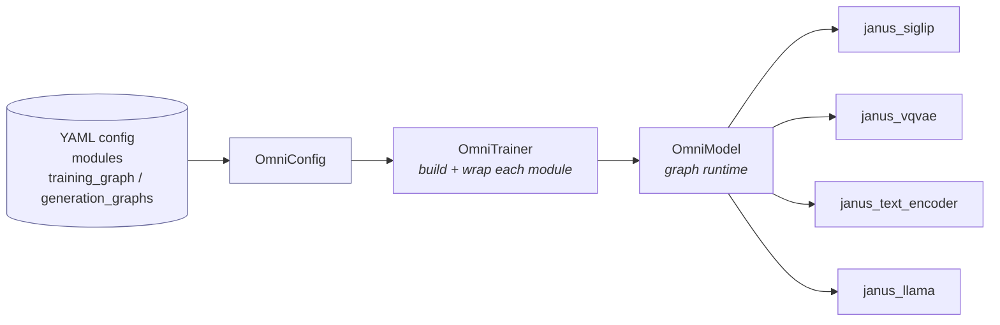
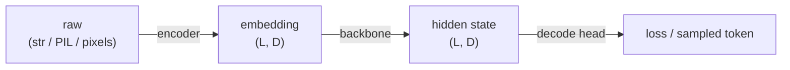
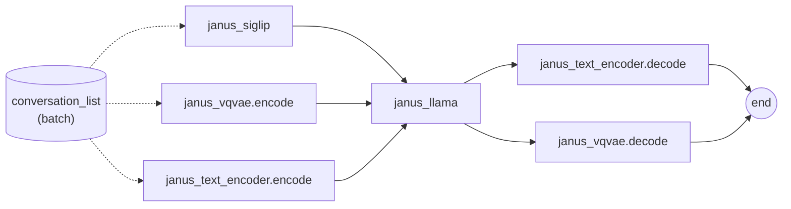
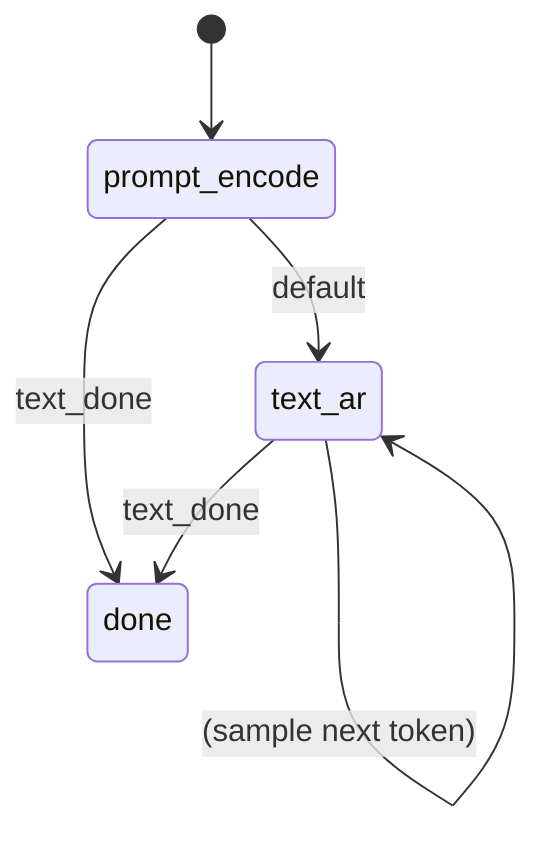
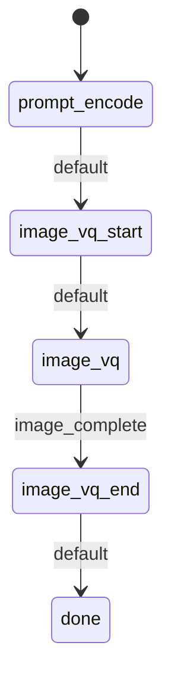

# SeedOmni Architecture

SeedOmni (`veomni/models/seed_omni/`) is VeOmni's composable, graph-driven
runtime for multi-modal models. This page explains how the pieces fit together:
the module split, the data carrier, the two graph views, and how a training step
and a generation request walk them. For running a model see
[Training and Inference](../usage/training_and_inference.md); for adding one see
[Adding a Model](../usage/adding_a_model.md).

## 1. What SeedOmni is

SeedOmni is a **model-agnostic runtime**. The framework (`OmniModel`) knows
nothing about Janus, vision towers, VQ codecs or boundary tokens. It only knows
how to:

1. build a set of independent sub-models (modules), each a HuggingFace
   `PreTrainedModel`;
2. walk a **graph** declared in YAML, calling one module per node;
3. pass a single shared data object, the **conversation list**, through those
   calls, and sum the single `_loss` each training node returns.

Everything model-specific (how to embed a SigLIP image, when to emit a
`<begin_of_image>` token, how to decode a VQ grid) lives inside the modules.
Swap the modules and the YAML graph and you have a different model, with no
framework change.



Every module also owns its own training unit. `ModuleRuntime` builds,
parallelizes, loads, freezes, optimizes and checkpoints one module on its own
`ParallelState`, so one job can freeze the ViT, EP-shard the LLM and DDP the VAE.
`OmniModelRuntime` composes the `ModuleRuntime`s around one `OmniModel`, and
`OmniTrainer` is a thin orchestrator: distributed init, dataloader, train loop
and callbacks.

## 2. Building blocks

### 2.1 Native and accelerated classes

Every module is defined twice:

- `modeling.py` holds a pure HuggingFace-native class: weights, `forward`, and
  the FSM `generate()` endpoint. It loads with plain `from_pretrained` /
  `AutoModel` and needs no VeOmni import.
- `accelerated/accelerated.py` holds a VeOmni wrapper that composes the
  training-graph mixins around the native class.

This mirrors HF's own split between a model's `forward` and its
`GenerationMixin.generate`. `modeling.py` defines the model's `forward` plus an
in-file `InferenceMixin` (the omni analog of `GenerationMixin`) that owns
`generate()` and all FSM inference state:

```python
# modeling.py: pure HF-native. InferenceMixin owns generate() + FSM state;
# the model class owns weights + forward, and inherits both.
class InferenceMixin:
    """FSM generate(), the analog of HF's GenerationMixin."""

    def reset_local_inference_state(self) -> None: ...
    def reset_global_inference_state(self) -> None: ...

    def generate(self, conversation_list=None, generation_kwargs=None, **kwargs):
        ...  # one FSM inference step (sample / embed): CFG cache, etc.

class JanusLlama(InferenceMixin, PretrainedOmniModule):
    def forward(self, ...): ...

# accelerated/accelerated.py: VeOmni-only. Owns training-graph hooks; no InferenceMixin.
class TrainingMixin(TrainingModuleMixin): ...
class VeOmniMixin(BaseMixin, TrainingMixin, MeterMixin): ...
class JanusLlamaAccelerated(VeOmniMixin, JanusLlama): ...
```

Rule of thumb: **if an HF user loading this checkpoint outside VeOmni would
expect it to work (chat, `generate`, `AutoModel.from_pretrained`), it belongs in
`modeling.py`.** Only things that are meaningless without the VeOmni graph
runtime (FSDP dummy inputs, sequence-parallel slicing, the per-module metric
meter, training pre/post hooks) belong in `accelerated/accelerated.py`. If
accelerated behavior genuinely differs from native inference, override the one
method on the accelerated class rather than duplicating it.

Both classes are registered by `model_type`: `OMNI_MODEL_REGISTRY` maps to the
native class (`OmniModel.from_pretrained`, eager inference) and
`OMNI_ACCELERATED_MODEL_REGISTRY` to the accelerated class (`ModuleRuntime`,
training and distributed inference).

**`InferenceMixin` goes first in the bases.** `PretrainedOmniModule` ships no-op
`reset_local_inference_state` / `reset_global_inference_state` / `finalize`
defaults (a safety net for modules without inference state; the FSM always calls
`module.finalize(ctx=...)`). Python resolves the MRO left to right, so listing
`PretrainedOmniModule` first would let those no-ops shadow the real
implementations. The accelerated class needs no `InferenceMixin` of its own:
`JanusLlamaAccelerated` inherits `JanusLlama`, which already has the real one
ahead of `PretrainedOmniModule`. A few backbones (`qwen3/llm`, `qwen3_moe/llm`)
share the family-wide `SimpleArGenerationMixin` (`modules/base/llm_packing.py`)
instead, under the same ordering rule.

Training-graph hooks on the accelerated class, all optional with safe defaults:

| Hook | When | Purpose |
|------|------|---------|
| `forward(**kwargs)` | training | the node's main compute; may return one `_loss` |
| `pre_forward(method, **kwargs)` | training | prepare inputs (the conversation list, or packed tensors for Janus `pack_*` nodes) |
| `post_forward(method, **outputs)` | training | write results back (the conversation list, or packed features / losses) |
| `freeze_model()` | build | freeze a parameter subset |
| `configure_optimizer(optimizer)` | build | adjust the module's param groups or register step hooks, before the lr scheduler is built and a checkpoint is loaded |
| `get_parallel_plan()` | build | per-module FSDP / SP plan |
| `get_assets()` | save | processors / tokenizers to checkpoint |
| `dummy_inputs(...)` | training | zero placeholders that keep FSDP aligned |
| `metric_meter_set_seqlens(...)` | training | optional per-module token and FLOPs meter, see [Metric Meter](../mixins/metric_meter.md) |

Native hooks in `modeling.py`, used during inference with no VeOmni graph:

| Hook | When | Purpose |
|------|------|---------|
| `generate(conversation_list, generation_kwargs, **kwargs)` | inference | one FSM step (sample / embed) |
| `reset_local_inference_state()` / `reset_global_inference_state()` | inference | clear per-request / per-generation FSM state |
| `finalize(*, ctx)` | inference | flush buffered output when `max_new_tokens` is hit |

Optional capabilities are mixins on the accelerated class, each with its own
page: [Metric Meter](../mixins/metric_meter.md) (per-module tokens and
theoretical FLOPs; `OmniModel` has no single `model_type` to estimate FLOPs on)
and [Offline Encoding](../mixins/offline_encoding.md) (cache a module's encoder
output once and train from the cache).

### 2.2 `ConversationItem`: the data carrier (`utils/conversation.py`)

There are **no per-field data channels** between modules. A single mutable list
is threaded through every call. One element:

```python
@dataclass
class ConversationItem:
    type: str       # "text" | "image" | "video" | "audio" | "output"
    value: Any      # raw content -> embedding tensor -> hidden state (mutated in place)
    role: str       # "user" | "assistant"
    is_dummy: bool  # FSDP placeholder, see below
    meta: dict      # data tags (``_img_tag``) + per-module baggage: labels, attention_mask, ...
```

- Training carries a **batch**: `list[list[ConversationItem]]`.
- Inference carries **one request**: `list[ConversationItem]`.

`value` has a lifecycle; modules overwrite it as data flows downstream:



Items carry no module ownership. Which module takes an item is decided by its
`type` / `role` / `meta` tags alone (for example the data layer's `_img_tag` =
`"und"` / `"gen"` / `"edit"`), so the same data works under any combination of
modules. The on-disk schema and the transform that builds these items are in
[Data Format](../usage/data_format.md).

An `is_dummy=True` item is a zero-tensor placeholder an encoder appends on a
micro-batch that lacks its modality (a text-only sample has no image). It keeps
the `role` and tags of the items it stands in for, so the encoder selects real
and placeholder rows with one filter and tells them apart by `is_dummy`. The
backbone skips dummy rows when packing but folds a `+ value.mean() * 0.0` anchor
so FSDP gradient sync stays aligned across ranks.

### 2.3 Two graph views (`graphs/`)

There is **no shared `nodes` / `edges` pool**. Both views are plain lists of
edges (`{from, to}`), and each endpoint is a self-describing `module[.method]`
string. A bare endpoint takes the view's default method (`forward` for training,
`generate` for inference); a dotted `module.method` uses that method verbatim. A
node's identity is its canonical `"<module>.<method>"` form.

- **`TrainingGraph`** (`graphs/training_graph.py`) is a **DAG**.
  `training_graph` is a flat list of edges; active nodes come from the endpoints
  and a topological sort gives the forward order. Each active node runs exactly
  once per forward. Edges are pure topology: they declare order, not data
  routing.
- **`GenerationGraph`** (`graphs/generation_graph.py`) is a **finite-state
  machine**. Each `state.body` is a list of inline `{from, to}` edges to run that
  step; `transitions` pick the next state by `module_signal` (a string a module
  writes into `ctx`) or `default`. Building it checks only the FSM's structure;
  the modules and methods its nodes name are checked at the start of
  `OmniModel.generate`, so a training run that loads only some modules (such as
  an offline-cache stage) can still carry the checkpoint's generation graph.

### 2.4 `OmniModel`: the graph runtime (`modeling_omni.py`)

`OmniModel` holds the modules as direct attributes (parameter FQNs are
`<module>.<rest>`), the `TrainingGraph`, and the optional `GenerationGraph`s.

**Loss protocol:** each module returns at most one scalar `_loss`, already
token-mean-reduced over its own micro-batch; `OmniModel.forward` sums them. There
is no central averaging, so token counts stay correct across modules.

## 3. Training flow

The default Janus `training_graph`
(`configs/seed_omni/Janus/janus_1.3b/train/graph_train.yaml`):



What each node does to the shared carrier:

1. **`janus_siglip`** replaces user `image` items' pixels with SigLIP patch
   embeddings.
2. **`janus_vqvae.encode`** replaces assistant `image` items with VQ embeddings
   and stores `meta.janus_vqvae_labels`.
3. **`janus_text_encoder.encode`** applies the Janus chat template to `text`
   items, tokenizes, runs the word-token embedding (`wte`) and stores
   `meta.labels`.
4. **`janus_llama`** concatenates every non-dummy item's embedding into one
   packed `bs=1` sequence, runs the LLaMA backbone (no `wte`, no `lm_head`) and
   writes the hidden state back onto each item's `value`.
5. **`janus_text_encoder.decode`** / **`janus_vqvae.decode`** read hidden states
   and labels off the carrier and each return one `_loss`.

The loop, simplified from `OmniModel.forward` and `TrainingGraph.iter_nodes`
(which mirror `OmniModel.generate` and `GenerationGraph.iter_nodes`):

```python
# OmniModel.forward imports nothing from VeOmni, so the modeling stays portable.
training_graph.reset()
for node in training_graph.iter_nodes():
    # run_node is the `node_runner` the runtime passed, else the modeling's own
    # eager `_run_train_node`. VeOmni passes TrainNodeRunner, which delegates to
    # execute_train_node: unwrap the sub-module, scope its ParallelState,
    # pre_forward -> call (through the FSDP/DDP wrapper) -> post_forward, then
    # merge conversation_list + _loss back into the shared batch.
    run_node(self.get_module(node.module), node, batch)
    loss = batch.pop("_loss", None)          # -> self._losses[node.name]
    ...
total_loss = sum(self._losses.values())
```

**Dummy forward (training only):** every active node must run on every
micro-batch or the FSDP all-reduce hangs. A micro-batch missing a modality makes
the encoder run its `dummy_inputs()` zeros and append an `is_dummy=True` item;
the backbone folds the anchor described in §2.2. Inference has no such
constraint: modules may `return {}` and the FSM skips the edge.

With Ulysses enabled, each module slices the replicated sample inside its own
`pre_forward` and all-gathers in its `post_forward`; see
[Sequence Parallelism](../distributed/sequence_parallel.md).

## 4. Generation flow

`OmniModel.generate(request, trace, generation_kwargs)` loops: run the current
state's body, drain any one-shot `generated` payloads, then take the first
matching transition. It stops at the `done` state or the
`generation_kwargs["max_new_tokens"]` cap (default 2048). It does **not** reset
the FSM; `OmniInferencer` calls `reset()` at request boundaries.

The same modules back several FSMs, selected by `model.model_config.infer_type`
(a key into the `model.model_config.infer_graph` map, each value one
`infer/graph_infer*.yaml`). For Janus:

**Understanding (`infer/graph_infer_und.yaml`, I2T / VQA):**



The text encoder's `generate` samples a token each step and emits the
`text_done` signal when it hits `</s>`.

**Generation (`infer/graph_infer_gen.yaml`, T2I):**



`image_vq_start` emits `<begin_of_image>`; `image_vq` loops backbone ->
`vqvae.generate` for 576 VQ steps and emits `image_complete` when the grid is
full; `image_vq_end` emits `<end_of_image>`.

**Interleave (`infer/graph_infer_interleave.yaml`):** the model decides
mid-stream whether to open an image span (`start_image_gen` on a sampled
`<boi>`), so `text_ar` and `image_vq` transition into each other instead of
straight to `done`.

## 5. File map

Paths are relative to `veomni/models/seed_omni/` unless they start with
`veomni/`, `tasks/` or `configs/`.

| Path | Responsibility |
|------|----------------|
| `configuration_omni.py` | `OmniConfig`: plain `PretrainedConfig`, checkpoint read/write only |
| `modeling_omni.py` | `OmniModel`: train DAG, infer FSM, loss sum |
| `processing_omni.py` | `OmniProcessor`: runs each module's preprocessor on a request |
| `graphs/base.py` | shared `NodeDef` / `EdgeDef` / `END` |
| `graphs/training_graph.py` | DAG view (topological forward order) |
| `graphs/generation_graph.py` | FSM view (states, transitions, signals) |
| `mixins/base_mixin.py` | shared assets, `_omni_hook_name` registry |
| `mixins/training_module_mixin.py` | `pre_forward` / `post_forward` dispatch |
| `mixins/inference_module_mixin.py` | `reset_*` / `finalize` hooks |
| `mixins/metric_meter_mixin.py` | `MetricMeterMixin`: optional per-module tokens and FLOPs |
| `mixins/offline_encoding_mixin.py` | `OfflineEncodingMixin`: optional encoder cache |
| `modules/module_modeling_base.py` | `PretrainedOmniModule`: base of every native class, with no-op inference-state defaults |
| `modules/module_configuration_base.py` | `OmniModuleConfig`: per-module HF descriptor |
| `modules/<family>/<sub>/` | per module: `configuration.py`, `modeling.py` (native, incl. `generate`), `accelerated/` (training hooks), optional `processing.py` |
| `utils/conversation.py` | `ConversationItem` and carrier helpers |
| `utils/convert_registry.py` | HF -> split-checkpoint conversion registry |
| `utils/checkpoint.py` | `OmniModuleCheckpointManager`: per-module DCP / HF / LoRA |
| `utils/offline_cache.py` | offline-cache writer and reader |
| `accelerated/omni_model/omni_model_config.py` | `OmniModelRuntimeArguments`; `.to_hf_config()` -> `OmniConfig` |
| `accelerated/omni_model/omni_model_runtime.py` | `OmniModelRuntime`: composed graph loops over one `OmniModel` |
| `accelerated/omni_module/omni_module_config.py` | `OmniModuleRuntimeArguments`: per-module runtime args |
| `accelerated/omni_module/omni_module_runtime.py` | `ModuleRuntime(VeOmniModelRuntime)`: per-module wrap, optimizer, checkpoint |
| `accelerated/utils/executor.py` | `TrainNodeRunner`, `execute_train_node` / `execute_generation_node` |
| `accelerated/utils/dispatch.py` | unwrap FSDP / DDP / LoRA wrappers, `call_graph_endpoint` |
| `veomni/arguments/omni_arguments_types.py` | launcher schema (`OmniArguments`) and YAML merge into the runtime args |
| `veomni/data/seed_omni/` | transform, preprocessors and `SeedOmniCollator` |
| `veomni/trainer/omni/omni_trainer.py` | `OmniTrainer`: build the runtime, drive the loop |
| `veomni/trainer/omni/omni_inferencer.py` | `OmniInferencer`: request loop, `reset` + `finalize` |
| `tasks/omni/train_omni.py` | training launch |
| `tasks/omni/infer_omni.py` | VeOmni inference launch: YAML -> `OmniModel` or `OmniModelRuntime` |
| `tasks/omni/infer_omni_native.py` | native HF launch: `OmniModel.from_pretrained` + `generate` |
| `configs/seed_omni/<model>/<task>/` | per task: `base.yaml`, `modules_train.yaml`, `graph_train.yaml`; shared: `infer/`, `data.yaml` |
