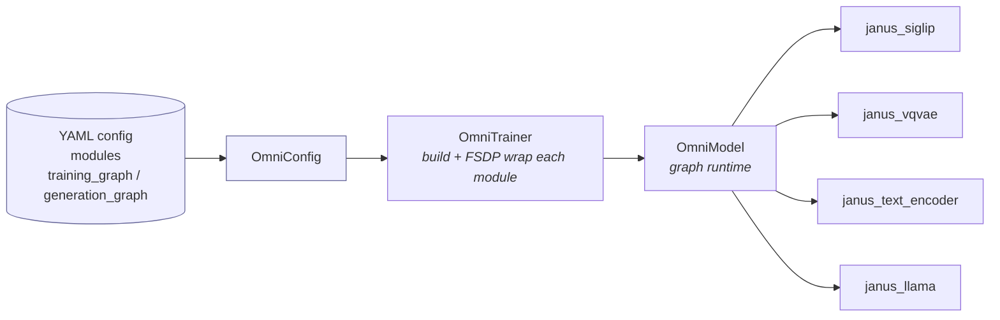
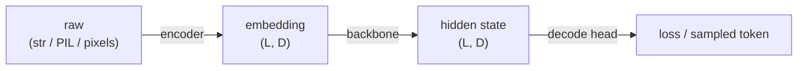
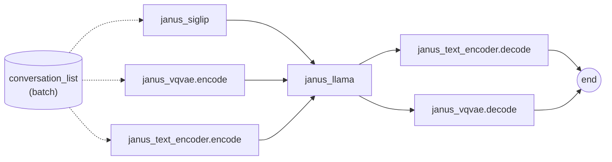
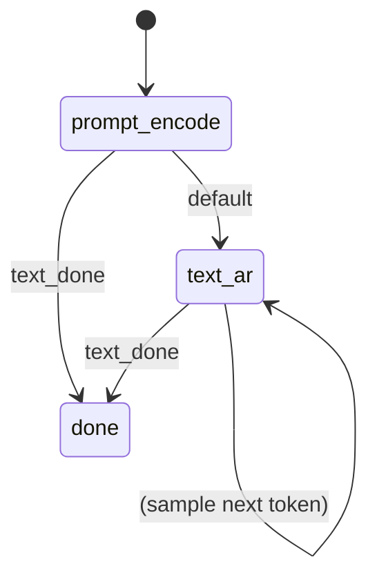
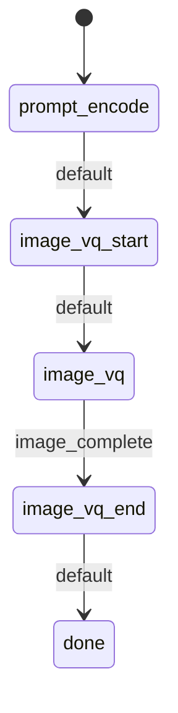

# SeedOmni V2 — Architecture & Developer Guide

> A ~10-minute tour of the composable, graph-driven multi-modal model in
> `veomni/models/seed_omni/`. By the end you will know how the modules fit
> together, what data flows between them, how Janus trains and generates, and
> how to add a new model.

---

## 1. What SeedOmni V2 is

SeedOmni V2 is a **model-agnostic runtime** for multi-modal models. The
framework (`OmniModel`) knows *nothing* about Janus, vision towers, VQ codecs,
or boundary tokens. It only knows how to:

1. Build a set of independent sub-models (each is a ``*ModuleMixin`` +
   HuggingFace ``PreTrainedModel`` pair).
2. Walk a **graph** declared in YAML, calling one sub-model per node.
3. Pass a single shared data object — the **conversation list** — through
   those calls, and sum up a single `_loss` per node during training.

Everything model-specific (how to embed a SigLIP image, when to emit a
`<begin_of_image>` token, how to decode a VQ grid) lives inside the modules.
Swap the modules + the YAML graph and you have a different model — no
framework changes.



---

## 2. The four building blocks

### 2.1 Module mixins (`module.py` + `modulemixin.py`)

Every sub-model multi-inherits a family-specific ``*ModuleMixin`` and a real
HuggingFace / diffusers model.  Shared defaults live in
:class:`~veomni.models.seed_omni.module.ModuleMixin`; per-module train/infer
logic lives in ``modules/<family>/<sub>/modulemixin.py``:

```python
class JanusSiglip(JanusSiglipModuleMixin, PreTrainedModel): ...
class JanusLlama(JanusLlamaModuleMixin, PreTrainedModel): ...
```

Construction chain: ``super().__init__(config)`` → ``PreTrainedModel`` +
:meth:`~veomni.models.seed_omni.module.ModuleMixin.init_omni_state`, then
build submodules in ``modeling.py`` and call ``self.post_init()`` for HF
weight init.  Core ``forward`` stays in ``modeling.py``; graph hooks
(``pre_forward``, ``generate``, …) stay in ``modulemixin.py``.

The mixins expose **optional hooks** with safe defaults:

| Hook | When | Purpose |
|------|------|---------|
| `forward(**kwargs)` | training | the node's main compute; may return one `_loss` |
| `pre_forward(method, **kwargs)` | training | prep inputs (read from conversation list) |
| `post_forward(method, **outputs)` | training | write results back onto conversation list |
| `generate(...)` / `generate_step` | inference | one FSM step (sample / embed) |
| `finalize(*, ctx)` | inference | flush buffered output if `max_new_tokens` hit |
| `freeze_model()` | build | freeze a parameter subset |
| `get_parallel_plan()` | build | per-module FSDP/SP plan |
| `get_assets()` | save | processors / tokenizers to checkpoint |
| `dummy_inputs(...)` | training | zero placeholders to keep FSDP aligned |
| `trace_add(...)` / `trace_collect(...)` | training | **optional** per-module token + theoretical-FLOPs meter (`TraceMixin`; driven by the module-trainer, not `pre_forward`) |

#### Optional per-module trace (`tracemixin.py`, `TraceMixin`)

`OmniModel` has no single `model_type` to estimate FLOPs on, so **FLOPs / MFU
accounting is per-module and opt-in**. The per-module meter is the optional
`TraceMixin` living on the module itself (`self.base.model` may or may not be a
`TraceMixin`) — the per-module analogue of how `helper.EnvironMeter` lives on the
trainer. A module opts in by mixing in `TraceMixin` (alongside `ModuleMixin`) and
implementing two hooks itself — `trace_token_lengths(method, data)` (its token
count) and `estimate_flops(seqlens)` (its own theoretical-FLOPs formula). It does
**not** touch its own `init_omni_state` / `pre_forward`. There is **no** shared
whole-model FLOPs counter: that would mis-count at module granularity (e.g. an AR
backbone owns no `wte` / `lm_head`, so those FLOPs belong to the `text_encoder`,
not the backbone — each module counts only what it actually computes).

A module has exactly **one** `seqlens`: a token is a token, whether it's a text
token, an image patch, or a VQ token — the mixin does not distinguish modalities.
A module only ever produces **time-independent** quantities (tokens + theoretical
FLOPs); all timing / MFU lives at the orchestrator.

Execution is driven by the module-trainer (not the module's `pre_forward`). The
training graph dispatches every node through
`OmniModuleTrainer.forward(method, **kwargs)`
(`OmniModel.set_node_executors(...)`), which:

1. runs the module's `pre_forward` → real input tensors;
2. feeds the meter `trace_add(method, data)` — the analogue of `EnvironMeter.add`.
   **Each module implements its own** `trace_token_lengths(method, data)` +
   `estimate_flops(seqlens)` (no generic defaults). For Janus:
   - `janus_llama` (backbone) — packed `cu_seq_lens_q`; FLOPs = transformer
     layers (no `lm_head`/`wte`).
   - `janus_text_encoder` (via base `text_encoder`) — `input_ids` on `encode`;
     FLOPs = `lm_head` (`vocab × hidden`).
   - `janus_siglip` — patches-per-image from `pixel_values`; FLOPs = ViT.
   - `janus_vqvae` — VQ tokens on `encode`, `[]` on `decode`; FLOPs = 0 (frozen
     codec, generation head not counted) — token count only.

   **SP note:** the backbone (`cu_seq_lens_q`) and text encoder (`input_ids`,
   pre-LLM full length) read full-sequence quantities, so the count is correct
   under sequence parallelism (which is also how the single-model `EnvironMeter`
   stays SP-safe — it counts the full `attention_mask`/`cu_seqlens` and reduces
   over `dp_group`, which excludes SP). Vision modules count the local image
   batch, which SP would slice — an accepted limitation;
3. runs the requested method (through the FSDP wrapper) + `post_forward`.

At the module-trainer's `on_step_end`, `trace_collect()` returns
`(estimate_flops(seqlens), seqlens)` — **no timing, no MFU, no reduction**. The
orchestrator (`OmniEnvironMeterCallback` + `OmniEnvironMeter`, in
`veomni/utils/omni_helper.py`) owns the single whole-graph timing and the
**global** roll-up. Its `add(micro_batch)` (per micro-batch) computes **only** the
sample count + multi-source ds_idx — **not** token lengths (those come from the
modules); its `step(...)` then:

- **achieved FLOPs / MFU** — sum every module's theoretical FLOPs, DP-reduce, and
  divide by the one forward+backward delta. (A per-module wall-clock is
  meaningless: a module's `on_step_end` fires only after the *whole* graph, so it
  would see the whole-step time, not its own.)
- **merge** all modules' token lengths into one batch → token / consume-tokens /
  tokens-per-second statistics. The **chunk count** is the real sample count from
  `add` (one per conversation), not the merged-seqlens length;
- **multi-source** per-dataset accounting — ds_idx from `add` zipped with the
  per-sample seqlens of the backbone (the module whose `seqlens` has one entry
  per sample); skipped with a warning if none aligns;
- **device / host memory** + cache-empty / GC cadence.

`OmniTrainer.on_step_begin` only records the single start time + calls `add` per
micro-batch; it does **not** cascade to module-trainers. There is **no
image-seqlens concept** anywhere. Modules that don't implement the trace hooks
contribute nothing.

### 2.2 `ConversationItem` — the data carrier (`conversation.py`)

There are **no per-field data channels** between modules. Instead, a single
mutable list is threaded through every call. One element:

```python
@dataclass
class ConversationItem:
    type: str    # "text" | "image" | "output"
    value: Any   # raw content → embedding tensor → hidden state (mutated in place)
    role: str    # "user" | "assistant" | "dummy"
    meta: dict   # per-module baggage: labels, attention_mask, janus_vqvae_labels, ...
```

- Training carries a **batch**: `list[list[ConversationItem]]`.
- Inference carries **one request**: `list[ConversationItem]`.

**`value` has a lifecycle** — modules overwrite it as data flows downstream:



A `role="dummy"` item is a zero-tensor placeholder an encoder appends on a
micro-batch that lacks its modality (e.g. a text-only sample has no image). The
backbone skips dummy rows when packing but folds a `+ value.mean()*0.0` anchor
so FSDP gradient-sync stays aligned across ranks.

### 2.3 Two graph views (`graph.py`, `training_graph.py`, `generation_graph.py`)

There is **no shared `nodes` / `edges` pool**. Both views are written as plain
lists of **edges** (`{from, to}`), and each endpoint is a self-describing
`module[.method]` string. A bare endpoint takes the view's default method
(`forward` for training, `generate` for inference); a dotted `module.method`
uses that method verbatim. A node's identity is its canonical
`"<module>.<method>"` form.

- **`TrainingGraph`** — a **DAG**. `training_graph` is a flat list of edges;
  active nodes are derived from the endpoints, and a topological sort gives the
  forward order. Each active node runs **exactly once** per forward. **Edges
  are pure topology** — they declare order only, not data routing.
- **`GenerationGraph`** — a **finite-state machine**. Each `state.body` is a
  list of inline `{from, to}` edges to run that step; `transitions` pick the
  next state by `module_signal` (a string a module writes into `ctx`) or
  `default`.

### 2.4 `OmniModel` — the runtime (`modeling_omni.py`)

Holds the sub-modules (as direct attributes, so param FQNs are
`<module>.<rest>`), the `TrainingGraph`, and the optional `GenerationGraph`.

**Loss protocol:** each module returns at most one scalar `_loss` (already
token-mean-reduced over its own micro-batches); `OmniModel.forward` simply sums
them. No central averaging — token counts stay correct across modules.

---

## 3. Training flow (Janus joint SFT)

The default Janus `training_graph` (`configs/seed_omni/Janus/janus_1.3b/graph_train.yaml`):



What each node does to the shared carrier:

1. **`janus_siglip`** — replaces user `image` items' raw pixels with SigLIP
   patch embeddings.
2. **`janus_vqvae.encode`** — replaces assistant `image` items with VQ
   embeddings and stashes `meta.janus_vqvae_labels`.
3. **`janus_text_encoder.encode`** — applies the Janus chat template to `text`
   items, tokenises, runs word-token embedding (`wte`), and stores
   `meta.labels`.
4. **`janus_llama`** — concatenates every non-dummy item's embedding into one
   packed `bs=1` sequence, runs the LLaMA backbone (no `wte`, no `lm_head`),
   and writes the hidden state back onto each item's `value`.
5. **`janus_text_encoder.decode`** / **`janus_vqvae.decode`** — read hidden
   states + labels off the carrier and each return one `_loss`.

The runtime loop (simplified from `OmniModel.forward`):

```python
for node in training_graph.execution_order:
    module = getattr(self, training_graph.module_of(node))
    kwargs = training_graph.collect_inputs(node, ...)   # shallow copy of batch
    kwargs = module.pre_forward(method, **kwargs)       # read conversation_list
    out    = module(**kwargs)                            # through FSDP wrapper
    out    = module.post_forward(method, **out)          # write conversation_list back
    batch["conversation_list"] = out["conversation_list"]  # carrier flows on
    if "_loss" in out: losses[node] = out["_loss"]
total_loss = sum(losses.values())
```

**Dummy forward (training only):** every active node must run on every
micro-batch or FSDP all-reduce hangs. Missing a modality? The encoder runs its
`dummy_inputs()` zeros and appends a `role="dummy"` item; the backbone folds the
anchor term described in §2.2. Inference has no such constraint — modules may
`return {}` and the FSM skips the edge.

---

## 4. Inference flow (FSM)

`OmniModel.generate(request, trace, generation_kwargs)` loops: run the current
state's body, drain any one-shot `generated` payloads, then take the first
matching transition. It stops at the `done` state or the
`generation_kwargs["max_new_tokens"]` cap (default 2048). It does **not** reset
the FSM — `OmniInferencer` calls `reset()` at request boundaries.

The same node pool backs three different FSMs, selected by
`infer.infer_type` (a key into the `infer.infer_graph` map, each pointing at one
`graph_infer_*.yaml`):

**Understanding — `graph_infer_und.yaml` (I2T / VQA):**



The `token_generate` node (the text encoder's `generate`) samples a token each
step and emits the `text_done` signal when it hits `</s>`.

**Generation — `graph_infer_gen.yaml` (T2I):**



`image_vq_start` emits `<begin_of_image>`; `image_vq` loops backbone →
`vqvae.generate` for 576 VQ steps and emits `image_complete` when the grid is
full; `image_vq_end` emits `<end_of_image>`.

**Interleave — `graph_infer_interleave.yaml`:** the model decides mid-stream whether
to open an image span (`start_image_gen` on a sampled `<boi>`), so `text_ar`
and `image_vq` transition into each other instead of straight to `done`.

---

## 5. The Janus modules

| Module (`model_type`) | HF base | Role |
|-----------------------|---------|------|
| `janus_siglip` | `SiglipVisionModel` | encode **understanding** images → patch embeds |
| `janus_vqvae` | `JanusVQVAE` + gen heads | encode **generation** images / decode VQ grid → pixels |
| `janus_text_encoder` | LLaMA `wte` + `lm_head` | chat template, token embed, LM head, `<boi>`/`<eoi>` emit |
| `janus_llama` | patched `LlamaModel` | backbone (no `wte`, no `lm_head`) |

Why split the LLM into `text_encoder` + `llama`? Word-token embedding and the
LM head are vocabulary-dependent — they mirror the discrete-image VQ codec on
the text side. Splitting them lets the graph treat text and image
symmetrically (both have `encode` / `decode` nodes), and lets Janus own the
boundary-token logic without the framework knowing about it.

---

## 6. Adding a new model

Use the `/seedomni-v2` skill for the full checklist. The shape of the work:

1. **Split the checkpoint.** Register a converter in `modules/<family>/convert_model.py` (dispatched by `scripts/convert_model.py`)
   to break the upstream HF checkpoint into one self-contained subfolder per
   module (`config.json` + `model.safetensors` + any processor/tokenizer JSON).

2. **Write each module triplet** under
   `veomni/models/seed_omni/modules/<family>/<sub>/`:
   - `configuration.py` — a `PretrainedConfig` with a unique `model_type`.
   - `modulemixin.py` — `class XxxModuleMixin(ModuleMixin)` with
     `init_omni_state`, `pre_forward` / `post_forward`, `generate`, etc.
   - `modeling.py` — `class X(XxxModuleMixin, <HFBase>)` with `__init__`,
     `forward`, and submodule layout.  Janus modules under
     `modules/janus/*/` are the reference pattern.
   - `processing.py` (optional) — if the module consumes raw images / audio.

   Reuse cross-family helpers in `modules/base/` where possible.

3. **Register** the classes in `modules/__init__.py`
   (`OMNI_CONFIG_REGISTRY` / `OMNI_MODEL_REGISTRY` / `OMNI_PROCESSOR_REGISTRY`),
   keyed by `model_type`. The trainer resolves a module by reading
   `config.json` → `model_type` → registry.

4. **Write the YAML** (`configs/seed_omni/<model>/`):
   - `base.yaml` — top-level launcher: `model.*` (incl. `modules` / `train_graph`
     paths), top-level `accelerator`, `data.*`, `train.*`, and the `infer` block.
   - `modules_train.yaml` — per-module training overrides (`model` / `train` /
     `accelerator` per module). A module's `accelerator` block drives its own
     parallel topology on the full world (heterogeneous FSDP2 / FSDP2+`emb`/`ep`
     / DDP); modules matching the global topology reuse it, others build their
     own `ParallelState`.
   - `graph_train.yaml` — the `training_graph` (a flat list of edges whose
     endpoints are `module[.method]` strings). Remember: edges only declare
     order; modules move data via the conversation list.
   - `modules_infer.yaml` (optional) — per-module inference overrides.
   - `graph_infer_*.yaml` — one `generation_graph` (FSM) per scenario, mapped
     under `infer.infer_graph`.

5. **Honour the contracts:**
   - Return at most one scalar `_loss` per node (token-mean reduced).
   - Read inputs in `pre_forward`, write results in `post_forward`, always
     returning `{"conversation_list": ...}` so the carrier flows on.
   - Implement `dummy_inputs()` for any encoder whose modality can be absent
     from a micro-batch.
   - For inference modules, emit `module_signal` strings to drive FSM
     transitions, and clear private buffers in
     `reset_local_inference_state()` / `reset_global_inference_state()` /
     `finalize()`.

6. **Validate:** render the graph with `TrainingGraph.to_mermaid()`, run the
   unit tests in `tests/seed_omni/`, then the end-to-end train/infer pipeline.
   Worked examples under `docs/seed_omni/example_models/`:
   - [`janus.md`](example_models/janus.md) — multimodal understanding + generation (SigLIP / VQVAE / LLaMA).
   - [`qwen3.md`](example_models/qwen3.md) — minimal text-only split.
   - [`qwen3moe.md`](example_models/qwen3moe.md) — MoE backbone with Expert Parallel (fsdp2 + ep).

---

## 7. File map

| Path | Responsibility |
|------|----------------|
| `module.py` | base `ModuleMixin` (shared hook defaults + `init_omni_state`) |
| `conversation.py` | `ConversationItem` + carrier helpers |
| `graph.py` | shared `NodeDef` / `EdgeDef` / `END` |
| `training_graph.py` | DAG view (topological forward order) |
| `generation_graph.py` | FSM view (states / transitions / signals) |
| `configuration_omni.py` | parse + merge the YAML into `OmniConfig` |
| `modeling_omni.py` | `OmniModel` runtime (train DAG + infer FSM + loss sum) |
| `modules/<family>/<sub>/` | per-module `configuration.py`, `modulemixin.py`, `modeling.py` [, `processing.py`] |
| `veomni/trainer/omni_trainer.py` | build + FSDP-wrap modules, drive the loop |
| `veomni/trainer/omni_inferencer.py` | request loop, `reset` + `finalize` |
| `configs/seed_omni/<model>/` | `base.yaml` + `modules_train.yaml` + `graph_train.yaml` (+ `modules_infer.yaml` / `graph_infer_*.yaml`) |
```
