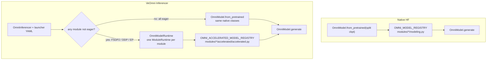

# SeedOmni Training and Inference

This page covers the workflow every SeedOmni model shares: config layout,
checkpoint conversion, training, resume, inference, and the graph debugging
tools. The per-model pages under `models/` give the concrete commands
(for example [Janus](../models/janus.md)); the concepts behind them are in
[Architecture](../design/architecture.md).

## 1. Config layout

Each model has one folder per task under `configs/seed_omni/<model>/<task>/`
(`train/`, `packed/`, `offline_cache/`, ...), holding that task's launcher and
the fragments only it uses. Anything two or more tasks share moves up to
`infer/` or, for `data.yaml`, to the model root.

| File | Role |
|------|------|
| `<task>/base.yaml` | Launcher: `model.*` (split-checkpoint root, module and graph paths, `model.accelerator`, `model.optimizer`), `data.*`, `train.*` and the `infer` block. Training and inference take the same file. |
| `<task>/modules_train.yaml` | Per-module training overrides (`model` / `train` / `accelerator` keys per module). |
| `<task>/graph_train.yaml` | The `training_graph`: a flat list of `{from, to}` edges whose endpoints are `module[.method]` strings. |
| `infer/modules_infer_*.yaml` | Per-module inference overrides (for example all-eager vs distributed). |
| `infer/graph_infer*.yaml` | One `generation_graph` (FSM) per scenario, mapped under `model.model_config.infer_graph`. |
| `data.yaml` | Data sources, see [Data Format](data_format.md). |

`model.model_config` points at the layout files:

```yaml
model:
  model_path: /path/to/split-checkpoint
  model_config:
    modules: configs/seed_omni/Janus/janus_1.3b/train/modules_train.yaml
    train_graph: configs/seed_omni/Janus/janus_1.3b/train/graph_train.yaml
    infer_graph:
      infer_gen: configs/seed_omni/Janus/janus_1.3b/infer/graph_infer_gen.yaml
      infer_und: configs/seed_omni/Janus/janus_1.3b/infer/graph_infer_und.yaml
    infer_type: infer_und
  accelerator: { ... }   # global default for every module
  optimizer: { ... }
```

`OmniConfig` loads **all** `infer_graph` entries into `generation_graphs`, and
`infer_type` selects the active one, so an exported checkpoint keeps serving
every scenario.

### How a module's arguments are resolved

`build_omni_module_runtime_args` (`veomni/arguments/omni_arguments_types.py`)
deep-merges each module's arguments from these layers, weakest first:

1. the launcher's global `model:` block (including `model.accelerator`);
2. the checkpoint's per-module entry (kernels, `model_config`, and an
   `accelerator` overlay if the entry carries one);
3. for inference only, an `fsdp_mode: eager` default;
4. the module's block in the `modules` YAML.

The `modules` YAML decides the module *set*: only modules it names are built.
Single keys can be overridden on the CLI with
`--model.model_config.modules.<module>.<key> <value>`, for example
`--model.model_config.modules.janus_llama.accelerator.fsdp_config.fsdp_mode eager`.

## 2. Convert the checkpoint

SeedOmni trains from a **split checkpoint**: a root `config.json` plus graph
sidecars, and one self-contained subfolder per module (`config.json`, weights,
processor and tokenizer files). The converter reads `model_type` from the
upstream HF `config.json` and dispatches to the family converter registered in
`modules/<family>/convert_model.py`:

```bash
python scripts/seed_omni/convert_model.py \
  --model_path /path/to/hf/Janus-1.3B \
  --output_dir /path/to/seed_omni/Janus-1.3B
```

The `output_dir` becomes `model.model_path` in `base.yaml`.

### 2.1 Load an upstream checkpoint directly

A family that registers an HF layout (`OMNI_HF_LAYOUT_REGISTRY`, today `qwen3`)
skips the convert: `model.model_path` (or `OmniModel.from_pretrained` /
`OmniProcessor.from_pretrained`) can name the upstream HF checkpoint. Detection
is by the root `config.json`'s `model_type`: `omni` is a split checkpoint, a type
with a registered layout loads through it, and any other type is an error.

- **Load.** Each process writes a weight-free view of the split checkpoint (module
  configs, tokenizer / processors, root config and graphs) to a temp directory,
  and `model.model_path` is pointed at it, so configs and preprocessors load
  exactly as from a split root. Module weights are read from the upstream
  checkpoint at weight-load time: each HF key is renamed onto the module that
  owns it, and keys owned by other modules are skipped without being read. This
  works for training (FSDP2, DDP, rank-0 broadcast, `fsdp_scope: model`) and
  for eager and distributed inference.
- **Save.** The HF export (`save_hf_weights`) is one checkpoint in the upstream
  layout under `global_step_N/hf_ckpt/`: the same keys, dtypes, shard files and
  non-weight files as the source, so it loads wherever the source does
  (`transformers`, or `model.model_path` again). Tensors of frozen modules and
  of LoRA bases are copied from the source; LoRA adapters still export per
  module. DCP checkpoints and resume stay per module.
- **Limits.** Every module in the `modules` YAML must be one the layout cuts
  from the checkpoint and keep its default `model_path` (the module name). A
  model composed from several sources, like Qwen3 text + the Qwen3-VL ViT,
  still needs split checkpoints. Per-module `model_config` overrides apply to
  the run but not to the exported `config.json`, which is the source's (a
  warning lists them). Expert-parallel streaming load
  (`ep_sharded_stream_load`) is not supported for renamed keys yet. Eager
  loads take `device_map` as `from_pretrained` does; a module spread over
  several devices (`"auto"`) is loaded on CPU first, so host memory must hold
  it once.

The offline convert of such a family goes through the same layout, so a split
checkpoint and the direct load hold identical module weights. To add a layout
for a family, see [Upstream Checkpoint Layout](hf_layout.md).

## 3. Train

`train.sh` is the thin `torchrun` launcher (it detects the GPU / NPU count and
handles single- or multi-node runs):

```bash
bash train.sh tasks/omni/train_omni.py configs/seed_omni/Janus/janus_1.3b/train/base.yaml
```

Common overrides:

- `--train.global_batch_size` / `--train.micro_batch_size`: global vs per-step
  micro batch.
- `--data.max_seq_len`: packed sequence length.
- `--train.checkpoint.output_dir`: run root; DCP checkpoints land in
  `<output_dir>/checkpoints/`.
- `--train.checkpoint.save_steps` / `--train.checkpoint.hf_save_steps`: DCP / HF
  save cadence.
- `--train.wandb.enable false`: disable wandb for quick runs.
- `--model.accelerator.fsdp_config.fsdp_mode`: the global FSDP mode.

### Parallelism

Each module may carry its own `accelerator` block in the `modules` YAML (FSDP2,
DDP, an `emb` or `ep` extra parallel group), for example a vocabulary-sharded
text encoder:

```yaml
# modules_train.yaml
janus_text_encoder:
  accelerator:
    extra_parallel_sizes: [4]
    extra_parallel_names: ["emb"]
    extra_parallel_placement_innermost: [false]
```

Sequence parallelism is set once for the whole job with
`--model.accelerator.ulysses_size N`. What a module may choose, what the job
shares, and why SP is not a per-module setting are covered in
[Per-Module Parallelism](../distributed/per_module_parallelism.md) and
[Sequence Parallelism](../distributed/sequence_parallel.md).

If your environment exports `TORCH_DISTRIBUTED_DEBUG=DETAIL`, unset it: its
`_ProcessGroupWrapper` lacks the coalesced all-gather that FSDP2's tied-head
`full_tensor()` needs, which crashes FSDP2 runs.

## 4. Resume

Each save writes per-module DCP shards plus the per-rank job state (global step,
dataloader position, RNG state) under `<output_dir>/checkpoints/global_step_N/`.
Resume by pointing `load_path` at that directory:

```bash
bash train.sh tasks/omni/train_omni.py \
  configs/seed_omni/Janus/janus_1.3b/train/base.yaml \
  --train.checkpoint.load_path outputs/janus_1.3b_omni_sft/checkpoints/global_step_500
```

The checkpoint layout is described in [Checkpointing](../../usage/checkpoint.md).

## 5. Inference

SeedOmni has two inference launches. Both walk the same generation FSM
(`OmniModel.generate`); they differ in how the composed model is built.



| | Native HF | VeOmni Inferencer |
|--|-----------|-------------------|
| CLI | `python tasks/omni/infer_omni_native.py` | `python tasks/omni/infer_omni.py <base.yaml>` (distributed: `bash train.sh ...`) |
| Handle | `OmniModel` | all eager: `OmniModel`; any FSDP2 / DDP / extra-parallel module: `OmniModelRuntime` |
| Module class | `modeling.py` via `OMNI_MODEL_REGISTRY` | eager modules: native `modeling.py`; distributed modules: `accelerated/accelerated.py` |
| Config | checkpoint `config.json` + `--infer_type` | `base.yaml` (graphs, per-module `accelerator` overlays, `--infer.*`) |
| When to use | single-process HF-style load, no VeOmni launcher | YAML graphs, processor pipeline, FSDP2 / DDP / vocab-parallel inference |

`generate()` always lives on the native `modeling.py`, so an all-eager Inferencer
run builds the same object a native user gets from `OmniModel.from_pretrained`;
the launcher only projects the YAML onto `OmniConfig` first.

**Native HF:**

```python
from veomni.models.seed_omni import OmniModel, OmniProcessor

model = OmniModel.from_pretrained(checkpoint_root, device_map="auto").eval()
processor = OmniProcessor.from_pretrained(checkpoint_root)
inputs = processor(text="Describe this image.", images=["/path/to/image.jpg"])
model.reset()
generated = model.generate(inputs, generation_kwargs={"max_new_tokens": 128})
```

```bash
python tasks/omni/infer_omni_native.py \
    --model_path /path/to/split-ckpt \
    --infer_type infer_und \
    --prompt "Describe this image." \
    --image /path/to/image.jpg
```

**VeOmni Inferencer:** the training `base.yaml`, with an inference `modules` file:

```bash
# all eager (single process)
python tasks/omni/infer_omni.py \
    configs/seed_omni/Janus/janus_1.3b/train/base.yaml \
    --model.model_config.modules configs/seed_omni/Janus/janus_1.3b/infer/modules_infer_eager.yaml \
    --model.model_config.infer_type infer_und \
    --infer.prompt "Describe this image." \
    --infer.images /path/to/image.jpg \
    --infer.output_dir janus_out

# any FSDP2 / DDP / extra-parallel module
bash train.sh tasks/omni/infer_omni.py \
    configs/seed_omni/Janus/janus_1.3b/train/base.yaml \
    --model.model_config.modules configs/seed_omni/Janus/janus_1.3b/infer/modules_infer_fsdp.yaml \
    --model.model_config.infer_type infer_gen \
    --infer.prompt "A cat on a windowsill"
```

### Inferring from a trained checkpoint

Training writes each module's HF weights under
`<output_dir>/checkpoints/global_step_N/hf_ckpt/<module>/`. Link each module's
folder into a flat root and pass it as `--model.model_path`:

```bash
STEP=outputs/janus_1.3b_omni_sft/checkpoints/global_step_20
ASM=outputs/janus_1.3b_omni_sft/infer_ckpt/global_step_20
mkdir -p "$ASM"
for m in janus_siglip janus_vqvae janus_text_encoder janus_llama; do
  ln -sfn "$(realpath "$STEP/hf_ckpt/$m")" "$ASM/$m"
done
```

## 6. Debugging the graph

### Visualize

Render the training DAG and every generation FSM a launcher resolves, through the
same config loader as training and inference:

```bash
python scripts/seed_omni/visualize_graph.py configs/seed_omni/Janus/janus_1.3b/train/base.yaml
# -> graphs/janus_1.3b_base/{training,infer_gen,infer_und,infer_interleave}.mmd
# add --visualize.format html for browser-renderable output
```

### Graph profiler

`train.graph_profile.*` records the execution path and, optionally, per-node
timing and memory. It is separate from `train.profile.*`, which owns PyTorch
profiler traces.

```yaml
train:
  graph_profile:
    enable_wall_time: true    # append wall_ms=...
    enable_cuda_events: true  # append cuda_ms=...
    enable_memory: true       # append peak_allocated_gb / peak_reserved_gb
    train_start_step: 1       # training only: record global steps 1-10
    train_end_step: 10
```

Inference always writes the graph path to `<output_dir>/<infer_type>/trace.txt`;
the `enable_*` switches only add fields to the node lines. Training writes rank-0
traces under `train.checkpoint.output_dir/graph_trace` only when a detail switch
is enabled.

### Smoke test

`scripts/seed_omni/run_smoke.sh` runs a short train and inference for each
shipped model and prints a PASS / FAIL summary; see the script header for the
model list and environment knobs.
