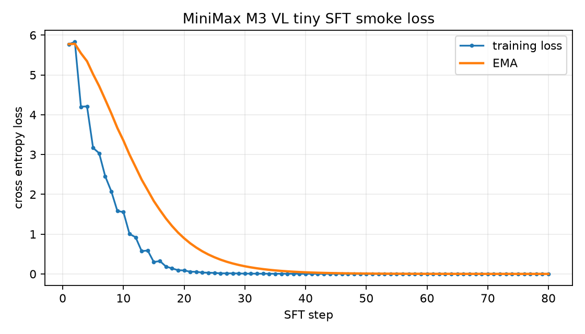

# MiniMax M3 VL 减层 SFT Loss 报告

日期：2026-06-22

## 结论

本报告记录三条减层 SFT 证据：

1. 旧的手写 tiny smoke：证明本地 JSONL、loss mask、optimizer 链路可用，80 step loss 从 `5.774437427520752` 降到 `0.0010620863176882267`。
2. GPU-path generated-model smoke：直接通过 VeOmni registry 构建 `veomni.models.transformers.minimax_m3_vl.generated.patched_modeling_minimax_m3_vl_gpu.MiniMaxM3SparseForConditionalGeneration`，在 `transformers==5.12.0` 临时环境中跑 8 个真实 backward/AdamW step，loss 从 `5.57344913482666` 降到 `4.035123348236084`。
3. Ascend NPU generated-model smoke：在 Ascend 910B3 容器环境中构建 `veomni.models.transformers.minimax_m3_vl.generated.patched_modeling_minimax_m3_vl_npu.MiniMaxM3SparseForConditionalGeneration`，跑 8 个真实 NPU backward/AdamW step，loss 从 `5.531774044036865` 降到 `4.8606367111206055`。

第二、第三条是本 PR 更关键的证据：它们覆盖 patchgen 生成模型、MiniMax toy config、默认 position id、forward、loss、backward 和参数更新，并且第三条证明 checked-in NPU generated modeling 可在单卡 Ascend NPU 上完成 toy SFT 优化。它们仍不代表真实 428B checkpoint 已完成加载，也不代表多卡 SP/EP/FSDP2 或 NPU 性能门已通过。

## Ascend NPU Generated Model Smoke

| 项目 | 值 |
|---|---|
| generated model | `patched_modeling_minimax_m3_vl_npu.MiniMaxM3SparseForConditionalGeneration` |
| config | `tests/toy_config/minimax_m3_vl_toy/config.json` |
| 数据集 | `tests/fixtures/minimax_m3_vl_sft/tiny_sft.jsonl` |
| 权重 | 随机初始化，`actual_weights_loaded=false` |
| step 数 | `8` |
| batch size | `2` |
| learning rate | `0.005` |
| seed | `20260622` |
| NPU | `Ascend910B3`, single visible device |
| CANN | `ASCEND_TOOLKIT_HOME=/usr/local/Ascend/cann-9.0.0` |
| torch / torch_npu | `2.10.0+cpu` / `2.10.0` |
| transformers | `5.12.0` |

执行命令摘要：

```bash
sudo docker run --rm --shm-size=8g \
  --device=/dev/davinci0 \
  --device=/dev/davinci_manager \
  --device=/dev/devmm_svm \
  --device=/dev/hisi_hdc \
  -v /usr/local/dcmi:/usr/local/dcmi \
  -v /usr/local/bin/npu-smi:/usr/local/bin/npu-smi \
  -v /usr/local/Ascend/driver/lib64:/usr/local/Ascend/driver/lib64 \
  -v /usr/local/Ascend/driver/version.info:/usr/local/Ascend/driver/version.info \
  -v /etc/ascend_install.info:/etc/ascend_install.info \
  -v /home/t00906153/super/work/VeOmni:/workspace/VeOmni \
  -v /home/t00906153/super/.cache/uv/archive-v0/9dxQQSoBJ81o7MEE:/tf512:ro \
  -w /workspace/VeOmni \
  -e ASCEND_RT_VISIBLE_DEVICES=0 \
  -e MODELING_BACKEND=veomni \
  -e PYTHONPATH=/tf512:/workspace/VeOmni \
  quay.io/ascend/vllm-ascend:v0.20.2rc1 \
  bash -lc 'python3 scripts/multimodal/run_minimax_m3_vl_npu_loss.py \
    --steps 8 --batch-size 2 --lr 0.005 --seed 20260622 --device npu:0'
```

关键输出：

```json
{
  "passed": true,
  "first_loss": 5.531774044036865,
  "last_loss": 4.8606367111206055,
  "losses": [
    5.531774044036865,
    5.550044536590576,
    5.541448593139648,
    5.088313102722168,
    5.126286506652832,
    5.201151371002197,
    4.945033073425293,
    4.8606367111206055
  ]
}
```

完整证据：

- [npu_generated_model_loss_log.json](./artifacts/minimax_m3_vl_npu_loss_smoke/npu_generated_model_loss_log.json)
- [npu_runtime_probe.json](./artifacts/minimax_m3_vl_npu_loss_smoke/npu_runtime_probe.json)
- [loss_curve.svg](./artifacts/minimax_m3_vl_npu_loss_smoke/loss_curve.svg)

## GPU-Path Generated Model Smoke

| 项目 | 值 |
|---|---|
| generated model | `patched_modeling_minimax_m3_vl_gpu.MiniMaxM3SparseForConditionalGeneration` |
| config | `tests/toy_config/minimax_m3_vl_toy/config.json` |
| 数据集 | `tests/fixtures/minimax_m3_vl_sft/tiny_sft.jsonl` |
| 权重 | 随机初始化，`actual_weights_loaded=false` |
| step 数 | `8` |
| batch size | `2` |
| learning rate | `0.005` |
| seed | `20260618` |
| transformers | `5.12.0` |

执行命令摘要：

```bash
env PYTHONPATH=$PWD \
  uv run --no-project --python 3.11 \
  --with transformers==5.12.0 --with torch==2.7.1 \
  --with packaging --with psutil --with einops --with numpy \
  --with safetensors --with tqdm --with rich \
  python - <<'PY'
# Builds MiniMaxM3SparseForConditionalGeneration through VeOmni registry,
# trains 8 AdamW steps on tests/fixtures/minimax_m3_vl_sft/tiny_sft.jsonl.
PY
```

关键输出：

```json
{
  "first_loss": 5.57344913482666,
  "last_loss": 4.035123348236084,
  "losses": [
    5.57344913482666,
    5.1658034324646,
    4.941288948059082,
    4.761152744293213,
    4.579178810119629,
    4.394667625427246,
    4.216017246246338,
    4.035123348236084
  ]
}
```

完整 JSON 证据：

- [generated_model_loss_log.json](./artifacts/minimax_m3_vl_sft_smoke/generated_model_loss_log.json)

## Legacy Tiny Smoke

保留旧 smoke 作为数据/loss-mask 回归证据：

- 脚本：`tests/train_scripts/train_minimax_m3_vl_sft_smoke.py`
- 输出：`docs/usage/support_new_models/artifacts/minimax_m3_vl_sft_smoke/loss_log.json`
- loss curve：`docs/usage/support_new_models/artifacts/minimax_m3_vl_sft_smoke/loss_curve.png`

该脚本使用 test-scope 手写 tiny 模型，不是 production generated modeling。它的价值是快速证明 JSONL fixture、`IGNORE_INDEX=-100` 和优化器链路。



## 验收解释

本报告证明：

- `minimax_m3_vl` toy config 可通过 VeOmni registry 加载。
- patchgen 生成的 MiniMax GPU/NPU modeling 可在局部 `transformers==5.12.0` 环境中实例化并训练。
- NPU generated modeling 可在 Ascend 910B3 单卡容器环境中完成 tensor smoke、forward、loss、backward 和 AdamW 参数更新。
- `get_position_id_func()` 返回 `None` 后，默认 1-D packed position ids 能支撑文本减层训练。
- sparse MoE/dense MLP 分支在 toy config 中被覆盖。

本报告不证明：

- 真实 MiniMaxAI/MiniMax-M3 safetensors 已完整加载；
- 真实 public checkpoint full trainer smoke 已完成；
- 多卡 FSDP2 回归、SP/EP metadata 或 NPU kernel 优化已完成；
- MSA 长上下文性能门已通过。

多模态 trainer glue 的 synthetic image/video 证据已在数据模块报告和迁移报告中记录：它通过 `VLMTrainer` transform/collator 入口、真实 transformers MiniMax image/video processor、toy generated model 和单进程 backward/optimizer smoke；本减层报告只声明 text-style toy SFT loss。
