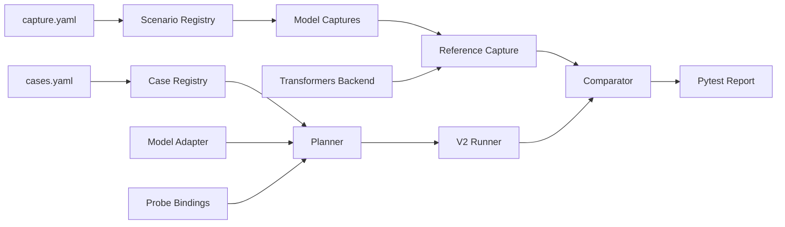

# SeedOmni Parity Suite

`parity_suite` is the shared test harness for SeedOmni V2 model migrations. It turns model-specific parity work into declarative cases plus a small amount of model-local adapter, probe, and capture code.

## Goals

- Generate pytest cases from model `cases.yaml` files.
- Reuse common reference backend loading, V2 graph/trainer execution, capture, metrics, and report code.
- Keep model migrations focused on semantics: input adapters, probe bindings, and custom extractors.
- Support offline fixture parity and online reference capture.

## Test Categories

- `reference parity`: compares a reference backend, usually `transformers`, against SeedOmni V2 outputs.
- `v2 consistency`: compares two V2 paths, for example graph output against trainer output.
- `framework smoke`: validates launcher, checkpoint, FSDP2, or distributed invariants. These are not official numerical parity checks.

## Model Package Layout

Each model integration lives next to the common SeedOmni tests:

```text
tests/seed_omni/
├── parity_suite/
│   ├── test_parity_cases.py
│   ├── core/
│   ├── backends/
│   ├── capture/
│   └── v2/
└── bagel/
    ├── cases.yaml
    ├── capture.yaml
    ├── adapter.py
    ├── probes.py
    ├── captures.py
    ├── transformers/
    ├── test_transformers_reference_smoke.py
    └── archive/
```

For BAGEL, `archive/` is historical reference only. New code must not import it. The model-local `transformers/` package is a test reference backend, not SeedOmni V2 runtime implementation.

## Case Schema

Model cases use a global-first YAML shape so backend, model, adapter, and env settings are not repeated. `cases.yaml` is a discovery manifest, not a hand-written case list:

```yaml
reference_backend:
  type: transformers
  model: ${VEOMNI_V2_TEST_BAGEL_REFERENCE_MODEL}
  trust_remote_code: true
  local_transformers: auto

v2_model:
  model_root: ${VEOMNI_V2_TEST_BAGEL_SPLIT_MODEL_ROOT}
  config_dir: configs/seed_omni/Bagel/bagel_7b_mot

adapter: tests.seed_omni.bagel.adapter:BagelParityAdapter
probes: tests.seed_omni.bagel.probes
captures: tests.seed_omni.bagel.captures

env:
  prefix: VEOMNI_V2_TEST_BAGEL_
  enable: ENABLE_PARITY_CHECK
  requires_cuda: true

discovery:
  graphs: {}
  modules:
    enabled: true
  framework:
    enabled: true
```

`cases.yaml` declares where cases are discovered. The V2 graph YAML files decide graph/module topology and graph-case domain, while the model-local scenario registry binds each discovered graph or framework scenario to probes, fixture env names, optional dedupe roles, and reference IO.

The registry generates one graph-level case per matching graph scenario, then expands module-level cases from the module/method nodes used by those graphs. Module generation is deduplicated by `module + method + dedupe_role`; `dedupe_role` defaults to the scenario id. Trainer/FSDP cases are generated from framework scenarios instead of graph node discovery.

## Scenario Registry

`capture.yaml` is a scenario/reference IO registry. Each scenario describes the graph or framework path it matches, its default probes and fixture env, and the reference action/outputs used to generate a capture plan:

```yaml
defaults:
  seed: 1234
  fixture:
    dtype: fp32
    tolerance:
      max_abs_diff: 0.0
      mean_abs_diff: 0.0

input_templates:
  causal_lm_tokens:
    input_ids: {kind: randint, shape: [1, 4], high: config.vocab_size}

output_templates:
  text_lm_step:
    text.hidden:
      path: one_step.hidden_state
      value: hidden_state
    text.logits:
      path: one_step.logits
      value: logits

scenarios:
  text_only_one_step_logits:
    graph: infer_und
    fixture: TEXT_PARITY_FIXTURE
    probes: [text.hidden, text.logits, qwen.kv_cache, text.greedy_token]
    reference:
      action: transformers_causal_lm.forward
      inputs:
        templates: [causal_lm_tokens]
      outputs:
        templates: [text_lm_step]
```

The suite derives capture plans from `scenarios.<id>.reference` after resolving `input_templates` and `output_templates`. It owns common actions such as `transformers_causal_lm.forward` and `transformers_causal_lm.forward_backward`, plus fixture/cache helpers in `parity_suite.capture.runtime`. `capture.yaml` does not load or configure the model; the reference model comes from `cases.yaml.reference_backend`. Model-local `captures.py` should stay thin: instantiate or retrieve model-local backend primitives and call the suite runtime. Complex models can add small custom primitives, but they should not duplicate case dispatch, fixture helpers, or declarative case/capture schema.

## Probe Interface

Probe bindings use the shared suite interface from `tests.seed_omni.parity_suite.core.probes`. Model packages should import `probe_binding` instead of defining their own binding types:

```python
from tests.seed_omni.parity_suite.core.probes import probe_binding

PROBES = {
    "text.logits": probe_binding(
        "bagel_text_encoder.token_generate:logits",
        "Text logits for one deterministic generation step.",
    ),
}
```

The suite normalizes these bindings into V2 anchors. Reference fixture paths are owned by the selected `capture.yaml` plan, so online capture and fixture-cache reads share the same reference schema.

## Backend Resolution

`backend: transformers` resolves in this order:

1. Import model-local `tests.seed_omni.<model>.transformers` if it exists and let it register Auto classes.
2. Try standard `AutoModel` / `AutoProcessor` / `AutoTokenizer.from_pretrained`.
3. Use an explicitly configured custom loader when a model cannot fit standard `Auto*`.

Model-local transformers code must be self-contained. It must not import `bagel-official` or any other reference checkout at runtime.

## Execution Flow

Cases are online by default. A `fixture` entry is treated as an optional cache or debugging override, not as the primary source of truth. If the fixture env/path is present, the model adapter may load it. Otherwise the adapter should call its model-local `captures.py`, which resolves `case.capture` through `capture.yaml` and computes the reference capture during the pytest run.

Use `requires_fixture: true` only for cases that cannot yet be captured online.



## Bagel Constraints

- `tests/seed_omni/bagel/archive` is never imported by new parity code.
- New BAGEL tests run through `parity_suite` and model-local files only.
- The BAGEL local transformers reference is test-side code. It exists so parity tests can run without `bagel-official`.
- A lightweight reference smoke should prove the local reference can load and forward before it is used as an oracle.
